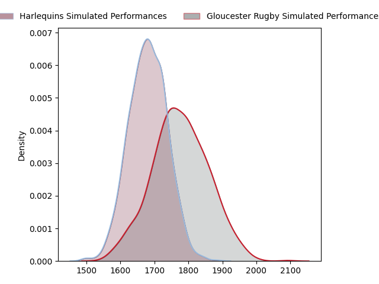
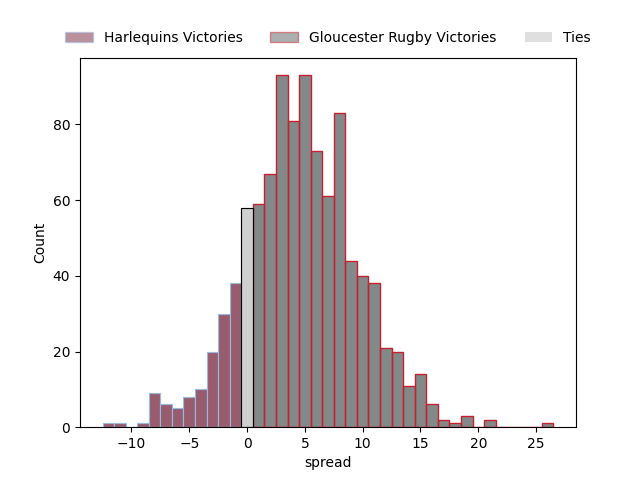

---  
layout: page  
title: Harlequins at Gloucester Rugby  
date: 2023-02-17 14:45:00 18:00:00 -0500  
categories: match projection  
---
# Harlequins at Gloucester Rugby

# Club Level Predictions

The first set of predictions treats a club as the smallest object, as the club develops its members, organizes a gameplan, and deploys its players as needed for each match. This club model has a prediction of 0.636, which translates to predicting Gloucester Rugby to win by 4.7.

Each club has a rating and a rating deviation (simiar to a Glicko system), and expected performances can be generated. This allows for simulated matches and spreads like the ones below.
## Projected Performances

## Projected Spreads

## Projected Results

# Player Level Predictions

Treating teams instead as an entity made up of the currently active players, I have ratings for each player in an altogether different system. These can be combined to form team ratings once teamsheets are announced, weighting starters a bit higher than the reserves. After the match is played, players can be weighted by their minutes on the field, allowing for an accurate measure of the team's composition. With these compiled team ratings, we can make predictions, measure inaccuracy, and update the individual player ratings.
## Prediction without Player Minutes: Gloucester Rugby by 5.5

Gloucester Rugby by 1.5 on a neutral field

| Away Player                                                       |   Away elo |   Away Percentile |   Number |   Home Percentile |   Home elo | Home Player                                                         |
|:------------------------------------------------------------------|-----------:|------------------:|---------:|------------------:|-----------:|:--------------------------------------------------------------------|
| [Joe Marler](..//playerfiles//JoeMarler_cleaned.md)               |      92.89 |                40 |        1 |                33 |      90.43 | [Val Rapava-Ruskin](..//playerfiles//ValRapava-Ruskin_cleaned.md)   |
| [Jack Musk](..//playerfiles//JackMusk_cleaned.md)                 |     106.32 |                83 |        2 |                33 |      90.05 | [Sebastian Blake](..//playerfiles//SebastianBlake_cleaned.md)       |
| [Wilco Louw](..//playerfiles//WilcoLouw_cleaned.md)               |     117.26 |                92 |        3 |                89 |     113.66 | [Kirill Gotovtsev](..//playerfiles//KirillGotovtsev_cleaned.md)     |
| [Dino Lamb](..//playerfiles//DinoLamb_cleaned.md)                 |     117.77 |                89 |        4 |                41 |      94.82 | [Freddie Clarke](..//playerfiles//FreddieClarke_cleaned.md)         |
| [Irne Herbst](..//playerfiles//IrneHerbst_cleaned.md)             |     112.8  |                84 |        5 |                75 |     106.73 | [Matias Alemanno](..//playerfiles//MatiasAlemanno_cleaned.md)       |
| [James Chisholm](..//playerfiles//JamesChisholm_cleaned.md)       |     120.77 |                95 |        6 |                60 |      99.63 | [Ruan Ackermann](..//playerfiles//RuanAckermann_cleaned.md)         |
| [Luke Wallace](..//playerfiles//LukeWallace_cleaned.md)           |      78.68 |                14 |        7 |                59 |      99.38 | [Lewis Ludlow](..//playerfiles//LewisLudlow_cleaned.md)             |
| [Tom Lawday](..//playerfiles//TomLawday_cleaned.md)               |      79.73 |                13 |        8 |                19 |      82.99 | [Albert Tuisue](..//playerfiles//AlbertTuisue_cleaned.md)           |
| [Danny Care](..//playerfiles//DannyCare_cleaned.md)               |     109.04 |                80 |        9 |                38 |      92.1  | [Ben Meehan](..//playerfiles//BenMeehan_cleaned.md)                 |
| [Tommaso Allan](..//playerfiles//TommasoAllan_cleaned.md)         |      97.07 |                50 |       10 |                97 |     142.32 | [Santiago Carreras](..//playerfiles//SantiagoCarreras_cleaned.md)   |
| [Josh Bassett](..//playerfiles//JoshBassett_cleaned.md)           |      95.3  |                48 |       11 |                91 |     121.89 | [Ollie Thorley](..//playerfiles//OllieThorley_cleaned.md)           |
| [Andre Esterhuizen](..//playerfiles//AndreEsterhuizen_cleaned.md) |     112.82 |                82 |       12 |                 5 |      71.4  | [Sebastien Atkinson](..//playerfiles//SebastienAtkinson_cleaned.md) |
| [Oscar Beard](..//playerfiles//OscarBeard_cleaned.md)             |     112.41 |                81 |       13 |                86 |     114.55 | [Chris Harris](..//playerfiles//ChrisHarris_cleaned.md)             |
| [Cadan Murley](..//playerfiles//CadanMurley_cleaned.md)           |      97.74 |                55 |       14 |                86 |     116.45 | [Jonny May](..//playerfiles//JonnyMay_cleaned.md)                   |
| [Nick David](..//playerfiles//NickDavid_cleaned.md)               |      93.98 |                44 |       15 |                85 |     119.23 | [Lloyd Evans](..//playerfiles//LloydEvans_cleaned.md)               |
| [Sam Riley](..//playerfiles//SamRiley_cleaned.md)                 |      90.23 |                33 |       16 |                88 |     113.69 | [Henry Walker](..//playerfiles//HenryWalker_cleaned.md)             |
| [Fin Baxter](..//playerfiles//FinBaxter_cleaned.md)               |      93.42 |                39 |       17 |                41 |      90.7  | [Harry Elrington](..//playerfiles//HarryElrington_cleaned.md)       |
| [George Hammond](..//playerfiles//GeorgeHammond_cleaned.md)       |      74.19 |                 7 |       19 |                96 |     128.46 | [Cameron Jordan](..//playerfiles//CameronJordan_cleaned.md)         |
| [Matas Jurevicius](..//playerfiles//MatasJurevicius_cleaned.md)   |     102.37 |                67 |       20 |                86 |     114.99 | [Jack Clement](..//playerfiles//JackClement_cleaned.md)             |
| [Scott Steele](..//playerfiles//ScottSteele_cleaned.md)           |      62.72 |                 0 |       21 |                60 |      98.05 | [Charlie Chapman](..//playerfiles//CharlieChapman_cleaned.md)       |
| [Will Edwards](..//playerfiles//WillEdwards_cleaned.md)           |     124.74 |                92 |       22 |                 3 |      61.58 | [Tom Seabrook](..//playerfiles//TomSeabrook_cleaned.md)             |
| [Luke Northmore](..//playerfiles//LukeNorthmore_cleaned.md)       |     118.98 |                88 |       23 |                23 |      86.57 | [Louis Rees-Zammit](..//playerfiles//LouisRees-Zammit_cleaned.md)   |

