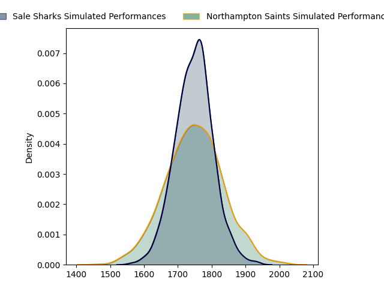
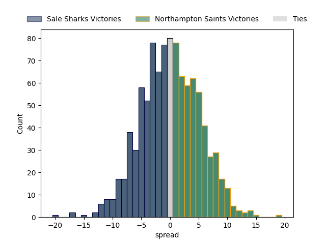

---  
layout: page  
title: Sale Sharks at Northampton Saints  
date: 2023-02-18 10:00:00 18:00:00 -0500  
categories: match projection  
---
# Sale Sharks at Northampton Saints

# Club Level Predictions

The first set of predictions treats a club as the smallest object, as the club develops its members, organizes a gameplan, and deploys its players as needed for each match. This club model has a prediction of 0.503, which translates to predicting Northampton Saints to win by 0.0.

Each club has a rating and a rating deviation (simiar to a Glicko system), and expected performances can be generated. This allows for simulated matches and spreads like the ones below.
## Projected Performances

## Projected Spreads

## Projected Results

# Player Level Predictions

Treating teams instead as an entity made up of the currently active players, I have ratings for each player in an altogether different system. These can be combined to form team ratings once teamsheets are announced, weighting starters a bit higher than the reserves. After the match is played, players can be weighted by their minutes on the field, allowing for an accurate measure of the team's composition. With these compiled team ratings, we can make predictions, measure inaccuracy, and update the individual player ratings.
## Prediction without Player Minutes: Sale Sharks by 1.6

Sale Sharks by 5.6 on a neutral field

| Away Player                                                       |   Away elo |   Away Percentile |   Number |   Home Percentile |   Home elo | Home Player                                                       |
|:------------------------------------------------------------------|-----------:|------------------:|---------:|------------------:|-----------:|:------------------------------------------------------------------|
| [Bevan Rodd](..//playerfiles//BevanRodd_cleaned.md)               |     113.29 |                88 |        1 |                97 |     128.73 | [Alex Waller](..//playerfiles//AlexWaller_cleaned.md)             |
| [Nic Schonert](..//playerfiles//NicSchonert_cleaned.md)           |      89.1  |                29 |        3 |                75 |     104.42 | [Paul Hill](..//playerfiles//PaulHill_cleaned.md)                 |
| [Cobus Wiese](..//playerfiles//CobusWiese_cleaned.md)             |      97.31 |                55 |        4 |                53 |      96.75 | [David Ribbans](..//playerfiles//DavidRibbans_cleaned.md)         |
| [Jonny Hill](..//playerfiles//JonnyHill_cleaned.md)               |      99.84 |                60 |        5 |                84 |     113.36 | [Alex Moon](..//playerfiles//AlexMoon_cleaned.md)                 |
| [Jono Ross](..//playerfiles//JonoRoss_cleaned.md)                 |     105.72 |                73 |        6 |                81 |     111.32 | [Angus Scott-Young](..//playerfiles//AngusScott-Young_cleaned.md) |
| [Tom Curry](..//playerfiles//TomCurry_cleaned.md)                 |      91.82 |                37 |        7 |                35 |      90.25 | [Aaron Hinkley](..//playerfiles//AaronHinkley_cleaned.md)         |
| [Jean-Luc du Preez](..//playerfiles//Jean-LucduPreez_cleaned.md)  |     112.45 |                81 |        8 |                27 |      87.28 | [Juarno Augustus](..//playerfiles//JuarnoAugustus_cleaned.md)     |
| [Gus Warr](..//playerfiles//GusWarr_cleaned.md)                   |      82.83 |                19 |        9 |                42 |      92.69 | [Tom James](..//playerfiles//TomJames_cleaned.md)                 |
| [Robert du Preez](..//playerfiles//RobertduPreez_cleaned.md)      |     110.35 |                78 |       10 |                44 |      94.09 | [Fin Smith](..//playerfiles//FinSmith_cleaned.md)                 |
| [Arron Reed](..//playerfiles//ArronReed_cleaned.md)               |     112.04 |                81 |       11 |                82 |     115.99 | [James Ramm](..//playerfiles//JamesRamm_cleaned.md)               |
| [Manu Tuilagi](..//playerfiles//ManuTuilagi_cleaned.md)           |     131.31 |                96 |       12 |                 8 |      72.84 | [Fraser Dingwall](..//playerfiles//FraserDingwall_cleaned.md)     |
| [Sam James](..//playerfiles//SamJames_cleaned.md)                 |     134.63 |                97 |       13 |                57 |      97.05 | [Matt Proctor](..//playerfiles//MattProctor_cleaned.md)           |
| [Tom O'Flaherty](..//playerfiles//TomO'Flaherty_cleaned.md)       |     101.06 |                64 |       14 |                78 |     108.99 | [Tommy Freeman](..//playerfiles//TommyFreeman_cleaned.md)         |
| [Joe Carpenter](..//playerfiles//JoeCarpenter_cleaned.md)         |      74.91 |                12 |       15 |                95 |     129.23 | [George Furbank](..//playerfiles//GeorgeFurbank_cleaned.md)       |
| [Simon McIntyre](..//playerfiles//SimonMcIntyre_cleaned.md)       |     110    |                84 |       17 |                65 |     102.52 | [Ethan Waller](..//playerfiles//EthanWaller_cleaned.md)           |
| [Coenie Oosthuizen](..//playerfiles//CoenieOosthuizen_cleaned.md) |     121.1  |                94 |       18 |                 8 |      67.96 | [Alfie Petch](..//playerfiles//AlfiePetch_cleaned.md)             |
| [Josh Beaumont](..//playerfiles//JoshBeaumont_cleaned.md)         |     113.67 |                85 |       19 |                 5 |      67.64 | [Alex Coles](..//playerfiles//AlexColes_cleaned.md)               |
| [Sam Dugdale](..//playerfiles//SamDugdale_cleaned.md)             |      89.19 |                31 |       20 |                84 |     115.39 | [Sam Graham](..//playerfiles//SamGraham_cleaned.md)               |
| [Raffi Quirke](..//playerfiles//RaffiQuirke_cleaned.md)           |     104.43 |                70 |       21 |                45 |      93.55 | [Callum Braley](..//playerfiles//CallumBraley_cleaned.md)         |
| [George Ford](..//playerfiles//GeorgeFord_cleaned.md)             |     116.03 |                85 |       22 |                38 |      90.56 | [Rory Hutchinson](..//playerfiles//RoryHutchinson_cleaned.md)     |
| [Tom Roebuck](..//playerfiles//TomRoebuck_cleaned.md)             |     105.09 |                73 |       23 |                88 |     113.51 | [Tom Collins](..//playerfiles//TomCollins_cleaned.md)             |

