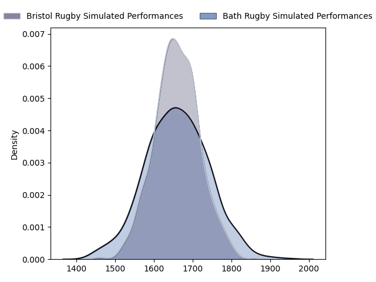
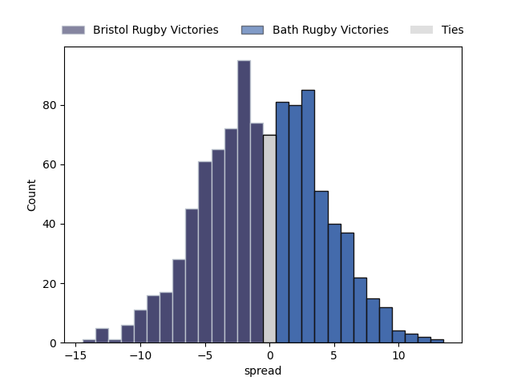

---  
layout: page  
title: Bristol Rugby at Bath Rugby  
date: 2023-02-24 14:45:00 18:00:00 -0500  
categories: match projection  
---
# Bristol Rugby at Bath Rugby

# Club Level Predictions

The first set of predictions treats a club as the smallest object, as the club develops its members, organizes a gameplan, and deploys its players as needed for each match. This club model has a prediction of 0.485, which translates to predicting Bristol Rugby to win by 0.5.

Each club has a rating and a rating deviation (simiar to a Glicko system), and expected performances can be generated. This allows for simulated matches and spreads like the ones below.
## Projected Performances

## Projected Spreads

## Projected Results

# Player Level Predictions

Treating teams instead as an entity made up of the currently active players, I have ratings for each player in an altogether different system. These can be combined to form team ratings once teamsheets are announced, weighting starters a bit higher than the reserves. After the match is played, players can be weighted by their minutes on the field, allowing for an accurate measure of the team's composition. With these compiled team ratings, we can make predictions, measure inaccuracy, and update the individual player ratings.
## Prediction without Player Minutes: Bristol Rugby by 0.3

Bristol Rugby by 4.3 on a neutral field

| Away Player                                                   |   Away elo |   Away Percentile |   Number |   Home Percentile |   Home elo | Home Player                                                   |
|:--------------------------------------------------------------|-----------:|------------------:|---------:|------------------:|-----------:|:--------------------------------------------------------------|
| [Yann Thomas](..//playerfiles//YannThomas_cleaned.md)         |      92.4  |                36 |        1 |                87 |     108.63 | [Beno Obano](..//playerfiles//BenoObano_cleaned.md)           |
| [Harry Thacker](..//playerfiles//HarryThacker_cleaned.md)     |      92.17 |                41 |        2 |                66 |      97.19 | [Niall Annett](..//playerfiles//NiallAnnett_cleaned.md)       |
| [Max Lahiff](..//playerfiles//MaxLahiff_cleaned.md)           |      93.83 |                46 |        3 |                 0 |      44.52 | [D'Arcy Rae](..//playerfiles//D'ArcyRae_cleaned.md)           |
| [Chris Vui](..//playerfiles//ChrisVui_cleaned.md)             |     110.21 |                85 |        5 |                95 |     120.67 | [Quinn Roux](..//playerfiles//QuinnRoux_cleaned.md)           |
| [Fitz Harding](..//playerfiles//FitzHarding_cleaned.md)       |     104.78 |                74 |        7 |                51 |      96.09 | [Sam Underhill](..//playerfiles//SamUnderhill_cleaned.md)     |
| [Magnus Bradbury](..//playerfiles//MagnusBradbury_cleaned.md) |      90.83 |                34 |        8 |                93 |     120.1  | [Miles Reid](..//playerfiles//MilesReid_cleaned.md)           |
| [Harry Randall](..//playerfiles//HarryRandall_cleaned.md)     |     109.92 |                88 |        9 |                92 |     113.31 | [Ben Spencer](..//playerfiles//BenSpencer_cleaned.md)         |
| [AJ MacGinty](..//playerfiles//AJMacGinty_cleaned.md)         |     108.63 |                83 |       10 |                93 |     123.44 | [Piers Francis](..//playerfiles//PiersFrancis_cleaned.md)     |
| [Gabriel Ibitoye](..//playerfiles//GabrielIbitoye_cleaned.md) |     104.96 |                76 |       11 |                94 |     123.13 | [Matt Gallagher](..//playerfiles//MattGallagher_cleaned.md)   |
| [James Williams](..//playerfiles//JamesWilliams_cleaned.md)   |      86.28 |                25 |       12 |                17 |      82.97 | [Max Ojomoh](..//playerfiles//MaxOjomoh_cleaned.md)           |
| [Semi Radradra](..//playerfiles//SemiRadradra_cleaned.md)     |     127.4  |                96 |       13 |                67 |     101.25 | [Cameron Redpath](..//playerfiles//CameronRedpath_cleaned.md) |
| [Ratu Naulago](..//playerfiles//RatuNaulago_cleaned.md)       |     101.89 |                70 |       14 |                56 |      96.95 | [Joe Cokanasiga](..//playerfiles//JoeCokanasiga_cleaned.md)   |
| [Bryan Byrne](..//playerfiles//BryanByrne_cleaned.md)         |     105.69 |                77 |       16 |                97 |     125.33 | [Tom Dunn](..//playerfiles//TomDunn_cleaned.md)               |
| [Andy Uren](..//playerfiles//AndyUren_cleaned.md)             |      76.89 |                11 |       21 |                65 |      99.66 | [Louis Schreuder](..//playerfiles//LouisSchreuder_cleaned.md) |
| [Sam Bedlow](..//playerfiles//SamBedlow_cleaned.md)           |     120.51 |                94 |       22 |                17 |      82.63 | [Orlando Bailey](..//playerfiles//OrlandoBailey_cleaned.md)   |
| [Ioan Lloyd](..//playerfiles//IoanLloyd_cleaned.md)           |      78.29 |                 9 |       23 |                95 |     122.35 | [Chris Cloete](..//playerfiles//ChrisCloete_cleaned.md)       |

