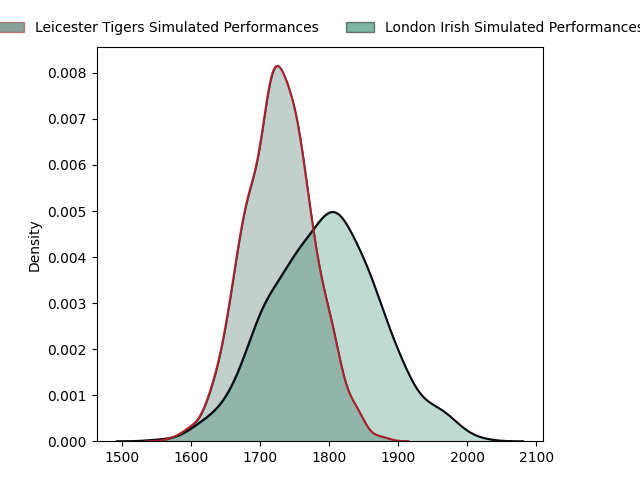
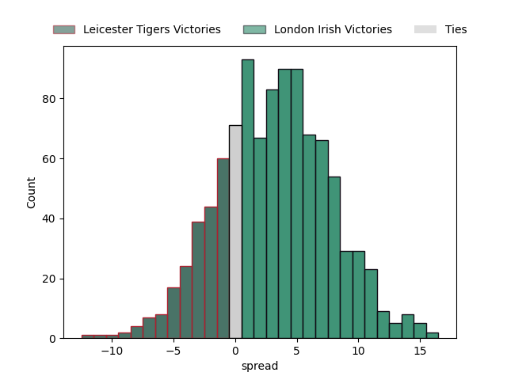

---  
layout: page  
title: Leicester Tigers at London Irish  
date: 2023-02-25 14:30:00 18:00:00 -0500  
categories: match projection  
---
# Leicester Tigers at London Irish

# Club Level Predictions

The first set of predictions treats a club as the smallest object, as the club develops its members, organizes a gameplan, and deploys its players as needed for each match. This club model has a prediction of 0.588, which translates to predicting London Irish to win by 3.3.

Each club has a rating and a rating deviation (simiar to a Glicko system), and expected performances can be generated. This allows for simulated matches and spreads like the ones below.
## Projected Performances

## Projected Spreads

## Projected Results

# Player Level Predictions

Treating teams instead as an entity made up of the currently active players, I have ratings for each player in an altogether different system. These can be combined to form team ratings once teamsheets are announced, weighting starters a bit higher than the reserves. After the match is played, players can be weighted by their minutes on the field, allowing for an accurate measure of the team's composition. With these compiled team ratings, we can make predictions, measure inaccuracy, and update the individual player ratings.
## Prediction without Player Minutes: London Irish by 14.1

London Irish by 10.1 on a neutral field

| Away Player                                                       |   Away elo |   Away Percentile |   Number |   Home Percentile |   Home elo | Home Player                                                                       |
|:------------------------------------------------------------------|-----------:|------------------:|---------:|------------------:|-----------:|:----------------------------------------------------------------------------------|
| [Tom West](..//playerfiles//TomWest_cleaned.md)                   |      92.03 |                38 |        1 |                64 |      98.99 | [Facundo Gigena](..//playerfiles//FacundoGigena_cleaned.md)                       |
| [Julian Montoya](..//playerfiles//JulianMontoya_cleaned.md)       |      84.43 |                17 |        2 |                10 |      83.57 | [Mike Willemse](..//playerfiles//MikeWillemse_cleaned.md)                         |
| [Joe Heyes](..//playerfiles//JoeHeyes_cleaned.md)                 |     100.87 |                70 |        3 |                12 |      83.32 | [Lovejoy Chawatama](..//playerfiles//LovejoyChawatama_cleaned.md)                 |
| [George Martin](..//playerfiles//GeorgeMartin_cleaned.md)         |      96.59 |                55 |        4 |                57 |      96.93 | [Api Ratuniyarawa](..//playerfiles//ApiRatuniyarawa_cleaned.md)                   |
| [Cameron Henderson](..//playerfiles//CameronHenderson_cleaned.md) |     112.2  |                88 |        5 |                99 |     136.24 | [Rob Simmons](..//playerfiles//RobSimmons_cleaned.md)                             |
| [Hanro Liebenberg](..//playerfiles//HanroLiebenberg_cleaned.md)   |     113.26 |                88 |        6 |                50 |      95.15 | [Juan Martin Gonzalez](..//playerfiles//JuanMartinGonzalez_cleaned.md)            |
| [Olly Cracknell](..//playerfiles//OllyCracknell_cleaned.md)       |      93.04 |                44 |        7 |                99 |     141.43 | [Tom Pearson](..//playerfiles//TomPearson_cleaned.md)                             |
| [Jasper Wiese](..//playerfiles//JasperWiese_cleaned.md)           |     102.7  |                72 |        8 |                87 |     112.37 | [Matt Rogerson](..//playerfiles//MattRogerson_cleaned.md)                         |
| [Ben Youngs](..//playerfiles//BenYoungs_cleaned.md)               |      86.73 |                25 |        9 |                26 |      87.39 | [Joe Powell](..//playerfiles//JoePowell_cleaned.md)                               |
| [Handre Pollard](..//playerfiles//HandrePollard_cleaned.md)       |     127.04 |                95 |       10 |                96 |     128.21 | [Paddy Jackson](..//playerfiles//PaddyJackson_cleaned.md)                         |
| [Harry Potter](..//playerfiles//HarryPotter_cleaned.md)           |      85.6  |                22 |       11 |                90 |     114.54 | [Ben Loader](..//playerfiles//BenLoader_cleaned.md)                               |
| [Jimmy Gopperth](..//playerfiles//JimmyGopperth_cleaned.md)       |      98.09 |                59 |       12 |                91 |     115.59 | [Rory Jennings](..//playerfiles//RoryJennings_cleaned.md)                         |
| [Matt Scott](..//playerfiles//MattScott_cleaned.md)               |      86.07 |                24 |       13 |                86 |     110.66 | [Benhard Janse van Rensburg](..//playerfiles//BenhardJansevanRensburg_cleaned.md) |
| [Chris Ashton](..//playerfiles//ChrisAshton_cleaned.md)           |     106.24 |                79 |       14 |                31 |      88.72 | [Lucio Cinti](..//playerfiles//LucioCinti_cleaned.md)                             |
| [Mike Brown](..//playerfiles//MikeBrown_cleaned.md)               |     104.78 |                73 |       15 |                79 |     107.95 | [James Stokes](..//playerfiles//JamesStokes_cleaned.md)                           |
| [Charlie Clare](..//playerfiles//CharlieClare_cleaned.md)         |      68.16 |                 3 |       16 |                93 |     115.64 | [Agustin Creevy](..//playerfiles//AgustinCreevy_cleaned.md)                       |
| [Will Hurd](..//playerfiles//WillHurd_cleaned.md)                 |      88.42 |                28 |       18 |                91 |     112.71 | [Oli Hoskins](..//playerfiles//OliHoskins_cleaned.md)                             |
| [Harry Wells](..//playerfiles//HarryWells_cleaned.md)             |     143.75 |                99 |       19 |                95 |     119.43 | [Chunya Munga](..//playerfiles//ChunyaMunga_cleaned.md)                           |
| [Harry Simmons](..//playerfiles//HarrySimmons_cleaned.md)         |     105.53 |                83 |       23 |                45 |      93.17 | [Will Joseph](..//playerfiles//WillJoseph_cleaned.md)                             |

