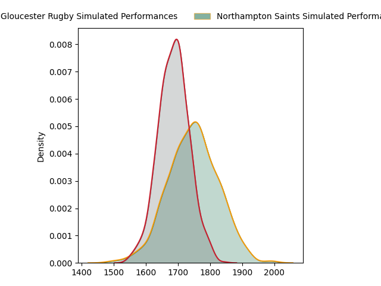
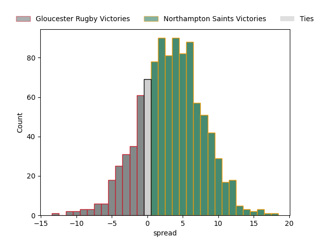

---  
layout: page  
title: Gloucester Rugby at Northampton Saints  
date: 2023-02-25 09:45:00 18:00:00 -0500  
categories: match projection  
---
# Gloucester Rugby at Northampton Saints

# Club Level Predictions

The first set of predictions treats a club as the smallest object, as the club develops its members, organizes a gameplan, and deploys its players as needed for each match. This club model has a prediction of 0.587, which translates to predicting Northampton Saints to win by 2.9.

Each club has a rating and a rating deviation (simiar to a Glicko system), and expected performances can be generated. This allows for simulated matches and spreads like the ones below.
## Projected Performances

## Projected Spreads

## Projected Results

# Player Level Predictions

Treating teams instead as an entity made up of the currently active players, I have ratings for each player in an altogether different system. These can be combined to form team ratings once teamsheets are announced, weighting starters a bit higher than the reserves. After the match is played, players can be weighted by their minutes on the field, allowing for an accurate measure of the team's composition. With these compiled team ratings, we can make predictions, measure inaccuracy, and update the individual player ratings.
## Prediction without Player Minutes: Northampton Saints by 6.7

Northampton Saints by 2.7 on a neutral field

| Away Player                                                         |   Away elo |   Away Percentile |   Number |   Home Percentile |   Home elo | Home Player                                                             |
|:--------------------------------------------------------------------|-----------:|------------------:|---------:|------------------:|-----------:|:------------------------------------------------------------------------|
| [Val Rapava-Ruskin](..//playerfiles//ValRapava-Ruskin_cleaned.md)   |      84.01 |                15 |        1 |                99 |     132.03 | [Alex Waller](..//playerfiles//AlexWaller_cleaned.md)                   |
| [Sebastian Blake](..//playerfiles//SebastianBlake_cleaned.md)       |      77.42 |                 8 |        2 |                 7 |      76.85 | [Robbie Smith](..//playerfiles//RobbieSmith_cleaned.md)                 |
| [Freddie Clarke](..//playerfiles//FreddieClarke_cleaned.md)         |      91.74 |                39 |        4 |                46 |      93.32 | [David Ribbans](..//playerfiles//DavidRibbans_cleaned.md)               |
| [Matias Alemanno](..//playerfiles//MatiasAlemanno_cleaned.md)       |     103.08 |                72 |        5 |                94 |     120.66 | [Alex Moon](..//playerfiles//AlexMoon_cleaned.md)                       |
| [Ruan Ackermann](..//playerfiles//RuanAckermann_cleaned.md)         |     100.23 |                65 |        6 |                 4 |      64.89 | [Alex Coles](..//playerfiles//AlexColes_cleaned.md)                     |
| [Lewis Ludlow](..//playerfiles//LewisLudlow_cleaned.md)             |      96.52 |                53 |        7 |                86 |     111.29 | [Angus Scott-Young](..//playerfiles//AngusScott-Young_cleaned.md)       |
| [Albert Tuisue](..//playerfiles//AlbertTuisue_cleaned.md)           |      93.15 |                41 |        8 |                85 |     114.98 | [Sam Graham](..//playerfiles//SamGraham_cleaned.md)                     |
| [Ollie Thorley](..//playerfiles//OllieThorley_cleaned.md)           |     117.37 |                92 |       11 |                92 |     116.07 | [Tom Collins](..//playerfiles//TomCollins_cleaned.md)                   |
| [Sebastien Atkinson](..//playerfiles//SebastienAtkinson_cleaned.md) |      50.52 |                 1 |       12 |                31 |      89.75 | [Rory Hutchinson](..//playerfiles//RoryHutchinson_cleaned.md)           |
| [Chris Harris](..//playerfiles//ChrisHarris_cleaned.md)             |     108.78 |                83 |       13 |                10 |      78.27 | [Fraser Dingwall](..//playerfiles//FraserDingwall_cleaned.md)           |
| [Jonny May](..//playerfiles//JonnyMay_cleaned.md)                   |      99.94 |                65 |       14 |                80 |     106.53 | [Tommy Freeman](..//playerfiles//TommyFreeman_cleaned.md)               |
| [Lloyd Evans](..//playerfiles//LloydEvans_cleaned.md)               |     104.26 |                71 |       15 |                91 |     116.66 | [James Ramm](..//playerfiles//JamesRamm_cleaned.md)                     |
| [Cameron Jordan](..//playerfiles//CameronJordan_cleaned.md)         |      82.14 |                17 |       19 |                17 |      83.05 | [Lukhan Salakaia-Loto](..//playerfiles//LukhanSalakaia-Loto_cleaned.md) |
| [Jack Clement](..//playerfiles//JackClement_cleaned.md)             |     107.08 |                81 |       20 |                25 |      87.51 | [Aaron Hinkley](..//playerfiles//AaronHinkley_cleaned.md)               |
| [Billy Twelvetrees](..//playerfiles//BillyTwelvetrees_cleaned.md)   |     134.56 |                97 |       22 |                43 |      92.88 | [Fin Smith](..//playerfiles//FinSmith_cleaned.md)                       |
| [Tom Seabrook](..//playerfiles//TomSeabrook_cleaned.md)             |      66.42 |                 6 |       23 |                92 |     117.81 | [Courtnall Skosan](..//playerfiles//CourtnallSkosan_cleaned.md)         |

