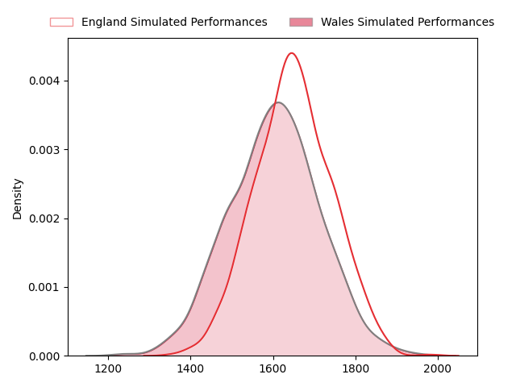
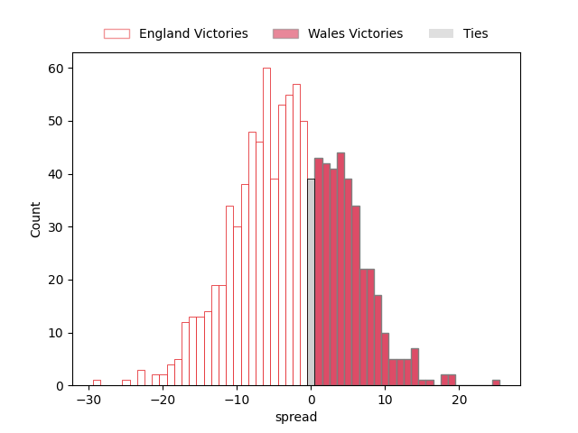

---  
layout: page  
title: England at Wales  
date: 2023-02-25 11:45:00 18:00:00 -0500  
categories: match projection  
---
# England at Wales

# Club Level Predictions

The first set of predictions treats a club as the smallest object, as the club develops its members, organizes a gameplan, and deploys its players as needed for each match. This club model has a prediction of 0.422, which translates to predicting England to win by 2.6.

Each club has a rating and a rating deviation (simiar to a Glicko system), and expected performances can be generated. This allows for simulated matches and spreads like the ones below.
## Projected Performances

## Projected Spreads

## Projected Results

# Player Level Predictions

Treating teams instead as an entity made up of the currently active players, I have ratings for each player in an altogether different system. These can be combined to form team ratings once teamsheets are announced, weighting starters a bit higher than the reserves. After the match is played, players can be weighted by their minutes on the field, allowing for an accurate measure of the team's composition. With these compiled team ratings, we can make predictions, measure inaccuracy, and update the individual player ratings.
## Prediction without Player Minutes: England by 9.4

England by 13.4 on a neutral field

| Away Player                                                          |   Away elo |   Away Percentile |   Number |   Home Percentile |   Home elo | Home Player                                                       |
|:---------------------------------------------------------------------|-----------:|------------------:|---------:|------------------:|-----------:|:------------------------------------------------------------------|
| [Ellis Genge](..//playerfiles//EllisGenge_cleaned.md)                |      95.27 |                51 |        1 |                 7 |      75.78 | [Gareth Thomas](..//playerfiles//GarethThomas_cleaned.md)         |
| [Jamie George](..//playerfiles//JamieGeorge_cleaned.md)              |     161.34 |               100 |        2 |                53 |      95.1  | [Ken Owens](..//playerfiles//KenOwens_cleaned.md)                 |
| [Kyle Sinckler](..//playerfiles//KyleSinckler_cleaned.md)            |     111.38 |                89 |        3 |                98 |     126.66 | [Tomas Francis](..//playerfiles//TomasFrancis_cleaned.md)         |
| [Maro Itoje](..//playerfiles//MaroItoje_cleaned.md)                  |     107.7  |                81 |        4 |                40 |      92.26 | [Adam Beard](..//playerfiles//AdamBeard_cleaned.md)               |
| [Ollie Chessum](..//playerfiles//OllieChessum_cleaned.md)            |     117.83 |                92 |        5 |                75 |     104.8  | [Alun Wyn Jones](..//playerfiles//AlunWynJones_cleaned.md)        |
| [Lewis Ludlam](..//playerfiles//LewisLudlam_cleaned.md)              |      94.71 |                49 |        6 |                21 |      86.14 | [Christ Tshiunza](..//playerfiles//ChristTshiunza_cleaned.md)     |
| [Jack Willis](..//playerfiles//JackWillis_cleaned.md)                |     124.28 |                95 |        7 |                91 |     117.44 | [Justin Tipuric](..//playerfiles//JustinTipuric_cleaned.md)       |
| [Alex Dombrandt](..//playerfiles//AlexDombrandt_cleaned.md)          |     139.37 |                99 |        8 |                39 |      91.57 | [Taulupe Faletau](..//playerfiles//TaulupeFaletau_cleaned.md)     |
| [Jack van Poortvliet](..//playerfiles//JackvanPoortvliet_cleaned.md) |      89.82 |                35 |        9 |                88 |     110.66 | [Tomos Williams](..//playerfiles//TomosWilliams_cleaned.md)       |
| [Owen Farrell](..//playerfiles//OwenFarrell_cleaned.md)              |     125.09 |                94 |       10 |                86 |     111.82 | [Owen Williams](..//playerfiles//OwenWilliams_cleaned.md)         |
| [Anthony Watson](..//playerfiles//AnthonyWatson_cleaned.md)          |      86.2  |                22 |       11 |                24 |      86.22 | [Louis Rees-Zammit](..//playerfiles//LouisRees-Zammit_cleaned.md) |
| [Ollie Lawrence](..//playerfiles//OllieLawrence_cleaned.md)          |      86.56 |                25 |       12 |                 8 |      75.02 | [Joe Hawkins](..//playerfiles//JoeHawkins_cleaned.md)             |
| [Henry Slade](..//playerfiles//HenrySlade_cleaned.md)                |      96.44 |                55 |       13 |                31 |      88.89 | [Mason Grady](..//playerfiles//MasonGrady_cleaned.md)             |
| [Max Malins](..//playerfiles//MaxMalins_cleaned.md)                  |      89.08 |                32 |       14 |                39 |      91.15 | [Josh Adams](..//playerfiles//JoshAdams_cleaned.md)               |
| [Freddie Steward](..//playerfiles//FreddieSteward_cleaned.md)        |      99.46 |                60 |       15 |                72 |     105.25 | [Leigh Halfpenny](..//playerfiles//LeighHalfpenny_cleaned.md)     |
| [Mako Vunipola](..//playerfiles//MakoVunipola_cleaned.md)            |     124.71 |                97 |       17 |                16 |      82.75 | [Rhys Carré](..//playerfiles//RhysCarré_cleaned.md)               |
| [Dan Cole](..//playerfiles//DanCole_cleaned.md)                      |      84.79 |                19 |       18 |                64 |      99.02 | [Dillon Lewis](..//playerfiles//DillonLewis_cleaned.md)           |
| [Ben Curry](..//playerfiles//BenCurry_cleaned.md)                    |      91.53 |                39 |       20 |                82 |     108.98 | [Tommy Reffell](..//playerfiles//TommyReffell_cleaned.md)         |
| [Marcus Smith](..//playerfiles//MarcusSmith_cleaned.md)              |     133.62 |                97 |       22 |                97 |     130.12 | [Dan Biggar](..//playerfiles//DanBiggar_cleaned.md)               |
| [Henry Arundell](..//playerfiles//HenryArundell_cleaned.md)          |      94.19 |                51 |       23 |                99 |     146.89 | [Nick Tompkins](..//playerfiles//NickTompkins_cleaned.md)         |

