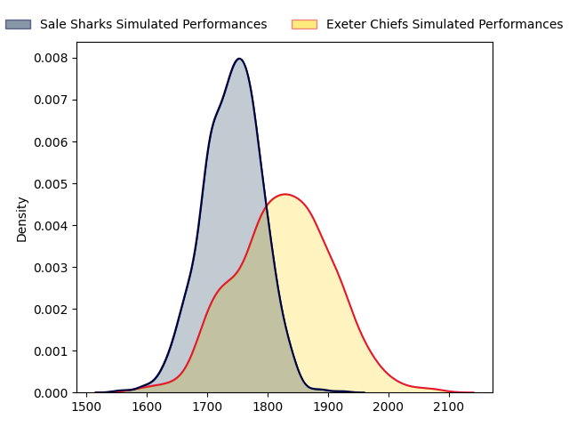
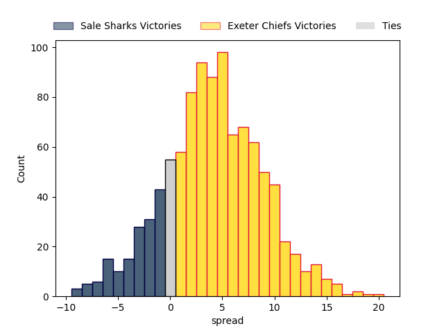

---  
layout: page  
title: Sale Sharks at Exeter Chiefs  
date: 2023-02-26 08:00:00 18:00:00 -0500  
categories: match projection  
---
# Sale Sharks at Exeter Chiefs

# Club Level Predictions

The first set of predictions treats a club as the smallest object, as the club develops its members, organizes a gameplan, and deploys its players as needed for each match. This club model has a prediction of 0.619, which translates to predicting Exeter Chiefs to win by 4.1.

Each club has a rating and a rating deviation (simiar to a Glicko system), and expected performances can be generated. This allows for simulated matches and spreads like the ones below.
## Projected Performances

## Projected Spreads

## Projected Results

# Player Level Predictions

Treating teams instead as an entity made up of the currently active players, I have ratings for each player in an altogether different system. These can be combined to form team ratings once teamsheets are announced, weighting starters a bit higher than the reserves. After the match is played, players can be weighted by their minutes on the field, allowing for an accurate measure of the team's composition. With these compiled team ratings, we can make predictions, measure inaccuracy, and update the individual player ratings.
## Prediction without Player Minutes: Exeter Chiefs by 11.4

Exeter Chiefs by 7.4 on a neutral field

| Away Player                                                       |   Away elo |   Away Percentile |   Number |   Home Percentile |   Home elo | Home Player                                                             |
|:------------------------------------------------------------------|-----------:|------------------:|---------:|------------------:|-----------:|:------------------------------------------------------------------------|
| [Bevan Rodd](..//playerfiles//BevanRodd_cleaned.md)               |     112.69 |                91 |        1 |                65 |      99.42 | [Scott Sio](..//playerfiles//ScottSio_cleaned.md)                       |
| [Ewan Ashman](..//playerfiles//EwanAshman_cleaned.md)             |      90.18 |                33 |        2 |                65 |      98.72 | [Jack Innard](..//playerfiles//JackInnard_cleaned.md)                   |
| [Coenie Oosthuizen](..//playerfiles//CoenieOosthuizen_cleaned.md) |     120.63 |                96 |        3 |                90 |     111.79 | [Harry Williams](..//playerfiles//HarryWilliams_cleaned.md)             |
| [Cobus Wiese](..//playerfiles//CobusWiese_cleaned.md)             |      92.63 |                42 |        4 |                92 |     119.31 | [Jannes Kirsten](..//playerfiles//JannesKirsten_cleaned.md)             |
| [Jonny Hill](..//playerfiles//JonnyHill_cleaned.md)               |      92.23 |                40 |        5 |                81 |     109.23 | [Jack Dunne](..//playerfiles//JackDunne_cleaned.md)                     |
| [Jono Ross](..//playerfiles//JonoRoss_cleaned.md)                 |     102.87 |                70 |        6 |                99 |     139.8  | [Dave Ewers](..//playerfiles//DaveEwers_cleaned.md)                     |
| [Jean-Luc du Preez](..//playerfiles//Jean-LucduPreez_cleaned.md)  |     111.19 |                86 |        8 |                95 |     122.77 | [Sam Simmonds](..//playerfiles//SamSimmonds_cleaned.md)                 |
| [Gus Warr](..//playerfiles//GusWarr_cleaned.md)                   |      80.63 |                14 |        9 |                 4 |      69.18 | [Sam Maunder](..//playerfiles//SamMaunder_cleaned.md)                   |
| [George Ford](..//playerfiles//GeorgeFord_cleaned.md)             |     116    |                89 |       10 |                70 |     102.16 | [Harvey Skinner](..//playerfiles//HarveySkinner_cleaned.md)             |
| [Tom O'Flaherty](..//playerfiles//TomO'Flaherty_cleaned.md)       |      89.39 |                33 |       11 |                98 |     132.56 | [Olly Woodburn](..//playerfiles//OllyWoodburn_cleaned.md)               |
| [Ryan Mills](..//playerfiles//RyanMills_cleaned.md)               |      96.66 |                55 |       12 |                95 |     120.98 | [Solomone Kata](..//playerfiles//SolomoneKata_cleaned.md)               |
| [Robert du Preez](..//playerfiles//RobertduPreez_cleaned.md)      |     108.83 |                83 |       13 |                52 |      95.71 | [Ian Whitten](..//playerfiles//IanWhitten_cleaned.md)                   |
| [Joe Carpenter](..//playerfiles//JoeCarpenter_cleaned.md)         |      68.52 |                 7 |       15 |                20 |      82.01 | [Josh Hodge](..//playerfiles//JoshHodge_cleaned.md)                     |
| [Nic Schonert](..//playerfiles//NicSchonert_cleaned.md)           |      89.03 |                28 |       18 |                75 |     106.06 | [Patrick Schickerling](..//playerfiles//PatrickSchickerling_cleaned.md) |
| [Raffi Quirke](..//playerfiles//RaffiQuirke_cleaned.md)           |     103.17 |                77 |       21 |                16 |      82.26 | [Jack Maunder](..//playerfiles//JackMaunder_cleaned.md)                 |
| [Sam James](..//playerfiles//SamJames_cleaned.md)                 |     129.08 |                97 |       22 |                91 |     120.63 | [Joe Simmonds](..//playerfiles//JoeSimmonds_cleaned.md)                 |
| [Arron Reed](..//playerfiles//ArronReed_cleaned.md)               |     104.14 |                75 |       23 |                32 |      86.22 | [Tom Hendrickson](..//playerfiles//TomHendrickson_cleaned.md)           |

