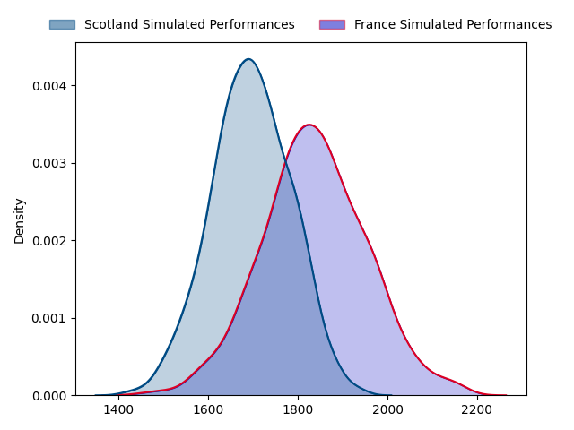
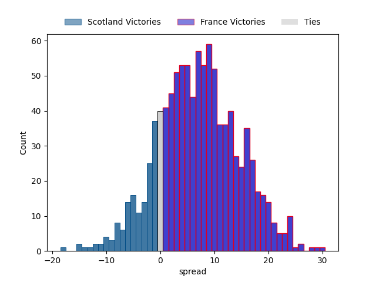

---  
layout: page  
title: Scotland at France  
date: 2023-02-26 10:00:00 18:00:00 -0500  
categories: match projection  
---
# Scotland at France

# Club Level Predictions

The first set of predictions treats a club as the smallest object, as the club develops its members, organizes a gameplan, and deploys its players as needed for each match. This club model has a prediction of 0.698, which translates to predicting France to win by 7.6.

Each club has a rating and a rating deviation (simiar to a Glicko system), and expected performances can be generated. This allows for simulated matches and spreads like the ones below.
## Projected Performances

## Projected Spreads

## Projected Results

# Player Level Predictions

Treating teams instead as an entity made up of the currently active players, I have ratings for each player in an altogether different system. These can be combined to form team ratings once teamsheets are announced, weighting starters a bit higher than the reserves. After the match is played, players can be weighted by their minutes on the field, allowing for an accurate measure of the team's composition. With these compiled team ratings, we can make predictions, measure inaccuracy, and update the individual player ratings.
## Prediction without Player Minutes: France by 2.1

Scotland by 1.9 on a neutral field

| Away Player                                                         |   Away elo |   Away Percentile |   Number |   Home Percentile |   Home elo | Home Player                                                     |
|:--------------------------------------------------------------------|-----------:|------------------:|---------:|------------------:|-----------:|:----------------------------------------------------------------|
| [Pierre Schoeman](..//playerfiles//PierreSchoeman_cleaned.md)       |      94.04 |                46 |        1 |                61 |      98    | [Cyril Baille](..//playerfiles//CyrilBaille_cleaned.md)         |
| [George Turner](..//playerfiles//GeorgeTurner_cleaned.md)           |     125.87 |                97 |        2 |                70 |     100.88 | [Julien Marchand](..//playerfiles//JulienMarchand_cleaned.md)   |
| [Richie Gray](..//playerfiles//RichieGray_cleaned.md)               |     126.26 |                96 |        4 |                83 |     108.73 | [Thibaud Flament](..//playerfiles//ThibaudFlament_cleaned.md)   |
| [Grant Gilchrist](..//playerfiles//GrantGilchrist_cleaned.md)       |     134.71 |                98 |        5 |                99 |     136.9  | [Paul Willemse](..//playerfiles//PaulWillemse_cleaned.md)       |
| [Jamie Ritchie](..//playerfiles//JamieRitchie_cleaned.md)           |     138.74 |                98 |        6 |                49 |      94.72 | [Anthony Jelonch](..//playerfiles//AnthonyJelonch_cleaned.md)   |
| [Matt Fagerson](..//playerfiles//MattFagerson_cleaned.md)           |     106.79 |                81 |        8 |                89 |     114.38 | [Gregory Alldritt](..//playerfiles//GregoryAlldritt_cleaned.md) |
| [Ben White](..//playerfiles//BenWhite_cleaned.md)                   |     110.87 |                87 |        9 |                98 |     125.15 | [Antoine Dupont](..//playerfiles//AntoineDupont_cleaned.md)     |
| [Finn Russell](..//playerfiles//FinnRussell_cleaned.md)             |     140.47 |                99 |       10 |                95 |     125.28 | [Romain Ntamack](..//playerfiles//RomainNtamack_cleaned.md)     |
| [Duhan van der Merwe](..//playerfiles//DuhanvanderMerwe_cleaned.md) |     106.55 |                80 |       11 |                76 |     104.63 | [Ethan Dumortier](..//playerfiles//EthanDumortier_cleaned.md)   |
| [Sione Tuipulotu](..//playerfiles//SioneTuipulotu_cleaned.md)       |      92.54 |                43 |       12 |                46 |      93.44 | [Yoram Moefana](..//playerfiles//YoramMoefana_cleaned.md)       |
| [Huw Jones](..//playerfiles//HuwJones_cleaned.md)                   |      80.35 |                12 |       13 |                73 |     102.64 | [Gael Fickou](..//playerfiles//GaelFickou_cleaned.md)           |
| [Kyle Steyn](..//playerfiles//KyleSteyn_cleaned.md)                 |     113.72 |                89 |       14 |                85 |     110.09 | [Damian Penaud](..//playerfiles//DamianPenaud_cleaned.md)       |
| [Stuart Hogg](..//playerfiles//StuartHogg_cleaned.md)               |     112.42 |                85 |       15 |                92 |     119.41 | [Thomas Ramos](..//playerfiles//ThomasRamos_cleaned.md)         |

