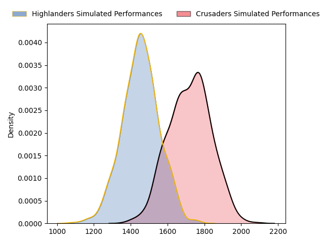
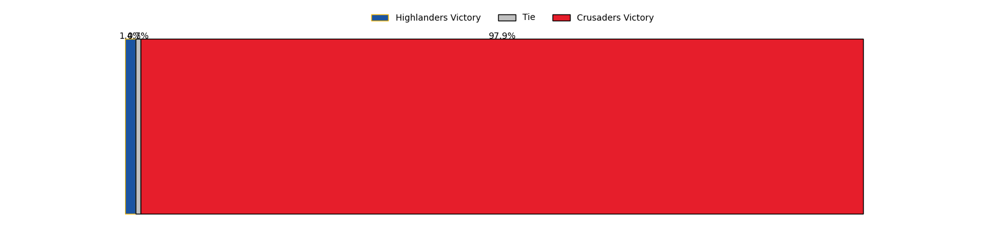

---  
layout: page  
title: Highlanders at Crusaders  
date: 2023-03-03 02:00:00 18:00:00 -0500  
categories: match projection  
---
# Highlanders at Crusaders

# Club Level Predictions

The first set of predictions treats a club as the smallest object, as the club develops its members, organizes a gameplan, and deploys its players as needed for each match. This club model has a prediction of 0.835, which translates to predicting Crusaders to win by 15.1.

Each club has a rating and a rating deviation (simiar to a Glicko system), and expected performances can be generated. This allows for simulated matches and spreads like the ones below.
## Projected Performances

## Projected Spreads

## Projected Results

# Player Level Predictions

Treating teams instead as an entity made up of the currently active players, I have ratings for each player in an altogether different system. These can be combined to form team ratings once teamsheets are announced, weighting starters a bit higher than the reserves. After the match is played, players can be weighted by their minutes on the field, allowing for an accurate measure of the team's composition. With these compiled team ratings, we can make predictions, measure inaccuracy, and update the individual player ratings.
## Prediction without Player Minutes: Crusaders by 7.0

Crusaders by 3.0 on a neutral field

| Away Player                                                                 |   Away elo |   Away Percentile |   Number |   Home Percentile |   Home elo | Home Player                                                                 |
|:----------------------------------------------------------------------------|-----------:|------------------:|---------:|------------------:|-----------:|:----------------------------------------------------------------------------|
| [Andrew Makalio](..//playerfiles//AndrewMakalio_cleaned.md)                 |     104.07 |                79 |        2 |                81 |     105.66 | [Codie Taylor](..//playerfiles//CodieTaylor_cleaned.md)                     |
| [Jermaine Ainsley](..//playerfiles//JermaineAinsley_cleaned.md)             |     108.2  |                86 |        3 |                41 |      91.25 | [Tamaiti Williams](..//playerfiles//TamaitiWilliams_cleaned.md)             |
| [Pari Pari Parkinson](..//playerfiles//PariPariParkinson_cleaned.md)        |     155.43 |               100 |        4 |                93 |     120.27 | [Scott Barrett](..//playerfiles//ScottBarrett_cleaned.md)                   |
| [Billy Harmon](..//playerfiles//BillyHarmon_cleaned.md)                     |     118.07 |                92 |        6 |                97 |     130.98 | [Ethan Blackadder](..//playerfiles//EthanBlackadder_cleaned.md)             |
| [Sean Withy](..//playerfiles//SeanWithy_cleaned.md)                         |      90.64 |                54 |        7 |                66 |     100.12 | [Tom Christie](..//playerfiles//TomChristie_cleaned.md)                     |
| [Kemara Hauiti-Parapara](..//playerfiles//KemaraHauiti-Parapara_cleaned.md) |      97.37 |                58 |        9 |                23 |      85.71 | [Mitchell Drummond](..//playerfiles//MitchellDrummond_cleaned.md)           |
| [Freddie Burns](..//playerfiles//FreddieBurns_cleaned.md)                   |     116.6  |                90 |       10 |                99 |     146.63 | [Richie Mo'unga](..//playerfiles//RichieMo'unga_cleaned.md)                 |
| [Connor Garden-Bachop](..//playerfiles//ConnorGarden-Bachop_cleaned.md)     |      95.62 |                52 |       11 |                47 |      94.09 | [Leicester Fainga'anuku](..//playerfiles//LeicesterFainga'anuku_cleaned.md) |
| [Thomas Umaga-Jensen](..//playerfiles//ThomasUmaga-Jensen_cleaned.md)       |      97.03 |                56 |       12 |                96 |     126.38 | [David Havili](..//playerfiles//DavidHavili_cleaned.md)                     |
| [Josh Timu](..//playerfiles//JoshTimu_cleaned.md)                           |      92.93 |                44 |       13 |                88 |     112.97 | [Jack Goodhue](..//playerfiles//JackGoodhue_cleaned.md)                     |
| [Jonah Lowe](..//playerfiles//JonahLowe_cleaned.md)                         |     106.53 |                80 |       14 |                98 |     136.31 | [Sevu Reece](..//playerfiles//SevuReece_cleaned.md)                         |
| [Sam Gilbert](..//playerfiles//SamGilbert_cleaned.md)                       |      89.83 |                37 |       15 |                16 |      82.36 | [Fergus Burke](..//playerfiles//FergusBurke_cleaned.md)                     |
| [Rhys Marshall](..//playerfiles//RhysMarshall_cleaned.md)                   |     106.02 |                82 |       16 |                84 |     104.84 | [Brodie McAlister](..//playerfiles//BrodieMcAlister_cleaned.md)             |
| [Dan Lienert-Brown](..//playerfiles//DanLienert-Brown_cleaned.md)           |     100.42 |                72 |       17 |                15 |      81.12 | [George Bower](..//playerfiles//GeorgeBower_cleaned.md)                     |
| [Mitch Hunt](..//playerfiles//MitchHunt_cleaned.md)                         |     123.25 |                93 |       22 |                88 |     112.99 | [Braydon Ennor](..//playerfiles//BraydonEnnor_cleaned.md)                   |

