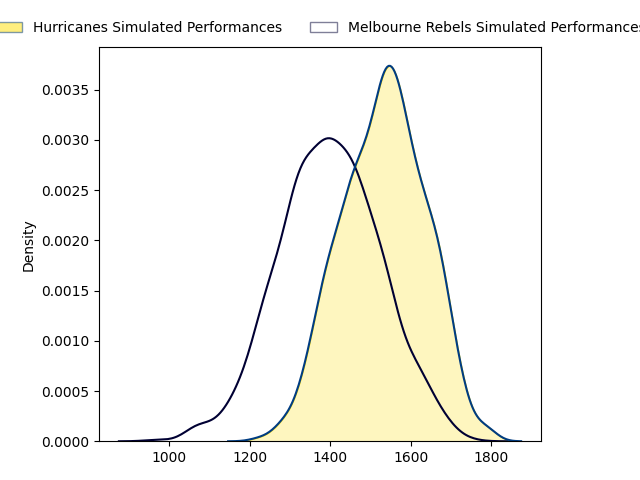
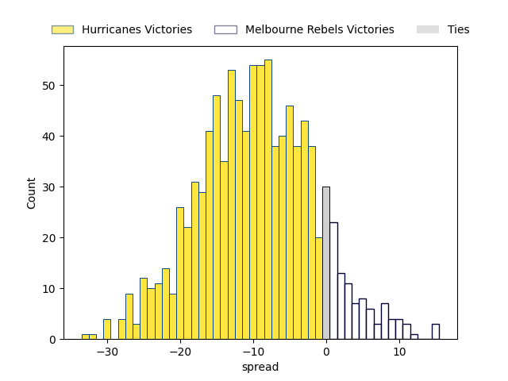
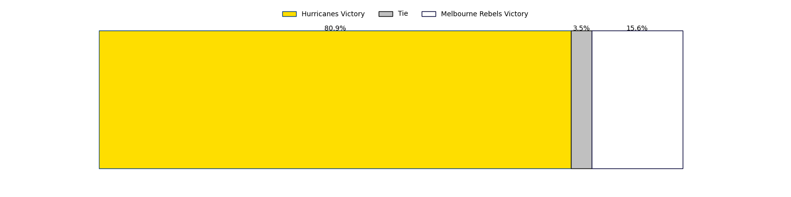

---  
layout: page  
title: Hurricanes at Melbourne Rebels  
date: 2023-03-03 04:10:00 18:00:00 -0500  
categories: match projection  
---
# Hurricanes at Melbourne Rebels

# Club Level Predictions

The first set of predictions treats a club as the smallest object, as the club develops its members, organizes a gameplan, and deploys its players as needed for each match. This club model has a prediction of 0.257, which translates to predicting Hurricanes to win by 9.6.

Each club has a rating and a rating deviation (simiar to a Glicko system), and expected performances can be generated. This allows for simulated matches and spreads like the ones below.
## Projected Performances

## Projected Spreads

## Projected Results

# Player Level Predictions

Treating teams instead as an entity made up of the currently active players, I have ratings for each player in an altogether different system. These can be combined to form team ratings once teamsheets are announced, weighting starters a bit higher than the reserves. After the match is played, players can be weighted by their minutes on the field, allowing for an accurate measure of the team's composition. With these compiled team ratings, we can make predictions, measure inaccuracy, and update the individual player ratings.
## Prediction without Player Minutes: Hurricanes by 14.4

Hurricanes by 18.4 on a neutral field

| Away Player                                                       |   Away elo |   Away Percentile |   Number |   Home Percentile |   Home elo | Home Player                                                          |
|:------------------------------------------------------------------|-----------:|------------------:|---------:|------------------:|-----------:|:---------------------------------------------------------------------|
| [Xavier Numia](..//playerfiles//XavierNumia_cleaned.md)           |     127.14 |                98 |        1 |                91 |     113.39 | [Matt Gibbon](..//playerfiles//MattGibbon_cleaned.md)                |
| [Dane Coles](..//playerfiles//DaneColes_cleaned.md)               |     131.17 |                98 |        2 |                58 |      96.62 | [Alex Mafi](..//playerfiles//AlexMafi_cleaned.md)                    |
| [Tyrel Lomax](..//playerfiles//TyrelLomax_cleaned.md)             |     146.2  |                99 |        3 |                41 |      92.71 | [Sam Talakai](..//playerfiles//SamTalakai_cleaned.md)                |
| [James Blackwell](..//playerfiles//JamesBlackwell_cleaned.md)     |     100.41 |                66 |        4 |                64 |      99.79 | [Josh Canham](..//playerfiles//JoshCanham_cleaned.md)                |
| [Brayden Iose](..//playerfiles//BraydenIose_cleaned.md)           |      60.08 |                 1 |        6 |                40 |      92.04 | [Tuaina Taii Tualima](..//playerfiles//TuainaTaiiTualima_cleaned.md) |
| [Du'Plessis Kirifi](..//playerfiles//Du'PlessisKirifi_cleaned.md) |     128.75 |                96 |        7 |                66 |     100.01 | [Brad Wilkin](..//playerfiles//BradWilkin_cleaned.md)                |
| [Ardie Savea](..//playerfiles//ArdieSavea_cleaned.md)             |     124.59 |                96 |        8 |                44 |      93.73 | [Richard Hardwick](..//playerfiles//RichardHardwick_cleaned.md)      |
| [Cam Roigard](..//playerfiles//CamRoigard_cleaned.md)             |     101.17 |                70 |        9 |                98 |     128.95 | [Ryan Louwrens](..//playerfiles//RyanLouwrens_cleaned.md)            |
| [Aidan Morgan](..//playerfiles//AidanMorgan_cleaned.md)           |     108.18 |                82 |       10 |                54 |      97.14 | [Carter Gordon](..//playerfiles//CarterGordon_cleaned.md)            |
| [Salesi Rayasi](..//playerfiles//SalesiRayasi_cleaned.md)         |     100.45 |                67 |       11 |                95 |     124.08 | [Monty Ioane](..//playerfiles//MontyIoane_cleaned.md)                |
| [Jordie Barrett](..//playerfiles//JordieBarrett_cleaned.md)       |     135.56 |                98 |       12 |                90 |     114.62 | [Stacey Ili](..//playerfiles//StaceyIli_cleaned.md)                  |
| [Billy Proctor](..//playerfiles//BillyProctor_cleaned.md)         |     122.09 |                95 |       13 |                78 |     105.31 | [Reece Hodge](..//playerfiles//ReeceHodge_cleaned.md)                |
| [Julian Savea](..//playerfiles//JulianSavea_cleaned.md)           |     139.12 |                98 |       14 |                35 |      90.05 | [Lachie Anderson](..//playerfiles//LachieAnderson_cleaned.md)        |
| [Asafo Aumua](..//playerfiles//AsafoAumua_cleaned.md)             |     124.18 |                96 |       16 |                61 |      97.95 | [Jordan Uelese](..//playerfiles//JordanUelese_cleaned.md)            |
| [Owen Franks](..//playerfiles//OwenFranks_cleaned.md)             |      93.89 |                45 |       18 |                74 |      97.77 | [Pone Fa'amausili](..//playerfiles//PoneFa'amausili_cleaned.md)      |
| [Peter Lakai](..//playerfiles//PeterLakai_cleaned.md)             |     107.22 |                78 |       20 |                42 |      92.06 | [Josh Kemeny](..//playerfiles//JoshKemeny_cleaned.md)                |
| [Jamie Booth](..//playerfiles//JamieBooth_cleaned.md)             |      69.66 |                 4 |       21 |                61 |      98.09 | [James Tuttle](..//playerfiles//JamesTuttle_cleaned.md)              |
| [Harry Godfrey](..//playerfiles//HarryGodfrey_cleaned.md)         |      87.54 |                32 |       23 |                 9 |      72.84 | [Nick Jooste](..//playerfiles//NickJooste_cleaned.md)                |

