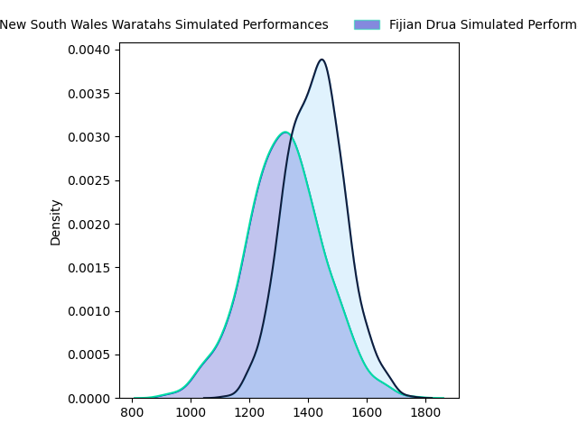
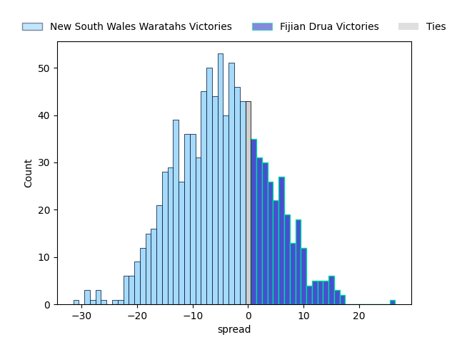
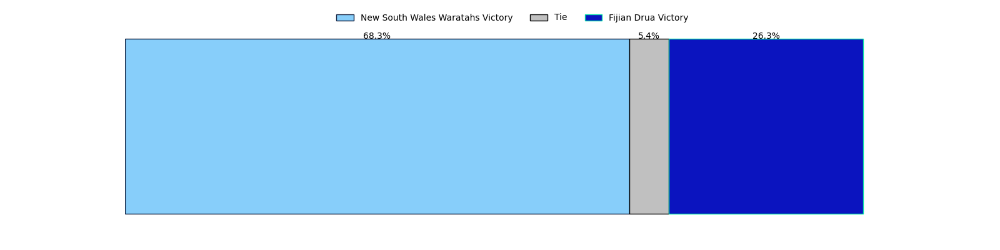

---  
layout: page  
title: New South Wales Waratahs at Fijian Drua  
date: 2023-03-04 03:35:00 18:00:00 -0500  
categories: match projection  
---
# New South Wales Waratahs at Fijian Drua

# Club Level Predictions

The first set of predictions treats a club as the smallest object, as the club develops its members, organizes a gameplan, and deploys its players as needed for each match. This club model has a prediction of 0.386, which translates to predicting New South Wales Waratahs to win by 4.2.

Each club has a rating and a rating deviation (simiar to a Glicko system), and expected performances can be generated. This allows for simulated matches and spreads like the ones below.
## Projected Performances

## Projected Spreads

## Projected Results

# Player Level Predictions

Treating teams instead as an entity made up of the currently active players, I have ratings for each player in an altogether different system. These can be combined to form team ratings once teamsheets are announced, weighting starters a bit higher than the reserves. After the match is played, players can be weighted by their minutes on the field, allowing for an accurate measure of the team's composition. With these compiled team ratings, we can make predictions, measure inaccuracy, and update the individual player ratings.
## Prediction without Player Minutes: Fijian Drua by 9.5

Fijian Drua by 5.5 on a neutral field

| Away Player                                                           |   Away elo |   Away Percentile |   Number |   Home Percentile |   Home elo | Home Player                                                                     |
|:----------------------------------------------------------------------|-----------:|------------------:|---------:|------------------:|-----------:|:--------------------------------------------------------------------------------|
| [Dave Porecki](..//playerfiles//DavePorecki_cleaned.md)               |     112.68 |                90 |        2 |                94 |     117.81 | [Tevita Ikanivere](..//playerfiles//TevitaIkanivere_cleaned.md)                 |
| [Jed Holloway](..//playerfiles//JedHolloway_cleaned.md)               |      84.42 |                20 |        4 |                97 |     128.25 | [Isoa Nasilasila](..//playerfiles//IsoaNasilasila_cleaned.md)                   |
| [Hugh Sinclair](..//playerfiles//HughSinclair_cleaned.md)             |      82.2  |                22 |        5 |                41 |      92.4  | [Ratu Rotuisolia](..//playerfiles//RatuRotuisolia_cleaned.md)                   |
| [Lachlan Swinton](..//playerfiles//LachlanSwinton_cleaned.md)         |     100.86 |                67 |        6 |                21 |      85.87 | [Joseva Tamani](..//playerfiles//JosevaTamani_cleaned.md)                       |
| [Michael Hooper](..//playerfiles//MichaelHooper_cleaned.md)           |     131.86 |                97 |        7 |                 5 |      72.88 | [Kitione Salawa](..//playerfiles//KitioneSalawa_cleaned.md)                     |
| [Langi Gleeson](..//playerfiles//LangiGleeson_cleaned.md)             |     103.23 |                73 |        8 |                89 |     115.67 | [Te Ahiwaru Cirikidaveta](..//playerfiles//TeAhiwaruCirikidaveta_cleaned.md)    |
| [Jake Gordon](..//playerfiles//JakeGordon_cleaned.md)                 |     123.86 |                97 |        9 |                26 |      86.8  | [Frank Lomani](..//playerfiles//FrankLomani_cleaned.md)                         |
| [Tane Edmed](..//playerfiles//TaneEdmed_cleaned.md)                   |      88.64 |                27 |       10 |                23 |      88.26 | [Caleb Muntz](..//playerfiles//CalebMuntz_cleaned.md)                           |
| [Max Jorgensen](..//playerfiles//MaxJorgensen_cleaned.md)             |      86.85 |                24 |       11 |                91 |     116.72 | [Tuidraki Samusamuvodre](..//playerfiles//TuidrakiSamusamuvodre_cleaned.md)     |
| [Lalakai Foketi](..//playerfiles//LalakaiFoketi_cleaned.md)           |      98.76 |                61 |       12 |                99 |     147.2  | [Kalaveti Ravouvou](..//playerfiles//KalavetiRavouvou_cleaned.md)               |
| [Izaia Perese](..//playerfiles//IzaiaPerese_cleaned.md)               |      82.85 |                16 |       13 |                61 |      98.69 | [Iosefo Masi](..//playerfiles//IosefoMasi_cleaned.md)                           |
| [Mark Nawaqanitawase](..//playerfiles//MarkNawaqanitawase_cleaned.md) |      95.01 |                51 |       14 |                36 |      90.21 | [Selestino Ravutaumada](..//playerfiles//SelestinoRavutaumada_cleaned.md)       |
| [Ben Donaldson](..//playerfiles//BenDonaldson_cleaned.md)             |     105.75 |                74 |       15 |                69 |     102.89 | [Ilaisa Droasese](..//playerfiles//IlaisaDroasese_cleaned.md)                   |
| [Taleni Seu](..//playerfiles//TaleniSeu_cleaned.md)                   |     110.24 |                85 |       19 |                24 |      87.21 | [Sorovakatini Tuifagalele](..//playerfiles//SorovakatiniTuifagalele_cleaned.md) |
| [Charlie Gamble](..//playerfiles//CharlieGamble_cleaned.md)           |      95.61 |                50 |       21 |                72 |     102.12 | [Peni Matawalu](..//playerfiles//PeniMatawalu_cleaned.md)                       |

