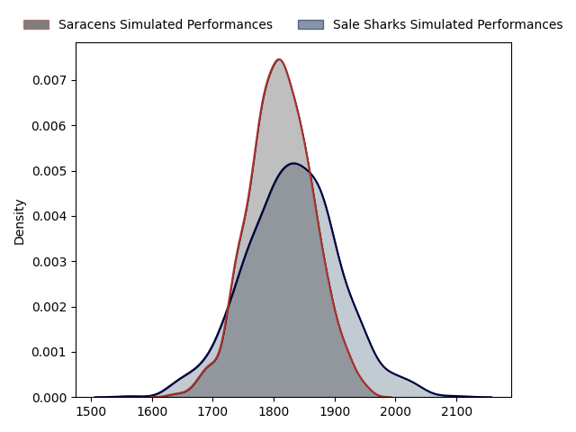
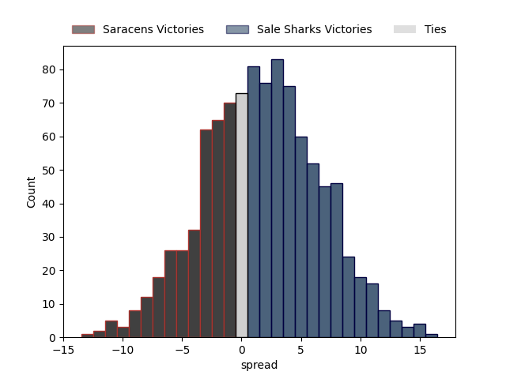

---  
layout: page  
title: Saracens at Sale Sharks  
date: 2023-03-05 10:00:00 18:00:00 -0500  
categories: match projection  
---
# Saracens at Sale Sharks

# Club Level Predictions

The first set of predictions treats a club as the smallest object, as the club develops its members, organizes a gameplan, and deploys its players as needed for each match. This club model has a prediction of 0.545, which translates to predicting Sale Sharks to win by 1.4.

Each club has a rating and a rating deviation (simiar to a Glicko system), and expected performances can be generated. This allows for simulated matches and spreads like the ones below.
## Projected Performances

## Projected Spreads

## Projected Results

# Player Level Predictions

Treating teams instead as an entity made up of the currently active players, I have ratings for each player in an altogether different system. These can be combined to form team ratings once teamsheets are announced, weighting starters a bit higher than the reserves. After the match is played, players can be weighted by their minutes on the field, allowing for an accurate measure of the team's composition. With these compiled team ratings, we can make predictions, measure inaccuracy, and update the individual player ratings.
## Prediction without Player Minutes: Sale Sharks by 7.4

Sale Sharks by 3.4 on a neutral field

| Away Player                                                 |   Away elo |   Away Percentile |   Number |   Home Percentile |   Home elo | Home Player                                                       |
|:------------------------------------------------------------|-----------:|------------------:|---------:|------------------:|-----------:|:------------------------------------------------------------------|
| [Eroni Mawi](..//playerfiles//EroniMawi_cleaned.md)         |      84.97 |                17 |        1 |                89 |     111.78 | [Bevan Rodd](..//playerfiles//BevanRodd_cleaned.md)               |
| [Theo Dan](..//playerfiles//TheoDan_cleaned.md)             |      98.09 |                60 |        2 |                35 |      90.59 | [Ewan Ashman](..//playerfiles//EwanAshman_cleaned.md)             |
| [Alec Clarey](..//playerfiles//AlecClarey_cleaned.md)       |      90.38 |                33 |        3 |                96 |     121.69 | [Coenie Oosthuizen](..//playerfiles//CoenieOosthuizen_cleaned.md) |
| [Nick Isiekwe](..//playerfiles//NickIsiekwe_cleaned.md)     |      89.26 |                32 |        4 |                51 |      95.68 | [Cobus Wiese](..//playerfiles//CobusWiese_cleaned.md)             |
| [Hugh Tizard](..//playerfiles//HughTizard_cleaned.md)       |      93.35 |                44 |        5 |                59 |      98.02 | [Jonny Hill](..//playerfiles//JonnyHill_cleaned.md)               |
| [Tom Ellis](..//playerfiles//TomEllis_cleaned.md)           |      81.93 |                16 |        6 |                69 |     101.69 | [Jono Ross](..//playerfiles//JonoRoss_cleaned.md)                 |
| [Andy Christie](..//playerfiles//AndyChristie_cleaned.md)   |      89.16 |                31 |        7 |                44 |      92.83 | [Sam Dugdale](..//playerfiles//SamDugdale_cleaned.md)             |
| [Billy Vunipola](..//playerfiles//BillyVunipola_cleaned.md) |     111.75 |                86 |        8 |                85 |     110.82 | [Jean-Luc du Preez](..//playerfiles//Jean-LucduPreez_cleaned.md)  |
| [Aled Davies](..//playerfiles//AledDavies_cleaned.md)       |     101.61 |                70 |        9 |                14 |      79.99 | [Gus Warr](..//playerfiles//GusWarr_cleaned.md)                   |
| [Manu Vunipola](..//playerfiles//ManuVunipola_cleaned.md)   |      97.28 |                55 |       10 |                82 |     108.43 | [Robert du Preez](..//playerfiles//RobertduPreez_cleaned.md)      |
| [Alex Lewington](..//playerfiles//AlexLewington_cleaned.md) |      94.05 |                47 |       11 |                28 |      88.14 | [Tom O'Flaherty](..//playerfiles//TomO'Flaherty_cleaned.md)       |
| [Nick Tompkins](..//playerfiles//NickTompkins_cleaned.md)   |     146.02 |                99 |       12 |                81 |     107.22 | [Ryan Mills](..//playerfiles//RyanMills_cleaned.md)               |
| [Alex Lozowski](..//playerfiles//AlexLozowski_cleaned.md)   |      96.49 |                54 |       13 |                94 |     119.93 | [Sam James](..//playerfiles//SamJames_cleaned.md)                 |
| [Sean Maitland](..//playerfiles//SeanMaitland_cleaned.md)   |     115.66 |                89 |       14 |                90 |     114.77 | [Tom Roebuck](..//playerfiles//TomRoebuck_cleaned.md)             |
| [Alex Goode](..//playerfiles//AlexGoode_cleaned.md)         |     103.09 |                70 |       15 |                 5 |      66.52 | [Joe Carpenter](..//playerfiles//JoeCarpenter_cleaned.md)         |
| [Eduardo Bello](..//playerfiles//EduardoBello_cleaned.md)   |      83.22 |                15 |       18 |                28 |      88.71 | [Nic Schonert](..//playerfiles//NicSchonert_cleaned.md)           |
| [Ivan van Zyl](..//playerfiles//IvanvanZyl_cleaned.md)      |     114.2  |                92 |       21 |                76 |     103.49 | [Raffi Quirke](..//playerfiles//RaffiQuirke_cleaned.md)           |
| [Olly Hartley](..//playerfiles//OllyHartley_cleaned.md)     |     101.21 |                68 |       22 |                91 |     116.05 | [Luke James](..//playerfiles//LukeJames_cleaned.md)               |
| [Rotimi Segun](..//playerfiles//RotimiSegun_cleaned.md)     |     108.69 |                83 |       23 |                71 |     103.66 | [Arron Reed](..//playerfiles//ArronReed_cleaned.md)               |

