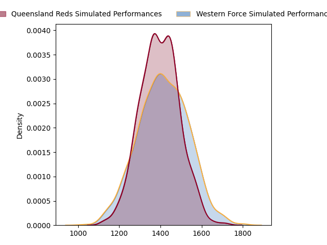
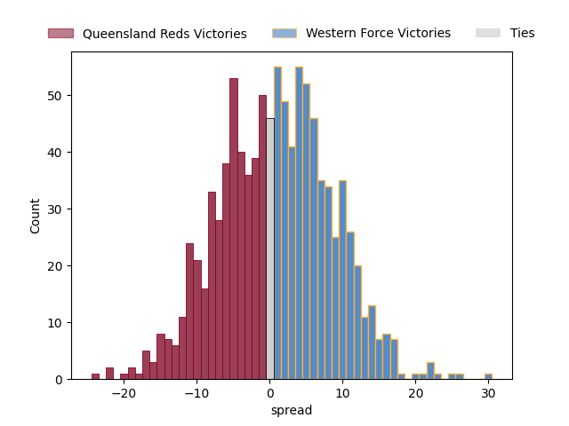

---  
layout: page  
title: Queensland Reds at Western Force  
date: 2023-03-05 00:30:00 18:00:00 -0500  
categories: match projection  
---
# Queensland Reds at Western Force

# Club Level Predictions

The first set of predictions treats a club as the smallest object, as the club develops its members, organizes a gameplan, and deploys its players as needed for each match. This club model has a prediction of 0.519, which translates to predicting Western Force to win by 0.9.

Each club has a rating and a rating deviation (simiar to a Glicko system), and expected performances can be generated. This allows for simulated matches and spreads like the ones below.
## Projected Performances

## Projected Spreads

## Projected Results

# Player Level Predictions

Treating teams instead as an entity made up of the currently active players, I have ratings for each player in an altogether different system. These can be combined to form team ratings once teamsheets are announced, weighting starters a bit higher than the reserves. After the match is played, players can be weighted by their minutes on the field, allowing for an accurate measure of the team's composition. With these compiled team ratings, we can make predictions, measure inaccuracy, and update the individual player ratings.
## Prediction without Player Minutes: Western Force by 6.6

Western Force by 2.6 on a neutral field

| Away Player                                                   |   Away elo |   Away Percentile |   Number |   Home Percentile |   Home elo | Home Player                                                               |
|:--------------------------------------------------------------|-----------:|------------------:|---------:|------------------:|-----------:|:--------------------------------------------------------------------------|
| [Dane Zander](..//playerfiles//DaneZander_cleaned.md)         |     101.93 |                75 |        1 |                94 |     117.82 | [Tom Robertson](..//playerfiles//TomRobertson_cleaned.md)                 |
| [Matt Faessler](..//playerfiles//MattFaessler_cleaned.md)     |      93.36 |                47 |        2 |                98 |     132.18 | [Folau Fainga'a](..//playerfiles//FolauFainga'a_cleaned.md)               |
| [Zane Nonggorr](..//playerfiles//ZaneNonggorr_cleaned.md)     |      92.2  |                39 |        3 |                96 |     120.73 | [Santiago Medrano](..//playerfiles//SantiagoMedrano_cleaned.md)           |
| [Ryan Smith](..//playerfiles//RyanSmith_cleaned.md)           |      91.18 |                37 |        4 |                 9 |      76.42 | [Jeremy Williams](..//playerfiles//JeremyWilliams_cleaned.md)             |
| [Seru Uru](..//playerfiles//SeruUru_cleaned.md)               |      93.28 |                45 |        5 |                88 |     113.66 | [Jeremy Thrush](..//playerfiles//JeremyThrush_cleaned.md)                 |
| [Fraser McReight](..//playerfiles//FraserMcReight_cleaned.md) |     108.89 |                82 |        7 |                34 |      90.08 | [Ollie Callan](..//playerfiles//OllieCallan_cleaned.md)                   |
| [Tate McDermott](..//playerfiles//TateMcDermott_cleaned.md)   |     100.45 |                67 |        9 |                62 |      99.97 | [Issak Fines-Leleiwasa](..//playerfiles//IssakFines-Leleiwasa_cleaned.md) |
| [Tom Lynagh](..//playerfiles//TomLynagh_cleaned.md)           |      88.94 |                28 |       10 |                83 |     108.9  | [Bryce Hegarty](..//playerfiles//BryceHegarty_cleaned.md)                 |
| [Filipo Daugunu](..//playerfiles//FilipoDaugunu_cleaned.md)   |     119.71 |                93 |       11 |                 9 |      74.61 | [Zach Kibirige](..//playerfiles//ZachKibirige_cleaned.md)                 |
| [Hunter Paisami](..//playerfiles//HunterPaisami_cleaned.md)   |     113.08 |                88 |       12 |                98 |     133.32 | [Hamish Stewart](..//playerfiles//HamishStewart_cleaned.md)               |
| [Josh Flook](..//playerfiles//JoshFlook_cleaned.md)           |      88.24 |                28 |       13 |                22 |      85.96 | [Bayley Kuenzle](..//playerfiles//BayleyKuenzle_cleaned.md)               |
| [Jordan Petaia](..//playerfiles//JordanPetaia_cleaned.md)     |      93.5  |                47 |       15 |                74 |     105.98 | [Chase Tiatia](..//playerfiles//ChaseTiatia_cleaned.md)                   |
| [Richie Asiata](..//playerfiles//RichieAsiata_cleaned.md)     |     114.66 |                90 |       16 |                75 |     104.08 | [Tom Horton](..//playerfiles//TomHorton_cleaned.md)                       |
| [Kalani Thomas](..//playerfiles//KalaniThomas_cleaned.md)     |      97.05 |                62 |       21 |                85 |     108.59 | [Ian Prior](..//playerfiles//IanPrior_cleaned.md)                         |

