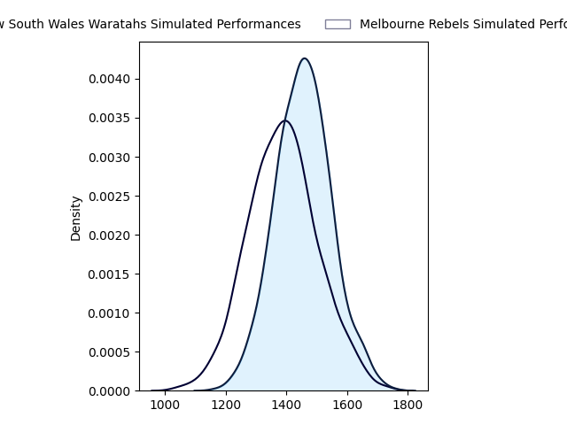
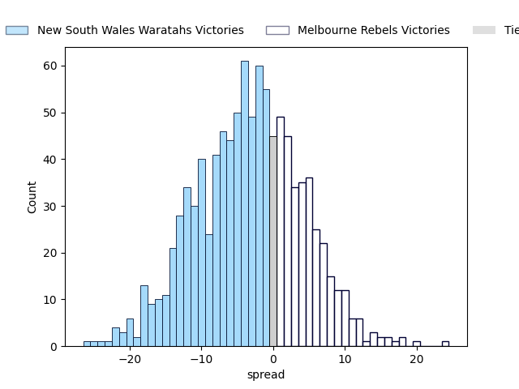
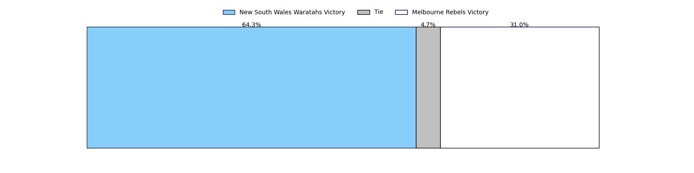

---  
layout: page  
title: New South Wales Waratahs at Melbourne Rebels  
date: 2023-03-10 03:35:00 18:00:00 -0500  
categories: match projection  
---
# New South Wales Waratahs at Melbourne Rebels

# Club Level Predictions

The first set of predictions treats a club as the smallest object, as the club develops its members, organizes a gameplan, and deploys its players as needed for each match. This club model has a prediction of 0.414, which translates to predicting New South Wales Waratahs to win by 3.0.

Each club has a rating and a rating deviation (simiar to a Glicko system), and expected performances can be generated. This allows for simulated matches and spreads like the ones below.
## Projected Performances

## Projected Spreads

## Projected Results

# Player Level Predictions

Treating teams instead as an entity made up of the currently active players, I have ratings for each player in an altogether different system. These can be combined to form team ratings once teamsheets are announced, weighting starters a bit higher than the reserves. After the match is played, players can be weighted by their minutes on the field, allowing for an accurate measure of the team's composition. With these compiled team ratings, we can make predictions, measure inaccuracy, and update the individual player ratings.
## Prediction without Player Minutes: New South Wales Waratahs by 1.3

New South Wales Waratahs by 5.3 on a neutral field

| Away Player                                                           |   Away elo |   Away Percentile |   Number |   Home Percentile |   Home elo | Home Player                                                          |
|:----------------------------------------------------------------------|-----------:|------------------:|---------:|------------------:|-----------:|:---------------------------------------------------------------------|
| [Tom Lambert](..//playerfiles//TomLambert_cleaned.md)                 |      99.37 |                66 |        1 |                48 |      94.35 | [Matt Gibbon](..//playerfiles//MattGibbon_cleaned.md)                |
| [Dave Porecki](..//playerfiles//DavePorecki_cleaned.md)               |      97.79 |                61 |        2 |                50 |      93.91 | [Alex Mafi](..//playerfiles//AlexMafi_cleaned.md)                    |
| [Jed Holloway](..//playerfiles//JedHolloway_cleaned.md)               |      99.11 |                62 |        4 |                48 |      94.54 | [Josh Canham](..//playerfiles//JoshCanham_cleaned.md)                |
| [Hugh Sinclair](..//playerfiles//HughSinclair_cleaned.md)             |      99.48 |                62 |        5 |                45 |      93.44 | [Trevor Hosea](..//playerfiles//TrevorHosea_cleaned.md)              |
| [Lachlan Swinton](..//playerfiles//LachlanSwinton_cleaned.md)         |      98.6  |                60 |        6 |                59 |      96.13 | [Josh Kemeny](..//playerfiles//JoshKemeny_cleaned.md)                |
| [Michael Hooper](..//playerfiles//MichaelHooper_cleaned.md)           |      99.11 |                63 |        7 |                45 |      93.06 | [Brad Wilkin](..//playerfiles//BradWilkin_cleaned.md)                |
| [Langi Gleeson](..//playerfiles//LangiGleeson_cleaned.md)             |     100.6  |                66 |        8 |                47 |      95.22 | [Richard Hardwick](..//playerfiles//RichardHardwick_cleaned.md)      |
| [Jake Gordon](..//playerfiles//JakeGordon_cleaned.md)                 |      97.75 |                59 |        9 |                50 |      94.47 | [Ryan Louwrens](..//playerfiles//RyanLouwrens_cleaned.md)            |
| [Tane Edmed](..//playerfiles//TaneEdmed_cleaned.md)                   |      98    |                58 |       10 |                48 |      94.54 | [Carter Gordon](..//playerfiles//CarterGordon_cleaned.md)            |
| [Max Jorgensen](..//playerfiles//MaxJorgensen_cleaned.md)             |      99.11 |                61 |       11 |                51 |      95.45 | [Monty Ioane](..//playerfiles//MontyIoane_cleaned.md)                |
| [Lalakai Foketi](..//playerfiles//LalakaiFoketi_cleaned.md)           |      99.11 |                62 |       12 |                47 |      94.54 | [Stacey Ili](..//playerfiles//StaceyIli_cleaned.md)                  |
| [Izaia Perese](..//playerfiles//IzaiaPerese_cleaned.md)               |     100.88 |                67 |       13 |                47 |      94.54 | [Reece Hodge](..//playerfiles//ReeceHodge_cleaned.md)                |
| [Mark Nawaqanitawase](..//playerfiles//MarkNawaqanitawase_cleaned.md) |      99.11 |                61 |       14 |                49 |      94.54 | [Lachie Anderson](..//playerfiles//LachieAnderson_cleaned.md)        |
| [Ben Donaldson](..//playerfiles//BenDonaldson_cleaned.md)             |      99.11 |                61 |       15 |                61 |      98.64 | [Nick Jooste](..//playerfiles//NickJooste_cleaned.md)                |
| [Taleni Seu](..//playerfiles//TaleniSeu_cleaned.md)                   |      94.63 |                38 |       19 |                46 |      93.19 | [Tuaina Taii Tualima](..//playerfiles//TuainaTaiiTualima_cleaned.md) |

