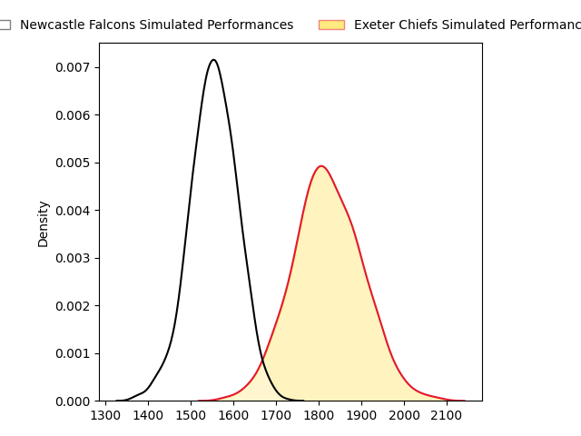
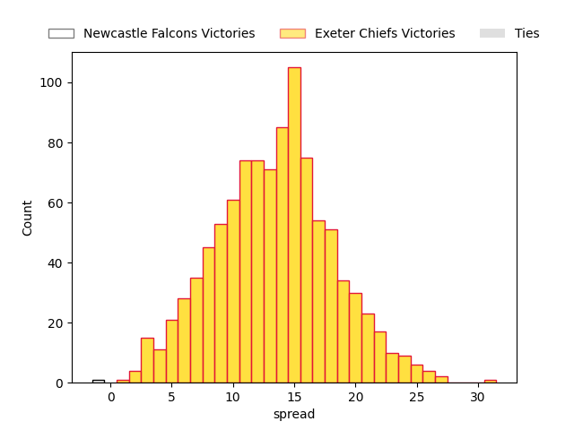

---  
layout: page  
title: Newcastle Falcons at Exeter Chiefs  
date: 2023-03-11 09:30:00 18:00:00 -0500  
categories: match projection  
---
# Newcastle Falcons at Exeter Chiefs

# Club Level Predictions

The first set of predictions treats a club as the smallest object, as the club develops its members, organizes a gameplan, and deploys its players as needed for each match. This club model has a prediction of 0.822, which translates to predicting Exeter Chiefs to win by 13.5.

Each club has a rating and a rating deviation (simiar to a Glicko system), and expected performances can be generated. This allows for simulated matches and spreads like the ones below.
## Projected Performances

## Projected Spreads

## Projected Results

# Player Level Predictions

Treating teams instead as an entity made up of the currently active players, I have ratings for each player in an altogether different system. These can be combined to form team ratings once teamsheets are announced, weighting starters a bit higher than the reserves. After the match is played, players can be weighted by their minutes on the field, allowing for an accurate measure of the team's composition. With these compiled team ratings, we can make predictions, measure inaccuracy, and update the individual player ratings.
## Prediction without Player Minutes: Exeter Chiefs by 6.1

Exeter Chiefs by 2.1 on a neutral field

| Away Player                                                          |   Away elo |   Away Percentile |   Number |   Home Percentile |   Home elo | Home Player                                                       |
|:---------------------------------------------------------------------|-----------:|------------------:|---------:|------------------:|-----------:|:------------------------------------------------------------------|
| [Adam Brocklebank](..//playerfiles//AdamBrocklebank_cleaned.md)      |      97.52 |                60 |        1 |                62 |      97.92 | [Scott Sio](..//playerfiles//ScottSio_cleaned.md)                 |
| [Jamie Blamire](..//playerfiles//JamieBlamire_cleaned.md)            |      89.84 |                33 |        2 |                99 |     135.48 | [Dan Frost](..//playerfiles//DanFrost_cleaned.md)                 |
| [Pedro Rubiolo](..//playerfiles//PedroRubiolo_cleaned.md)            |      96.15 |                54 |        4 |                91 |     115.99 | [Jannes Kirsten](..//playerfiles//JannesKirsten_cleaned.md)       |
| [Sebastian de Chaves](..//playerfiles//SebastiandeChaves_cleaned.md) |      69.62 |                 5 |        5 |                66 |      98.3  | [Jack Dunne](..//playerfiles//JackDunne_cleaned.md)               |
| [Freddie Lockwood](..//playerfiles//FreddieLockwood_cleaned.md)      |     100.05 |                75 |        6 |                98 |     133.51 | [Dave Ewers](..//playerfiles//DaveEwers_cleaned.md)               |
| [Callum Chick](..//playerfiles//CallumChick_cleaned.md)              |     102.44 |                72 |        7 |                11 |      80.66 | [Jacques Vermeulen](..//playerfiles//JacquesVermeulen_cleaned.md) |
| [Carl Fearns](..//playerfiles//CarlFearns_cleaned.md)                |     120.29 |                94 |        8 |                95 |     121.42 | [Sam Simmonds](..//playerfiles//SamSimmonds_cleaned.md)           |
| [Michael Young](..//playerfiles//MichaelYoung_cleaned.md)            |     109.16 |                86 |        9 |                 1 |      59.55 | [Sam Maunder](..//playerfiles//SamMaunder_cleaned.md)             |
| [Brett Connon](..//playerfiles//BrettConnon_cleaned.md)              |      90.26 |                35 |       10 |                26 |      87.91 | [Harvey Skinner](..//playerfiles//HarveySkinner_cleaned.md)       |
| [Mateo Carreras](..//playerfiles//MateoCarreras_cleaned.md)          |      93.07 |                45 |       11 |                95 |     120.46 | [Olly Woodburn](..//playerfiles//OllyWoodburn_cleaned.md)         |
| [Matias Orlando](..//playerfiles//MatiasOrlando_cleaned.md)          |      79.86 |                12 |       12 |                94 |     118.97 | [Solomone Kata](..//playerfiles//SolomoneKata_cleaned.md)         |
| [Matias Moroni](..//playerfiles//MatiasMoroni_cleaned.md)            |     120.88 |                95 |       13 |                45 |      93.68 | [Ian Whitten](..//playerfiles//IanWhitten_cleaned.md)             |
| [Adam Radwan](..//playerfiles//AdamRadwan_cleaned.md)                |     131.04 |                97 |       14 |                12 |      78.52 | [Jack Nowell](..//playerfiles//JackNowell_cleaned.md)             |
| [Elliott Obatoyinbo](..//playerfiles//ElliottObatoyinbo_cleaned.md)  |      91.57 |                43 |       15 |                 7 |      67.54 | [Josh Hodge](..//playerfiles//JoshHodge_cleaned.md)               |
| [Sam Stuart](..//playerfiles//SamStuart_cleaned.md)                  |      62.24 |                 2 |       21 |                16 |      81.72 | [Jack Maunder](..//playerfiles//JackMaunder_cleaned.md)           |

