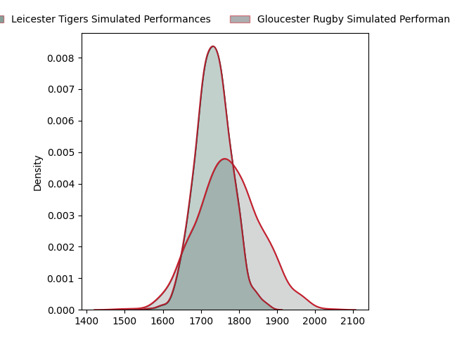
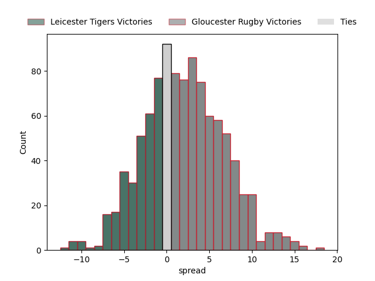

---  
layout: page  
title: Leicester Tigers at Gloucester Rugby  
date: 2023-03-12 09:00:00 18:00:00 -0500  
categories: match projection  
---
# Leicester Tigers at Gloucester Rugby

# Club Level Predictions

The first set of predictions treats a club as the smallest object, as the club develops its members, organizes a gameplan, and deploys its players as needed for each match. This club model has a prediction of 0.553, which translates to predicting Gloucester Rugby to win by 2.0.

Each club has a rating and a rating deviation (simiar to a Glicko system), and expected performances can be generated. This allows for simulated matches and spreads like the ones below.
## Projected Performances

## Projected Spreads

## Projected Results

# Player Level Predictions

Treating teams instead as an entity made up of the currently active players, I have ratings for each player in an altogether different system. These can be combined to form team ratings once teamsheets are announced, weighting starters a bit higher than the reserves. After the match is played, players can be weighted by their minutes on the field, allowing for an accurate measure of the team's composition. With these compiled team ratings, we can make predictions, measure inaccuracy, and update the individual player ratings.
## Prediction without Player Minutes: Leicester Tigers by 11.3

Leicester Tigers by 15.3 on a neutral field

| Away Player                                                       |   Away elo |   Away Percentile |   Number |   Home Percentile |   Home elo | Home Player                                                         |
|:------------------------------------------------------------------|-----------:|------------------:|---------:|------------------:|-----------:|:--------------------------------------------------------------------|
| [Tom West](..//playerfiles//TomWest_cleaned.md)                   |     105.93 |                83 |        1 |                17 |      84.06 | [Val Rapava-Ruskin](..//playerfiles//ValRapava-Ruskin_cleaned.md)   |
| [Julian Montoya](..//playerfiles//JulianMontoya_cleaned.md)       |      86.83 |                23 |        2 |                 5 |      72.21 | [Sebastian Blake](..//playerfiles//SebastianBlake_cleaned.md)       |
| [Joe Heyes](..//playerfiles//JoeHeyes_cleaned.md)                 |     104.18 |                80 |        3 |                89 |     110.74 | [Kirill Gotovtsev](..//playerfiles//KirillGotovtsev_cleaned.md)     |
| [Harry Wells](..//playerfiles//HarryWells_cleaned.md)             |     144.19 |                99 |        4 |                46 |      93.83 | [Freddie Clarke](..//playerfiles//FreddieClarke_cleaned.md)         |
| [Eli Snyman](..//playerfiles//EliSnyman_cleaned.md)               |      91.28 |                36 |        5 |                71 |     102.8  | [Matias Alemanno](..//playerfiles//MatiasAlemanno_cleaned.md)       |
| [Olly Cracknell](..//playerfiles//OllyCracknell_cleaned.md)       |     105.81 |                76 |        7 |                54 |      96.24 | [Lewis Ludlow](..//playerfiles//LewisLudlow_cleaned.md)             |
| [Jasper Wiese](..//playerfiles//JasperWiese_cleaned.md)           |     105.6  |                79 |        8 |                68 |     100.35 | [Ruan Ackermann](..//playerfiles//RuanAckermann_cleaned.md)         |
| [Ben Youngs](..//playerfiles//BenYoungs_cleaned.md)               |      89.82 |                35 |        9 |                24 |      86.2  | [Ben Meehan](..//playerfiles//BenMeehan_cleaned.md)                 |
| [Handre Pollard](..//playerfiles//HandrePollard_cleaned.md)       |     128.51 |                96 |       10 |                99 |     137.88 | [Santiago Carreras](..//playerfiles//SantiagoCarreras_cleaned.md)   |
| [Harry Simmons](..//playerfiles//HarrySimmons_cleaned.md)         |     111.76 |                88 |       11 |                92 |     115.88 | [Ollie Thorley](..//playerfiles//OllieThorley_cleaned.md)           |
| [Guy Porter](..//playerfiles//GuyPorter_cleaned.md)               |     116.39 |                92 |       12 |                 0 |      47.04 | [Sebastien Atkinson](..//playerfiles//SebastienAtkinson_cleaned.md) |
| [Matt Scott](..//playerfiles//MattScott_cleaned.md)               |      88.06 |                27 |       13 |                 5 |      64.99 | [Tom Seabrook](..//playerfiles//TomSeabrook_cleaned.md)             |
| [Harry Potter](..//playerfiles//HarryPotter_cleaned.md)           |      95.55 |                51 |       14 |                80 |     106    | [Jonny May](..//playerfiles//JonnyMay_cleaned.md)                   |
| [Mike Brown](..//playerfiles//MikeBrown_cleaned.md)               |     108.03 |                81 |       15 |                75 |     104.8  | [Lloyd Evans](..//playerfiles//LloydEvans_cleaned.md)               |
| [James Cronin](..//playerfiles//JamesCronin_cleaned.md)           |      86.49 |                19 |       17 |                48 |      87.37 | [Harry Elrington](..//playerfiles//HarryElrington_cleaned.md)       |
| [Cameron Henderson](..//playerfiles//CameronHenderson_cleaned.md) |     120.37 |                94 |       19 |                21 |      82.2  | [Cameron Jordan](..//playerfiles//CameronJordan_cleaned.md)         |
| [George Martin](..//playerfiles//GeorgeMartin_cleaned.md)         |     101.55 |                68 |       20 |                38 |      92.16 | [Albert Tuisue](..//playerfiles//AlbertTuisue_cleaned.md)           |
| [Tom Whiteley](..//playerfiles//TomWhiteley_cleaned.md)           |     100.79 |                76 |       22 |                98 |     134.16 | [Billy Twelvetrees](..//playerfiles//BillyTwelvetrees_cleaned.md)   |

