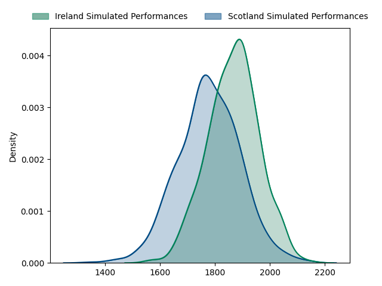
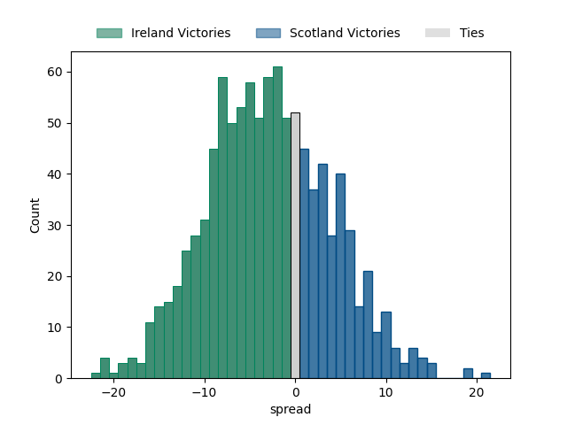

---  
layout: page  
title: Ireland at Scotland  
date: 2023-03-12 11:00:00 18:00:00 -0500  
categories: match projection  
---
# Ireland at Scotland

# Club Level Predictions

The first set of predictions treats a club as the smallest object, as the club develops its members, organizes a gameplan, and deploys its players as needed for each match. This club model has a prediction of 0.379, which translates to predicting Ireland to win by 4.4.

Each club has a rating and a rating deviation (simiar to a Glicko system), and expected performances can be generated. This allows for simulated matches and spreads like the ones below.
## Projected Performances

## Projected Spreads

## Projected Results

# Player Level Predictions

Treating teams instead as an entity made up of the currently active players, I have ratings for each player in an altogether different system. These can be combined to form team ratings once teamsheets are announced, weighting starters a bit higher than the reserves. After the match is played, players can be weighted by their minutes on the field, allowing for an accurate measure of the team's composition. With these compiled team ratings, we can make predictions, measure inaccuracy, and update the individual player ratings.
## Prediction without Player Minutes: Ireland by 8.5

Ireland by 12.5 on a neutral field

| Away Player                                                       |   Away elo |   Away Percentile |   Number |   Home Percentile |   Home elo | Home Player                                                         |
|:------------------------------------------------------------------|-----------:|------------------:|---------:|------------------:|-----------:|:--------------------------------------------------------------------|
| [Andrew Porter](..//playerfiles//AndrewPorter_cleaned.md)         |      98.55 |                64 |        1 |                30 |      89.58 | [Pierre Schoeman](..//playerfiles//PierreSchoeman_cleaned.md)       |
| [Dan Sheehan](..//playerfiles//DanSheehan_cleaned.md)             |     110.27 |                89 |        2 |                96 |     122.46 | [George Turner](..//playerfiles//GeorgeTurner_cleaned.md)           |
| [Iain Henderson](..//playerfiles//IainHenderson_cleaned.md)       |     117.23 |                92 |        4 |                95 |     123.08 | [Richie Gray](..//playerfiles//RichieGray_cleaned.md)               |
| [James Ryan](..//playerfiles//JamesRyan_cleaned.md)               |     111.69 |                87 |        5 |                70 |     102.34 | [Jonny Gray](..//playerfiles//JonnyGray_cleaned.md)                 |
| [Peter O'Mahony](..//playerfiles//PeterO'Mahony_cleaned.md)       |      82.95 |                14 |        6 |                76 |     103.99 | [Matt Fagerson](..//playerfiles//MattFagerson_cleaned.md)           |
| [Josh van der Flier](..//playerfiles//JoshvanderFlier_cleaned.md) |     131.86 |                97 |        7 |                97 |     132.94 | [Jamie Ritchie](..//playerfiles//JamieRitchie_cleaned.md)           |
| [Conor Murray](..//playerfiles//ConorMurray_cleaned.md)           |     145.86 |                99 |        9 |                84 |     108.17 | [Ben White](..//playerfiles//BenWhite_cleaned.md)                   |
| [Johnny Sexton](..//playerfiles//JohnnySexton_cleaned.md)         |     143.72 |                99 |       10 |                99 |     136.96 | [Finn Russell](..//playerfiles//FinnRussell_cleaned.md)             |
| [James Lowe](..//playerfiles//JamesLowe_cleaned.md)               |     144.93 |                99 |       11 |                67 |     100.9  | [Duhan van der Merwe](..//playerfiles//DuhanvanderMerwe_cleaned.md) |
| [Bundee Aki](..//playerfiles//BundeeAki_cleaned.md)               |     138.56 |                98 |       12 |                28 |      88.35 | [Sione Tuipulotu](..//playerfiles//SioneTuipulotu_cleaned.md)       |
| [Garry Ringrose](..//playerfiles//GarryRingrose_cleaned.md)       |      79.57 |                11 |       13 |                 8 |      75.77 | [Huw Jones](..//playerfiles//HuwJones_cleaned.md)                   |
| [Mack Hansen](..//playerfiles//MackHansen_cleaned.md)             |      88.92 |                29 |       14 |                86 |     110.06 | [Kyle Steyn](..//playerfiles//KyleSteyn_cleaned.md)                 |
| [Hugo Keenan](..//playerfiles//HugoKeenan_cleaned.md)             |     143.42 |                99 |       15 |                83 |     108.84 | [Stuart Hogg](..//playerfiles//StuartHogg_cleaned.md)               |
| [Jack Conan](..//playerfiles//JackConan_cleaned.md)               |     123.42 |                96 |       20 |                26 |      87.36 | [Hamish Watson](..//playerfiles//HamishWatson_cleaned.md)           |

