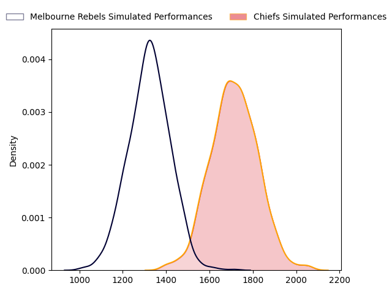
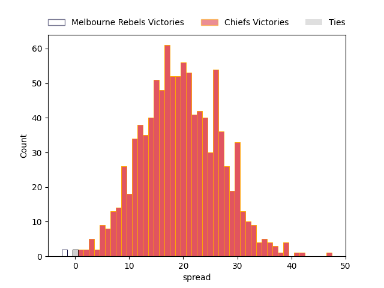

---  
layout: page  
title: Melbourne Rebels at Chiefs  
date: 2023-03-17 23:35:00 18:00:00 -0500  
categories: match projection  
---
# Melbourne Rebels at Chiefs

# Club Level Predictions

The first set of predictions treats a club as the smallest object, as the club develops its members, organizes a gameplan, and deploys its players as needed for each match. This club model has a prediction of 0.896, which translates to predicting Chiefs to win by 19.4.

Each club has a rating and a rating deviation (simiar to a Glicko system), and expected performances can be generated. This allows for simulated matches and spreads like the ones below.
## Projected Performances

## Projected Spreads

## Projected Results

# Player Level Predictions

Treating teams instead as an entity made up of the currently active players, I have ratings for each player in an altogether different system. These can be combined to form team ratings once teamsheets are announced, weighting starters a bit higher than the reserves. After the match is played, players can be weighted by their minutes on the field, allowing for an accurate measure of the team's composition. With these compiled team ratings, we can make predictions, measure inaccuracy, and update the individual player ratings.
## Prediction without Player Minutes: Chiefs by 3.3

Melbourne Rebels by 0.7 on a neutral field

| Away Player                                                          |   Away elo |   Away Percentile |   Number |   Home Percentile |   Home elo | Home Player                                                         |
|:---------------------------------------------------------------------|-----------:|------------------:|---------:|------------------:|-----------:|:--------------------------------------------------------------------|
| [Matt Gibbon](..//playerfiles//MattGibbon_cleaned.md)                |     100.67 |                71 |        1 |                56 |      96.48 | [Aidan Ross](..//playerfiles//AidanRoss_cleaned.md)                 |
| [Sam Talakai](..//playerfiles//SamTalakai_cleaned.md)                |      94.9  |                51 |        3 |                82 |     105.29 | [John Ryan](..//playerfiles//JohnRyan_cleaned.md)                   |
| [Tuaina Taii Tualima](..//playerfiles//TuainaTaiiTualima_cleaned.md) |      95.22 |                46 |        4 |                44 |      92.73 | [Naitoa Ah Kuoi](..//playerfiles//NaitoaAhKuoi_cleaned.md)          |
| [Brad Wilkin](..//playerfiles//BradWilkin_cleaned.md)                |      97.68 |                59 |        7 |                76 |     104.48 | [Luke Jacobson](..//playerfiles//LukeJacobson_cleaned.md)           |
| [Richard Hardwick](..//playerfiles//RichardHardwick_cleaned.md)      |     101.87 |                70 |        8 |                79 |     105.97 | [Pita Gus Sowakula](..//playerfiles//PitaGusSowakula_cleaned.md)    |
| [Monty Ioane](..//playerfiles//MontyIoane_cleaned.md)                |     102.1  |                71 |       11 |                71 |     102.18 | [Etene Nanai-Seturo](..//playerfiles//EteneNanai-Seturo_cleaned.md) |
| [Stacey Ili](..//playerfiles//StaceyIli_cleaned.md)                  |     100.94 |                68 |       12 |                68 |     100.84 | [Rameka Poihipi](..//playerfiles//RamekaPoihipi_cleaned.md)         |
| [Reece Hodge](..//playerfiles//ReeceHodge_cleaned.md)                |     101.19 |                69 |       13 |                77 |     104.48 | [Alex Nankivell](..//playerfiles//AlexNankivell_cleaned.md)         |
| [Lachie Anderson](..//playerfiles//LachieAnderson_cleaned.md)        |     101.19 |                68 |       14 |                40 |      91.78 | [Emoni Narawa](..//playerfiles//EmoniNarawa_cleaned.md)             |
| [Nick Jooste](..//playerfiles//NickJooste_cleaned.md)                |     103.74 |                72 |       15 |                74 |     104.48 | [Shaun Stevenson](..//playerfiles//ShaunStevenson_cleaned.md)       |
| [Cabous Eloff](..//playerfiles//CabousEloff_cleaned.md)              |      98.97 |                65 |       17 |                74 |     100.61 | [Ollie Norris](..//playerfiles//OllieNorris_cleaned.md)             |

