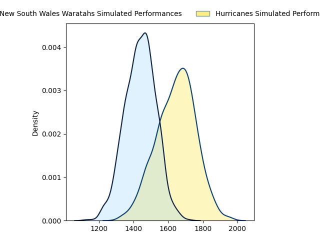
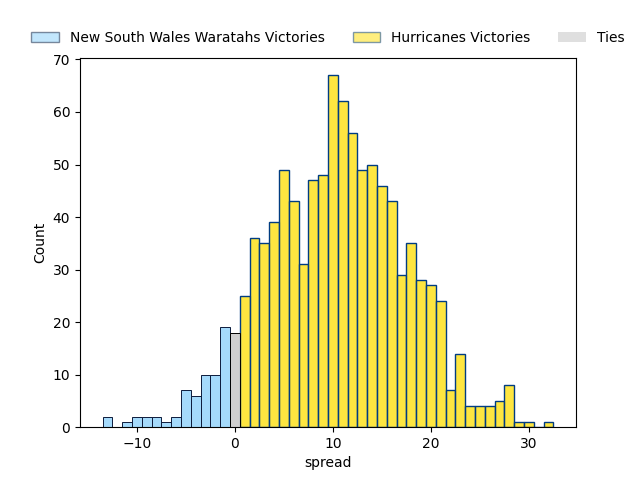
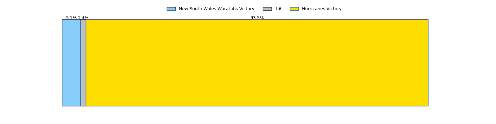

---  
layout: page  
title: New South Wales Waratahs at Hurricanes  
date: 2023-03-17 02:05:00 18:00:00 -0500  
categories: match projection  
---
# New South Wales Waratahs at Hurricanes

# Club Level Predictions

The first set of predictions treats a club as the smallest object, as the club develops its members, organizes a gameplan, and deploys its players as needed for each match. This club model has a prediction of 0.767, which translates to predicting Hurricanes to win by 10.3.

Each club has a rating and a rating deviation (simiar to a Glicko system), and expected performances can be generated. This allows for simulated matches and spreads like the ones below.
## Projected Performances

## Projected Spreads

## Projected Results

# Player Level Predictions

Treating teams instead as an entity made up of the currently active players, I have ratings for each player in an altogether different system. These can be combined to form team ratings once teamsheets are announced, weighting starters a bit higher than the reserves. After the match is played, players can be weighted by their minutes on the field, allowing for an accurate measure of the team's composition. With these compiled team ratings, we can make predictions, measure inaccuracy, and update the individual player ratings.
## Prediction without Player Minutes: Hurricanes by 10.7

Hurricanes by 6.7 on a neutral field

| Away Player                                                           |   Away elo |   Away Percentile |   Number |   Home Percentile |   Home elo | Home Player                                                             |
|:----------------------------------------------------------------------|-----------:|------------------:|---------:|------------------:|-----------:|:------------------------------------------------------------------------|
| [Tom Lambert](..//playerfiles//TomLambert_cleaned.md)                 |      93.29 |                44 |        1 |                56 |      96.45 | [Xavier Numia](..//playerfiles//XavierNumia_cleaned.md)                 |
| [Taleni Seu](..//playerfiles//TaleniSeu_cleaned.md)                   |      91.07 |                38 |        5 |                69 |     101.89 | [Isaia Walker-Leawere](..//playerfiles//IsaiaWalker-Leawere_cleaned.md) |
| [Charlie Gamble](..//playerfiles//CharlieGamble_cleaned.md)           |      91.07 |                34 |        6 |                53 |      95.26 | [Devan Flanders](..//playerfiles//DevanFlanders_cleaned.md)             |
| [Michael Hooper](..//playerfiles//MichaelHooper_cleaned.md)           |      92.47 |                43 |        7 |                41 |      91.77 | [Du'Plessis Kirifi](..//playerfiles//Du'PlessisKirifi_cleaned.md)       |
| [Langi Gleeson](..//playerfiles//LangiGleeson_cleaned.md)             |      95.16 |                49 |        8 |                82 |     108.25 | [Ardie Savea](..//playerfiles//ArdieSavea_cleaned.md)                   |
| [Jake Gordon](..//playerfiles//JakeGordon_cleaned.md)                 |      91.11 |                39 |        9 |                63 |      98.77 | [Cam Roigard](..//playerfiles//CamRoigard_cleaned.md)                   |
| [Ben Donaldson](..//playerfiles//BenDonaldson_cleaned.md)             |      92.47 |                44 |       10 |                27 |      87.69 | [Brett Cameron](..//playerfiles//BrettCameron_cleaned.md)               |
| [Lalakai Foketi](..//playerfiles//LalakaiFoketi_cleaned.md)           |      92.47 |                42 |       12 |                65 |      99.77 | [Jordie Barrett](..//playerfiles//JordieBarrett_cleaned.md)             |
| [Izaia Perese](..//playerfiles//IzaiaPerese_cleaned.md)               |      94.24 |                47 |       13 |                65 |      99.77 | [Billy Proctor](..//playerfiles//BillyProctor_cleaned.md)               |
| [Mark Nawaqanitawase](..//playerfiles//MarkNawaqanitawase_cleaned.md) |      92.47 |                43 |       14 |                61 |      98.63 | [Julian Savea](..//playerfiles//JulianSavea_cleaned.md)                 |
| [Max Jorgensen](..//playerfiles//MaxJorgensen_cleaned.md)             |      92.47 |                43 |       15 |                64 |     100.2  | [Joshua Moorby](..//playerfiles//JoshuaMoorby_cleaned.md)               |
| [Tane Edmed](..//playerfiles//TaneEdmed_cleaned.md)                   |      91.35 |                38 |       22 |                82 |     106.63 | [Aidan Morgan](..//playerfiles//AidanMorgan_cleaned.md)                 |

