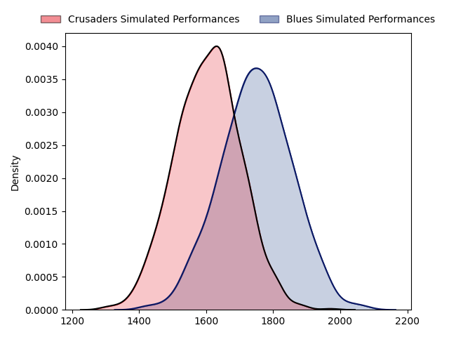
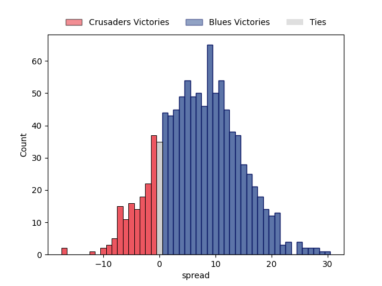

---  
layout: page  
title: Crusaders at Blues  
date: 2023-03-18 02:05:00 18:00:00 -0500  
categories: match projection  
---
# Crusaders at Blues

# Club Level Predictions

The first set of predictions treats a club as the smallest object, as the club develops its members, organizes a gameplan, and deploys its players as needed for each match. This club model has a prediction of 0.675, which translates to predicting Blues to win by 7.2.

Each club has a rating and a rating deviation (simiar to a Glicko system), and expected performances can be generated. This allows for simulated matches and spreads like the ones below.
## Projected Performances

## Projected Spreads

## Projected Results

# Player Level Predictions

Treating teams instead as an entity made up of the currently active players, I have ratings for each player in an altogether different system. These can be combined to form team ratings once teamsheets are announced, weighting starters a bit higher than the reserves. After the match is played, players can be weighted by their minutes on the field, allowing for an accurate measure of the team's composition. With these compiled team ratings, we can make predictions, measure inaccuracy, and update the individual player ratings.
## Prediction without Player Minutes: Blues by 4.3

Blues by 0.3 on a neutral field

| Away Player                                                                 |   Away elo |   Away Percentile |   Number |   Home Percentile |   Home elo | Home Player                                                           |
|:----------------------------------------------------------------------------|-----------:|------------------:|---------:|------------------:|-----------:|:----------------------------------------------------------------------|
| [Joe Moody](..//playerfiles//JoeMoody_cleaned.md)                           |      86.85 |                22 |        1 |                49 |      95.36 | [Alex Hodgman](..//playerfiles//AlexHodgman_cleaned.md)               |
| [Codie Taylor](..//playerfiles//CodieTaylor_cleaned.md)                     |     106.65 |                83 |        2 |                50 |      94.53 | [Ricky Riccitelli](..//playerfiles//RickyRiccitelli_cleaned.md)       |
| [Tamaiti Williams](..//playerfiles//TamaitiWilliams_cleaned.md)             |      91.62 |                37 |        3 |                79 |     104.43 | [James Lay](..//playerfiles//JamesLay_cleaned.md)                     |
| [Scott Barrett](..//playerfiles//ScottBarrett_cleaned.md)                   |     120.68 |                94 |        4 |                86 |     112.26 | [James Tucker](..//playerfiles//JamesTucker_cleaned.md)               |
| [Sam Whitelock](..//playerfiles//SamWhitelock_cleaned.md)                   |     108.92 |                82 |        5 |                80 |     107.17 | [Cameron Suafoa](..//playerfiles//CameronSuafoa_cleaned.md)           |
| [Ethan Blackadder](..//playerfiles//EthanBlackadder_cleaned.md)             |     131.9  |                97 |        6 |                37 |      93.83 | [Adrian Choat](..//playerfiles//AdrianChoat_cleaned.md)               |
| [Tom Christie](..//playerfiles//TomChristie_cleaned.md)                     |     101.51 |                69 |        7 |                76 |     104.77 | [Dalton Papali'i](..//playerfiles//DaltonPapali'i_cleaned.md)         |
| [Sione Havili](..//playerfiles//SioneHavili_cleaned.md)                     |     104.09 |                74 |        8 |                98 |     128.5  | [Hoskins Sotutu](..//playerfiles//HoskinsSotutu_cleaned.md)           |
| [Mitchell Drummond](..//playerfiles//MitchellDrummond_cleaned.md)           |      88.43 |                29 |        9 |                81 |     105.1  | [Finlay Christie](..//playerfiles//FinlayChristie_cleaned.md)         |
| [Richie Mo'unga](..//playerfiles//RichieMo'unga_cleaned.md)                 |     147.91 |                99 |       10 |               100 |     158.36 | [Beauden Barrett](..//playerfiles//BeaudenBarrett_cleaned.md)         |
| [Leicester Fainga'anuku](..//playerfiles//LeicesterFainga'anuku_cleaned.md) |      95.37 |                50 |       11 |                67 |     100.58 | [Caleb Clarke](..//playerfiles//CalebClarke_cleaned.md)               |
| [Dallas McLeod](..//playerfiles//DallasMcLeod_cleaned.md)                   |     101.12 |                73 |       12 |                21 |      85.18 | [Roger Tuivasa-Sheck](..//playerfiles//RogerTuivasa-Sheck_cleaned.md) |
| [Braydon Ennor](..//playerfiles//BraydonEnnor_cleaned.md)                   |     113.18 |                87 |       13 |                12 |      79.59 | [Rieko Ioane](..//playerfiles//RiekoIoane_cleaned.md)                 |
| [Sevu Reece](..//playerfiles//SevuReece_cleaned.md)                         |     136.72 |                98 |       14 |                90 |     114.76 | [Mark Telea](..//playerfiles//MarkTelea_cleaned.md)                   |
| [Fergus Burke](..//playerfiles//FergusBurke_cleaned.md)                     |      83.62 |                18 |       15 |                90 |     117.03 | [Stephen Perofeta](..//playerfiles//StephenPerofeta_cleaned.md)       |
| [George Bower](..//playerfiles//GeorgeBower_cleaned.md)                     |      81.06 |                12 |       18 |                96 |     121.21 | [Nepo Laulala](..//playerfiles//NepoLaulala_cleaned.md)               |
| [Zach Gallagher](..//playerfiles//ZachGallagher_cleaned.md)                 |      96.93 |                57 |       19 |                91 |     117.6  | [Tom Robinson](..//playerfiles//TomRobinson_cleaned.md)               |
| [Willi Heinz](..//playerfiles//WilliHeinz_cleaned.md)                       |      93.51 |                45 |       21 |                20 |      84.8  | [Taufa Funaki](..//playerfiles//TaufaFunaki_cleaned.md)               |

