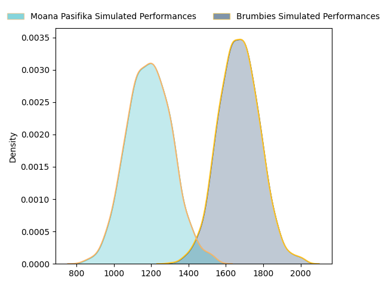
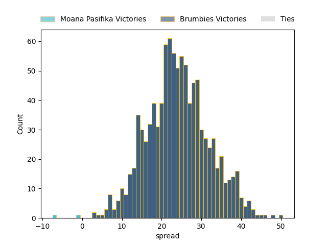

---  
layout: page  
title: Moana Pasifika at Brumbies  
date: 2023-03-18 04:35:00 18:00:00 -0500  
categories: match projection  
---
# Moana Pasifika at Brumbies

# Club Level Predictions

The first set of predictions treats a club as the smallest object, as the club develops its members, organizes a gameplan, and deploys its players as needed for each match. This club model has a prediction of 0.931, which translates to predicting Brumbies to win by 24.1.

Each club has a rating and a rating deviation (simiar to a Glicko system), and expected performances can be generated. This allows for simulated matches and spreads like the ones below.
## Projected Performances

## Projected Spreads

## Projected Results

# Player Level Predictions

Treating teams instead as an entity made up of the currently active players, I have ratings for each player in an altogether different system. These can be combined to form team ratings once teamsheets are announced, weighting starters a bit higher than the reserves. After the match is played, players can be weighted by their minutes on the field, allowing for an accurate measure of the team's composition. With these compiled team ratings, we can make predictions, measure inaccuracy, and update the individual player ratings.
## Prediction without Player Minutes: Brumbies by 21.0

Brumbies by 17.0 on a neutral field

| Away Player                                                               |   Away elo |   Away Percentile |   Number |   Home Percentile |   Home elo | Home Player                                                     |
|:--------------------------------------------------------------------------|-----------:|------------------:|---------:|------------------:|-----------:|:----------------------------------------------------------------|
| [Abraham Pole](..//playerfiles//AbrahamPole_cleaned.md)                   |      85.61 |                20 |        1 |                65 |      98.91 | [James Slipper](..//playerfiles//JamesSlipper_cleaned.md)       |
| [Suetena Asomua](..//playerfiles//SuetenaAsomua_cleaned.md)               |      90.07 |                32 |        3 |                63 |      98.43 | [Rhys Van Nek](..//playerfiles//RhysVanNek_cleaned.md)          |
| [Mike McKee](..//playerfiles//MikeMcKee_cleaned.md)                       |      86.84 |                25 |        5 |                62 |      99.39 | [Cadeyrn Neville](..//playerfiles//CadeyrnNeville_cleaned.md)   |
| [Miracle Faiilagi](..//playerfiles//MiracleFaiilagi_cleaned.md)           |      85.82 |                21 |        6 |                73 |     102.96 | [Rob Valetini](..//playerfiles//RobValetini_cleaned.md)         |
| [Lotu Inisi](..//playerfiles//LotuInisi_cleaned.md)                       |      91.16 |                35 |        8 |                68 |     101.36 | [Pete Samu](..//playerfiles//PeteSamu_cleaned.md)               |
| [Ere Enari](..//playerfiles//EreEnari_cleaned.md)                         |      85.92 |                23 |        9 |                53 |      95.7  | [Nic White](..//playerfiles//NicWhite_cleaned.md)               |
| [Christian Leali'ifano](..//playerfiles//ChristianLeali'ifano_cleaned.md) |      82.98 |                17 |       10 |                44 |      93.38 | [Noah Lolesio](..//playerfiles//NoahLolesio_cleaned.md)         |
| [Timoci Tavatavanawai](..//playerfiles//TimociTavatavanawai_cleaned.md)   |      79.16 |                13 |       11 |                69 |     101.36 | [Corey Toole](..//playerfiles//CoreyToole_cleaned.md)           |
| [Danny Toala](..//playerfiles//DannyToala_cleaned.md)                     |      81.9  |                14 |       12 |                41 |      92.13 | [Ollie Sapsford](..//playerfiles//OllieSapsford_cleaned.md)     |
| [Levi Aumua](..//playerfiles//LeviAumua_cleaned.md)                       |      82.85 |                19 |       13 |                60 |      98.79 | [Len Ikitau](..//playerfiles//LenIkitau_cleaned.md)             |
| [Fine Inisi](..//playerfiles//FineInisi_cleaned.md)                       |      82.94 |                16 |       14 |                69 |     101.36 | [Andy Muirhead](..//playerfiles//AndyMuirhead_cleaned.md)       |
| [William Havili](..//playerfiles//WilliamHavili_cleaned.md)               |      84.6  |                24 |       15 |                67 |     101.36 | [Tom Wright](..//playerfiles//TomWright_cleaned.md)             |
| [Samiuela Moli](..//playerfiles//SamiuelaMoli_cleaned.md)                 |      82.95 |                15 |       16 |                58 |      96.76 | [Lachlan Lonergan](..//playerfiles//LachlanLonergan_cleaned.md) |
| [Manu Paea](..//playerfiles//ManuPaea_cleaned.md)                         |      88.24 |                31 |       21 |                75 |     100.66 | [Ryan Lonergan](..//playerfiles//RyanLonergan_cleaned.md)       |

