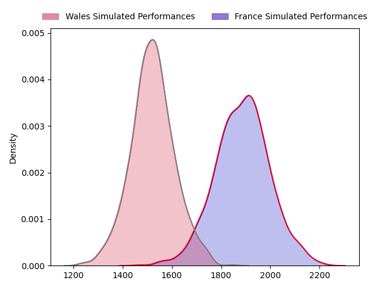
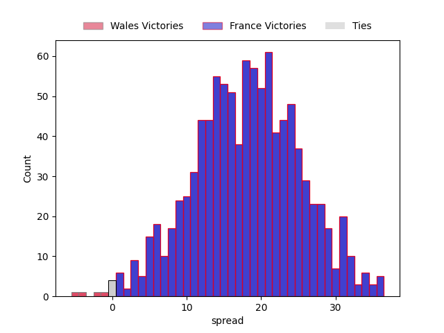

---  
layout: page  
title: Wales at France  
date: 2023-03-18 10:45:00 18:00:00 -0500  
categories: match projection  
---
# Wales at France

# Club Level Predictions

The first set of predictions treats a club as the smallest object, as the club develops its members, organizes a gameplan, and deploys its players as needed for each match. This club model has a prediction of 0.884, which translates to predicting France to win by 18.2.

Each club has a rating and a rating deviation (simiar to a Glicko system), and expected performances can be generated. This allows for simulated matches and spreads like the ones below.
## Projected Performances

## Projected Spreads

## Projected Results

# Player Level Predictions

Treating teams instead as an entity made up of the currently active players, I have ratings for each player in an altogether different system. These can be combined to form team ratings once teamsheets are announced, weighting starters a bit higher than the reserves. After the match is played, players can be weighted by their minutes on the field, allowing for an accurate measure of the team's composition. With these compiled team ratings, we can make predictions, measure inaccuracy, and update the individual player ratings.
## Prediction without Player Minutes: France by 29.0

France by 25.0 on a neutral field

| Away Player                                                       |   Away elo |   Away Percentile |   Number |   Home Percentile |   Home elo | Home Player                                                     |
|:------------------------------------------------------------------|-----------:|------------------:|---------:|------------------:|-----------:|:----------------------------------------------------------------|
| [Wyn Jones](..//playerfiles//WynJones_cleaned.md)                 |      99.22 |                66 |        1 |                85 |     107.72 | [Cyril Baille](..//playerfiles//CyrilBaille_cleaned.md)         |
| [Ken Owens](..//playerfiles//KenOwens_cleaned.md)                 |     101.1  |                72 |        2 |                88 |     110.51 | [Julien Marchand](..//playerfiles//JulienMarchand_cleaned.md)   |
| [Tomas Francis](..//playerfiles//TomasFrancis_cleaned.md)         |     129.43 |                98 |        3 |                98 |     129.57 | [Uini Atonio](..//playerfiles//UiniAtonio_cleaned.md)           |
| [Adam Beard](..//playerfiles//AdamBeard_cleaned.md)               |      96.7  |                54 |        4 |                94 |     121.3  | [Thibaud Flament](..//playerfiles//ThibaudFlament_cleaned.md)   |
| [Justin Tipuric](..//playerfiles//JustinTipuric_cleaned.md)       |     122.17 |                94 |        7 |                99 |     146.28 | [Charles Ollivon](..//playerfiles//CharlesOllivon_cleaned.md)   |
| [Taulupe Faletau](..//playerfiles//TaulupeFaletau_cleaned.md)     |      98.1  |                56 |        8 |                95 |     122.82 | [Gregory Alldritt](..//playerfiles//GregoryAlldritt_cleaned.md) |
| [Rhys Webb](..//playerfiles//RhysWebb_cleaned.md)                 |     116.68 |                94 |        9 |                99 |     136.51 | [Antoine Dupont](..//playerfiles//AntoineDupont_cleaned.md)     |
| [Dan Biggar](..//playerfiles//DanBiggar_cleaned.md)               |     130.03 |                97 |       10 |                98 |     135.44 | [Romain Ntamack](..//playerfiles//RomainNtamack_cleaned.md)     |
| [Rio Dyer](..//playerfiles//RioDyer_cleaned.md)                   |      69.69 |                 6 |       11 |                88 |     111.58 | [Ethan Dumortier](..//playerfiles//EthanDumortier_cleaned.md)   |
| [Nick Tompkins](..//playerfiles//NickTompkins_cleaned.md)         |     145.12 |                99 |       12 |                82 |     107.53 | [Jonathan Danty](..//playerfiles//JonathanDanty_cleaned.md)     |
| [George North](..//playerfiles//GeorgeNorth_cleaned.md)           |     109.37 |                82 |       13 |                91 |     116.06 | [Gael Fickou](..//playerfiles//GaelFickou_cleaned.md)           |
| [Josh Adams](..//playerfiles//JoshAdams_cleaned.md)               |      95.38 |                51 |       14 |                95 |     123.75 | [Damian Penaud](..//playerfiles//DamianPenaud_cleaned.md)       |
| [Louis Rees-Zammit](..//playerfiles//LouisRees-Zammit_cleaned.md) |      87.77 |                20 |       15 |                97 |     130.53 | [Thomas Ramos](..//playerfiles//ThomasRamos_cleaned.md)         |
| [Owen Williams](..//playerfiles//OwenWilliams_cleaned.md)         |     118.07 |                92 |       22 |                61 |     100.36 | [Yoram Moefana](..//playerfiles//YoramMoefana_cleaned.md)       |

