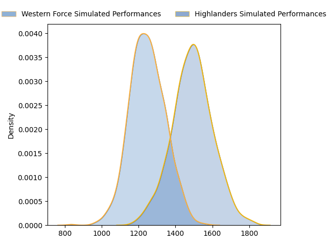
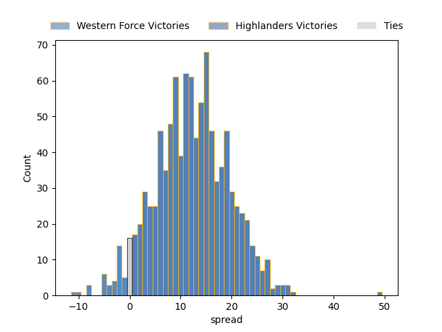

---  
layout: page  
title: Western Force at Highlanders  
date: 2023-03-18 22:35:00 18:00:00 -0500  
categories: match projection  
---
# Western Force at Highlanders

# Club Level Predictions

The first set of predictions treats a club as the smallest object, as the club develops its members, organizes a gameplan, and deploys its players as needed for each match. This club model has a prediction of 0.784, which translates to predicting Highlanders to win by 12.2.

Each club has a rating and a rating deviation (simiar to a Glicko system), and expected performances can be generated. This allows for simulated matches and spreads like the ones below.
## Projected Performances

## Projected Spreads

## Projected Results

# Player Level Predictions

Treating teams instead as an entity made up of the currently active players, I have ratings for each player in an altogether different system. These can be combined to form team ratings once teamsheets are announced, weighting starters a bit higher than the reserves. After the match is played, players can be weighted by their minutes on the field, allowing for an accurate measure of the team's composition. With these compiled team ratings, we can make predictions, measure inaccuracy, and update the individual player ratings.
## Prediction without Player Minutes: Highlanders by 14.5

Highlanders by 10.5 on a neutral field

| Away Player                                                                   |   Away elo |   Away Percentile |   Number |   Home Percentile |   Home elo | Home Player                                                             |
|:------------------------------------------------------------------------------|-----------:|------------------:|---------:|------------------:|-----------:|:------------------------------------------------------------------------|
| [Tom Robertson](..//playerfiles//TomRobertson_cleaned.md)                     |     115.05 |                92 |        1 |                89 |     111.24 | [Ethan de Groot](..//playerfiles//EthandeGroot_cleaned.md)              |
| [Folau Fainga'a](..//playerfiles//FolauFainga'a_cleaned.md)                   |     130.08 |                98 |        2 |                76 |     103.32 | [Andrew Makalio](..//playerfiles//AndrewMakalio_cleaned.md)             |
| [Santiago Medrano](..//playerfiles//SantiagoMedrano_cleaned.md)               |     117.95 |                94 |        3 |                83 |     106.57 | [Jermaine Ainsley](..//playerfiles//JermaineAinsley_cleaned.md)         |
| [Jeremy Williams](..//playerfiles//JeremyWilliams_cleaned.md)                 |      71.24 |                 6 |        4 |                80 |     104.8  | [Fabian Holland](..//playerfiles//FabianHolland_cleaned.md)             |
| [Michael Wells](..//playerfiles//MichaelWells_cleaned.md)                     |      88.96 |                30 |        6 |                91 |     117.8  | [Shannon Frizell](..//playerfiles//ShannonFrizell_cleaned.md)           |
| [Ollie Callan](..//playerfiles//OllieCallan_cleaned.md)                       |      71.28 |                 4 |        7 |                90 |     116.93 | [Billy Harmon](..//playerfiles//BillyHarmon_cleaned.md)                 |
| [Rahboni Warren-Vosayaco](..//playerfiles//RahboniWarren-Vosayaco_cleaned.md) |      79.58 |                12 |        8 |                 3 |      65.31 | [Hugh Renton](..//playerfiles//HughRenton_cleaned.md)                   |
| [Bryce Hegarty](..//playerfiles//BryceHegarty_cleaned.md)                     |      97.62 |                56 |       10 |                93 |     121.86 | [Mitch Hunt](..//playerfiles//MitchHunt_cleaned.md)                     |
| [Toni Pulu](..//playerfiles//ToniPulu_cleaned.md)                             |     125.64 |                96 |       11 |                79 |     105.79 | [Jonah Lowe](..//playerfiles//JonahLowe_cleaned.md)                     |
| [Hamish Stewart](..//playerfiles//HamishStewart_cleaned.md)                   |     124.07 |                95 |       12 |                29 |      88.69 | [Thomas Umaga-Jensen](..//playerfiles//ThomasUmaga-Jensen_cleaned.md)   |
| [Bayley Kuenzle](..//playerfiles//BayleyKuenzle_cleaned.md)                   |      76.23 |                 9 |       13 |                19 |      84.51 | [Josh Timu](..//playerfiles//JoshTimu_cleaned.md)                       |
| [Zach Kibirige](..//playerfiles//ZachKibirige_cleaned.md)                     |      67.22 |                 5 |       14 |                96 |     126.55 | [Martin Bogado](..//playerfiles//MartinBogado_cleaned.md)               |
| [Chase Tiatia](..//playerfiles//ChaseTiatia_cleaned.md)                       |     102.67 |                70 |       15 |                26 |      85.91 | [Sam Gilbert](..//playerfiles//SamGilbert_cleaned.md)                   |
| [Felix Kalapu](..//playerfiles//FelixKalapu_cleaned.md)                       |      47.92 |                 1 |       19 |                45 |      91.48 | [Max Hicks](..//playerfiles//MaxHicks_cleaned.md)                       |
| [Tim Anstee](..//playerfiles//TimAnstee_cleaned.md)                           |      53.33 |                 0 |       20 |                58 |      97.58 | [James Lentjes](..//playerfiles//JamesLentjes_cleaned.md)               |
| [Issak Fines-Leleiwasa](..//playerfiles//IssakFines-Leleiwasa_cleaned.md)     |      94.19 |                54 |       21 |                17 |      82.68 | [Folau Fakatava](..//playerfiles//FolauFakatava_cleaned.md)             |
| [Manasa Mataele](..//playerfiles//ManasaMataele_cleaned.md)                   |     118.48 |                92 |       23 |                47 |      94.1  | [Connor Garden-Bachop](..//playerfiles//ConnorGarden-Bachop_cleaned.md) |

