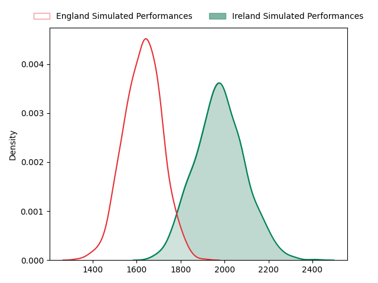
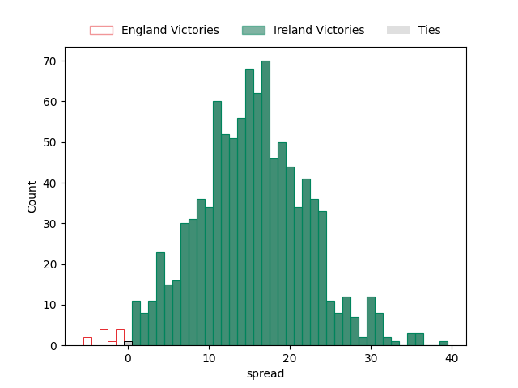

---  
layout: page  
title: England at Ireland  
date: 2023-03-18 13:00:00 18:00:00 -0500  
categories: match projection  
---
# England at Ireland

# Club Level Predictions

The first set of predictions treats a club as the smallest object, as the club develops its members, organizes a gameplan, and deploys its players as needed for each match. This club model has a prediction of 0.874, which translates to predicting Ireland to win by 17.5.

Each club has a rating and a rating deviation (simiar to a Glicko system), and expected performances can be generated. This allows for simulated matches and spreads like the ones below.
## Projected Performances

## Projected Spreads

## Projected Results

# Player Level Predictions

Treating teams instead as an entity made up of the currently active players, I have ratings for each player in an altogether different system. These can be combined to form team ratings once teamsheets are announced, weighting starters a bit higher than the reserves. After the match is played, players can be weighted by their minutes on the field, allowing for an accurate measure of the team's composition. With these compiled team ratings, we can make predictions, measure inaccuracy, and update the individual player ratings.
## Prediction without Player Minutes: Ireland by 34.0

Ireland by 30.0 on a neutral field

| Away Player                                                   |   Away elo |   Away Percentile |   Number |   Home Percentile |   Home elo | Home Player                                                       |
|:--------------------------------------------------------------|-----------:|------------------:|---------:|------------------:|-----------:|:------------------------------------------------------------------|
| [Ellis Genge](..//playerfiles//EllisGenge_cleaned.md)         |      88.27 |                26 |        1 |                80 |     105.15 | [Andrew Porter](..//playerfiles//AndrewPorter_cleaned.md)         |
| [Jamie George](..//playerfiles//JamieGeorge_cleaned.md)       |     152.32 |                99 |        2 |                89 |     112.91 | [Dan Sheehan](..//playerfiles//DanSheehan_cleaned.md)             |
| [Kyle Sinckler](..//playerfiles//KyleSinckler_cleaned.md)     |     103.87 |                77 |        3 |                89 |     111.7  | [Tadhg Furlong](..//playerfiles//TadhgFurlong_cleaned.md)         |
| [David Ribbans](..//playerfiles//DavidRibbans_cleaned.md)     |      96.3  |                54 |        5 |                91 |     117.17 | [James Ryan](..//playerfiles//JamesRyan_cleaned.md)               |
| [Lewis Ludlam](..//playerfiles//LewisLudlam_cleaned.md)       |      84.5  |                18 |        6 |                21 |      85.76 | [Peter O'Mahony](..//playerfiles//PeterO'Mahony_cleaned.md)       |
| [Jack Willis](..//playerfiles//JackWillis_cleaned.md)         |     115.93 |                90 |        7 |                98 |     137.28 | [Josh van der Flier](..//playerfiles//JoshvanderFlier_cleaned.md) |
| [Alex Dombrandt](..//playerfiles//AlexDombrandt_cleaned.md)   |     129.17 |                98 |        8 |                97 |     128.44 | [Caelan Doris](..//playerfiles//CaelanDoris_cleaned.md)           |
| [Owen Farrell](..//playerfiles//OwenFarrell_cleaned.md)       |     119.73 |                93 |       10 |                99 |     147.87 | [Johnny Sexton](..//playerfiles//JohnnySexton_cleaned.md)         |
| [Henry Arundell](..//playerfiles//HenryArundell_cleaned.md)   |      92.33 |                52 |       11 |                99 |     151.19 | [James Lowe](..//playerfiles//JamesLowe_cleaned.md)               |
| [Manu Tuilagi](..//playerfiles//ManuTuilagi_cleaned.md)       |     129.16 |                97 |       12 |                99 |     143.38 | [Bundee Aki](..//playerfiles//BundeeAki_cleaned.md)               |
| [Henry Slade](..//playerfiles//HenrySlade_cleaned.md)         |      89.85 |                33 |       13 |                99 |     141.31 | [Robbie Henshaw](..//playerfiles//RobbieHenshaw_cleaned.md)       |
| [Anthony Watson](..//playerfiles//AnthonyWatson_cleaned.md)   |      77.55 |                11 |       14 |                48 |      94.53 | [Mack Hansen](..//playerfiles//MackHansen_cleaned.md)             |
| [Freddie Steward](..//playerfiles//FreddieSteward_cleaned.md) |      88.74 |                34 |       15 |                99 |     150.01 | [Hugo Keenan](..//playerfiles//HugoKeenan_cleaned.md)             |
| [Jack Walker](..//playerfiles//JackWalker_cleaned.md)         |      81.03 |                15 |       16 |                15 |      83.29 | [Rob Herring](..//playerfiles//RobHerring_cleaned.md)             |
| [Dan Cole](..//playerfiles//DanCole_cleaned.md)               |      82.31 |                18 |       18 |                20 |      87.16 | [Tom O'Toole](..//playerfiles//TomO'Toole_cleaned.md)             |
| [Ben Curry](..//playerfiles//BenCurry_cleaned.md)             |      89.38 |                43 |       20 |                95 |     128.06 | [Jack Conan](..//playerfiles//JackConan_cleaned.md)               |
| [Alex Mitchell](..//playerfiles//AlexMitchell_cleaned.md)     |     103.68 |                85 |       21 |                99 |     148.41 | [Conor Murray](..//playerfiles//ConorMurray_cleaned.md)           |
| [Marcus Smith](..//playerfiles//MarcusSmith_cleaned.md)       |     127.98 |                96 |       22 |                88 |     114.86 | [Ross Byrne](..//playerfiles//RossByrne_cleaned.md)               |

