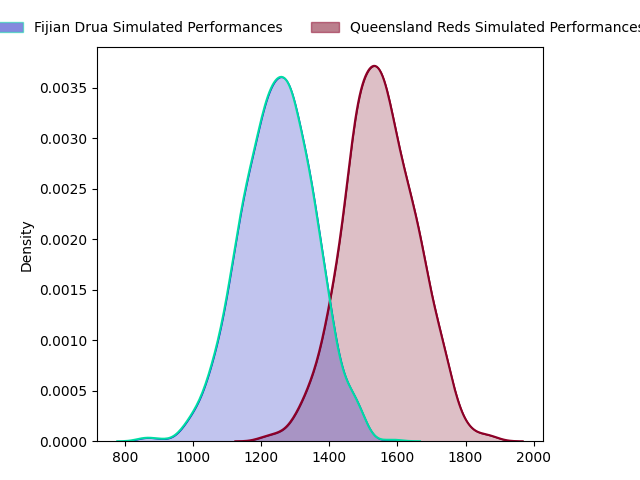
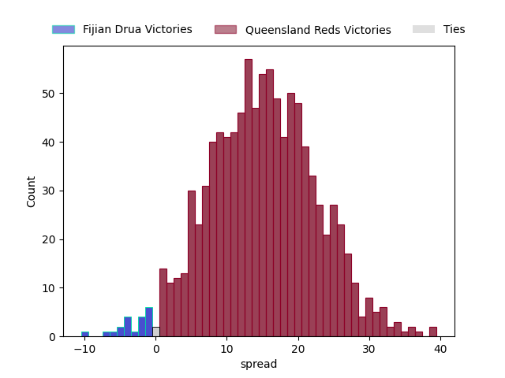

---  
layout: page  
title: Fijian Drua at Queensland Reds  
date: 2023-03-19 01:00:00 18:00:00 -0500  
categories: match projection  
---
# Fijian Drua at Queensland Reds

# Club Level Predictions

The first set of predictions treats a club as the smallest object, as the club develops its members, organizes a gameplan, and deploys its players as needed for each match. This club model has a prediction of 0.835, which translates to predicting Queensland Reds to win by 15.1.

Each club has a rating and a rating deviation (simiar to a Glicko system), and expected performances can be generated. This allows for simulated matches and spreads like the ones below.
## Projected Performances

## Projected Spreads

## Projected Results

# Player Level Predictions

Treating teams instead as an entity made up of the currently active players, I have ratings for each player in an altogether different system. These can be combined to form team ratings once teamsheets are announced, weighting starters a bit higher than the reserves. After the match is played, players can be weighted by their minutes on the field, allowing for an accurate measure of the team's composition. With these compiled team ratings, we can make predictions, measure inaccuracy, and update the individual player ratings.
## Prediction without Player Minutes: Queensland Reds by 9.4

Queensland Reds by 5.4 on a neutral field

| Away Player                                                                  |   Away elo |   Away Percentile |   Number |   Home Percentile |   Home elo | Home Player                                                     |
|:-----------------------------------------------------------------------------|-----------:|------------------:|---------:|------------------:|-----------:|:----------------------------------------------------------------|
| [Meli Tuni](..//playerfiles//MeliTuni_cleaned.md)                            |     101.66 |                72 |        1 |                85 |     108.27 | [Dane Zander](..//playerfiles//DaneZander_cleaned.md)           |
| [Tevita Ikanivere](..//playerfiles//TevitaIkanivere_cleaned.md)              |     117.61 |                94 |        2 |                66 |      99.55 | [Matt Faessler](..//playerfiles//MattFaessler_cleaned.md)       |
| [Samuela Tawake](..//playerfiles//SamuelaTawake_cleaned.md)                  |      90.87 |                25 |        3 |                74 |     102.41 | [Zane Nonggorr](..//playerfiles//ZaneNonggorr_cleaned.md)       |
| [Isoa Nasilasila](..//playerfiles//IsoaNasilasila_cleaned.md)                |     127.58 |                97 |        4 |                57 |      97.78 | [Ryan Smith](..//playerfiles//RyanSmith_cleaned.md)             |
| [Te Ahiwaru Cirikidaveta](..//playerfiles//TeAhiwaruCirikidaveta_cleaned.md) |     113.65 |                87 |        5 |                65 |     100.9  | [Seru Uru](..//playerfiles//SeruUru_cleaned.md)                 |
| [Joseva Tamani](..//playerfiles//JosevaTamani_cleaned.md)                    |      84.25 |                17 |        6 |                96 |     128.63 | [Liam Wright](..//playerfiles//LiamWright_cleaned.md)           |
| [Kitione Salawa](..//playerfiles//KitioneSalawa_cleaned.md)                  |      68.91 |                 3 |        7 |                85 |     111.41 | [Fraser McReight](..//playerfiles//FraserMcReight_cleaned.md)   |
| [Ratu Meli Derenalagi](..//playerfiles//RatuMeliDerenalagi_cleaned.md)       |     107.45 |                78 |        8 |                80 |     107.72 | [Harry Wilson](..//playerfiles//HarryWilson_cleaned.md)         |
| [Frank Lomani](..//playerfiles//FrankLomani_cleaned.md)                      |      86.37 |                24 |        9 |                73 |     102.42 | [Tate McDermott](..//playerfiles//TateMcDermott_cleaned.md)     |
| [Teti Tela](..//playerfiles//TetiTela_cleaned.md)                            |     105.28 |                77 |       10 |                42 |      93.64 | [James O'Connor](..//playerfiles//JamesO'Connor_cleaned.md)     |
| [Eroni Sau](..//playerfiles//EroniSau_cleaned.md)                            |      93.78 |                46 |       11 |                94 |     121.97 | [Filipo Daugunu](..//playerfiles//FilipoDaugunu_cleaned.md)     |
| [Iosefo Masi](..//playerfiles//IosefoMasi_cleaned.md)                        |      94.79 |                48 |       13 |                71 |     102.55 | [Josh Flook](..//playerfiles//JoshFlook_cleaned.md)             |
| [Selestino Ravutaumada](..//playerfiles//SelestinoRavutaumada_cleaned.md)    |      86.24 |                22 |       14 |                52 |      95.51 | [Jordan Petaia](..//playerfiles//JordanPetaia_cleaned.md)       |
| [Ilaisa Droasese](..//playerfiles//IlaisaDroasese_cleaned.md)                |      98.92 |                61 |       15 |                64 |     102.04 | [Jock Campbell](..//playerfiles//JockCampbell_cleaned.md)       |
| [Elia Canakaivata](..//playerfiles//EliaCanakaivata_cleaned.md)              |      96.57 |                51 |       20 |                35 |      88.5  | [Connor Vest](..//playerfiles//ConnorVest_cleaned.md)           |
| [Peni Matawalu](..//playerfiles//PeniMatawalu_cleaned.md)                    |     102.01 |                73 |       21 |                63 |     100.22 | [Kalani Thomas](..//playerfiles//KalaniThomas_cleaned.md)       |
| [Kalaveti Ravouvou](..//playerfiles//KalavetiRavouvou_cleaned.md)            |     146.41 |                99 |       23 |                57 |      97.6  | [Suliasi Vunivalu](..//playerfiles//SuliasiVunivalu_cleaned.md) |

