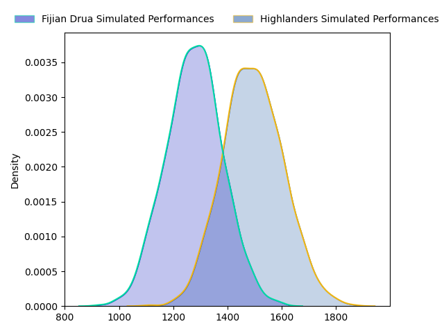
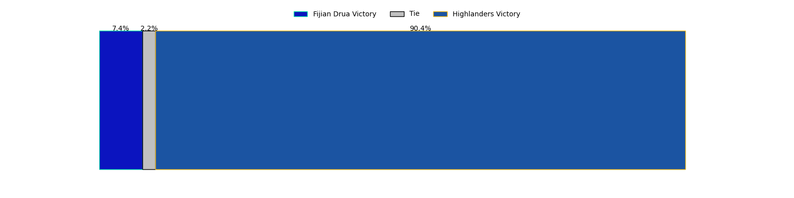

---  
layout: page  
title: Fijian Drua at Highlanders  
date: 2023-03-24 23:35:00 18:00:00 -0500  
categories: match projection  
---
# Fijian Drua at Highlanders

# Club Level Predictions

The first set of predictions treats a club as the smallest object, as the club develops its members, organizes a gameplan, and deploys its players as needed for each match. This club model has a prediction of 0.766, which translates to predicting Highlanders to win by 10.9.

Each club has a rating and a rating deviation (simiar to a Glicko system), and expected performances can be generated. This allows for simulated matches and spreads like the ones below.
## Projected Performances

## Projected Spreads

## Projected Results

# Player Level Predictions

Treating teams instead as an entity made up of the currently active players, I have ratings for each player in an altogether different system. These can be combined to form team ratings once teamsheets are announced, weighting starters a bit higher than the reserves. After the match is played, players can be weighted by their minutes on the field, allowing for an accurate measure of the team's composition. With these compiled team ratings, we can make predictions, measure inaccuracy, and update the individual player ratings.
## Prediction without Player Minutes: Highlanders by 0.1

Fijian Drua by 3.9 on a neutral field

| Away Player                                                                     |   Away elo |   Away Percentile |   Number |   Home Percentile |   Home elo | Home Player                                                           |
|:--------------------------------------------------------------------------------|-----------:|------------------:|---------:|------------------:|-----------:|:----------------------------------------------------------------------|
| [Emosi Tuqiri](..//playerfiles//EmosiTuqiri_cleaned.md)                         |     101.97 |                55 |        1 |                89 |     110.63 | [Ethan de Groot](..//playerfiles//EthandeGroot_cleaned.md)            |
| [Tevita Ikanivere](..//playerfiles//TevitaIkanivere_cleaned.md)                 |     118.65 |                94 |        2 |                13 |      82.12 | [Leni Apisai](..//playerfiles//LeniApisai_cleaned.md)                 |
| [Samuela Tawake](..//playerfiles//SamuelaTawake_cleaned.md)                     |      94.51 |                47 |        3 |                82 |     105.6  | [Jermaine Ainsley](..//playerfiles//JermaineAinsley_cleaned.md)       |
| [Isoa Nasilasila](..//playerfiles//IsoaNasilasila_cleaned.md)                   |     128.63 |                97 |        4 |                99 |     153.64 | [Pari Pari Parkinson](..//playerfiles//PariPariParkinson_cleaned.md)  |
| [Ratu Rotuisolia](..//playerfiles//RatuRotuisolia_cleaned.md)                   |      92.27 |                38 |        5 |                69 |     101.96 | [Josh Dickson](..//playerfiles//JoshDickson_cleaned.md)               |
| [Joseva Tamani](..//playerfiles//JosevaTamani_cleaned.md)                       |      84.59 |                16 |        6 |                14 |      82.52 | [Sean Withy](..//playerfiles//SeanWithy_cleaned.md)                   |
| [Kitione Salawa](..//playerfiles//KitioneSalawa_cleaned.md)                     |      74.88 |                 6 |        7 |                89 |     115.79 | [Billy Harmon](..//playerfiles//BillyHarmon_cleaned.md)               |
| [Ratu Meli Derenalagi](..//playerfiles//RatuMeliDerenalagi_cleaned.md)          |     112.75 |                86 |        8 |                 2 |      61.5  | [Hugh Renton](..//playerfiles//HughRenton_cleaned.md)                 |
| [Frank Lomani](..//playerfiles//FrankLomani_cleaned.md)                         |      87.42 |                24 |        9 |                57 |      98.02 | [Aaron Smith](..//playerfiles//AaronSmith_cleaned.md)                 |
| [Kalaveti Ravouvou](..//playerfiles//KalavetiRavouvou_cleaned.md)               |     146.81 |                99 |       12 |                19 |      84.91 | [Thomas Umaga-Jensen](..//playerfiles//ThomasUmaga-Jensen_cleaned.md) |
| [Apisalome Vota](..//playerfiles//ApisalomeVota_cleaned.md)                     |     121.49 |                92 |       13 |                13 |      80.73 | [Josh Timu](..//playerfiles//JoshTimu_cleaned.md)                     |
| [Iosefo Masi](..//playerfiles//IosefoMasi_cleaned.md)                           |     100.75 |                64 |       14 |                94 |     124.61 | [Martin Bogado](..//playerfiles//MartinBogado_cleaned.md)             |
| [Selestino Ravutaumada](..//playerfiles//SelestinoRavutaumada_cleaned.md)       |      92.2  |                40 |       15 |                17 |      82.03 | [Sam Gilbert](..//playerfiles//SamGilbert_cleaned.md)                 |
| [Meli Tuni](..//playerfiles//MeliTuni_cleaned.md)                               |     104.71 |                80 |       17 |                71 |      99.93 | [Dan Lienert-Brown](..//playerfiles//DanLienert-Brown_cleaned.md)     |
| [Jone Koroiduadua](..//playerfiles//JoneKoroiduadua_cleaned.md)                 |      99    |                59 |       18 |                79 |     100.06 | [Saula Mau](..//playerfiles//SaulaMau_cleaned.md)                     |
| [Sorovakatini Tuifagalele](..//playerfiles//SorovakatiniTuifagalele_cleaned.md) |      84.22 |                22 |       19 |                25 |      87.95 | [Will Tucker](..//playerfiles//WillTucker_cleaned.md)                 |
| [Vilive Miramira](..//playerfiles//ViliveMiramira_cleaned.md)                   |      88.13 |                22 |       20 |                56 |      97.6  | [James Lentjes](..//playerfiles//JamesLentjes_cleaned.md)             |
| [Elia Canakaivata](..//playerfiles//EliaCanakaivata_cleaned.md)                 |      99.73 |                59 |       21 |                16 |      82.39 | [Folau Fakatava](..//playerfiles//FolauFakatava_cleaned.md)           |
| [Peni Matawalu](..//playerfiles//PeniMatawalu_cleaned.md)                       |     102.27 |                69 |       22 |                70 |     102.78 | [Cameron Millar](..//playerfiles//CameronMillar_cleaned.md)           |
| [Teti Tela](..//playerfiles//TetiTela_cleaned.md)                               |     106.33 |                76 |       23 |                16 |      82.23 | [Jake Te Hiwi](..//playerfiles//JakeTeHiwi_cleaned.md)                |

