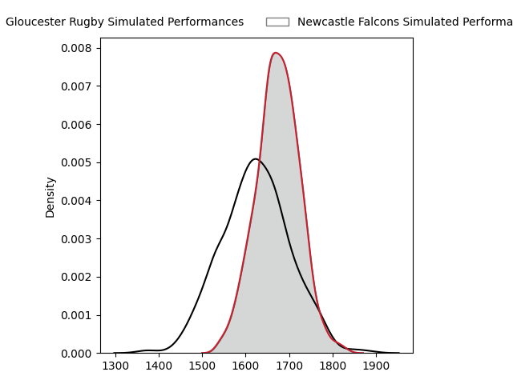
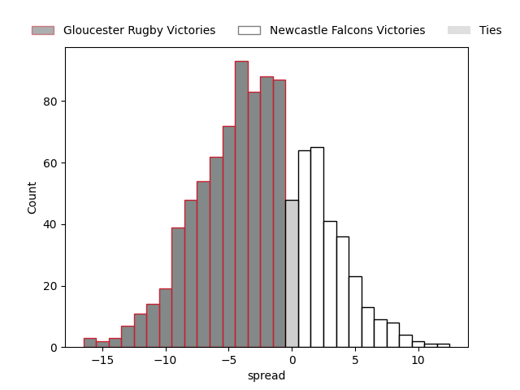

---  
layout: page  
title: Gloucester Rugby at Newcastle Falcons  
date: 2023-03-24 15:45:00 18:00:00 -0500  
categories: match projection  
---
# Gloucester Rugby at Newcastle Falcons

# Club Level Predictions

The first set of predictions treats a club as the smallest object, as the club develops its members, organizes a gameplan, and deploys its players as needed for each match. This club model has a prediction of 0.428, which translates to predicting Gloucester Rugby to win by 2.6.

Each club has a rating and a rating deviation (simiar to a Glicko system), and expected performances can be generated. This allows for simulated matches and spreads like the ones below.
## Projected Performances

## Projected Spreads

## Projected Results

# Player Level Predictions

Treating teams instead as an entity made up of the currently active players, I have ratings for each player in an altogether different system. These can be combined to form team ratings once teamsheets are announced, weighting starters a bit higher than the reserves. After the match is played, players can be weighted by their minutes on the field, allowing for an accurate measure of the team's composition. With these compiled team ratings, we can make predictions, measure inaccuracy, and update the individual player ratings.
## Prediction without Player Minutes: Gloucester Rugby by 1.7

Gloucester Rugby by 5.7 on a neutral field

| Away Player                                                         |   Away elo |   Away Percentile |   Number |   Home Percentile |   Home elo | Home Player                                                          |
|:--------------------------------------------------------------------|-----------:|------------------:|---------:|------------------:|-----------:|:---------------------------------------------------------------------|
| [Harry Elrington](..//playerfiles//HarryElrington_cleaned.md)       |      86.85 |                49 |        1 |                32 |      90.85 | [Adam Brocklebank](..//playerfiles//AdamBrocklebank_cleaned.md)      |
| [Sebastian Blake](..//playerfiles//SebastianBlake_cleaned.md)       |      75.58 |                 6 |        2 |                28 |      88.38 | [Jamie Blamire](..//playerfiles//JamieBlamire_cleaned.md)            |
| [Kirill Gotovtsev](..//playerfiles//KirillGotovtsev_cleaned.md)     |     110.86 |                89 |        3 |                43 |      93.3  | [Richard Palframan](..//playerfiles//RichardPalframan_cleaned.md)    |
| [Freddie Clarke](..//playerfiles//FreddieClarke_cleaned.md)         |      93.68 |                45 |        4 |                12 |      79.26 | [Greg Peterson](..//playerfiles//GregPeterson_cleaned.md)            |
| [Matias Alemanno](..//playerfiles//MatiasAlemanno_cleaned.md)       |     102.82 |                71 |        5 |                 3 |      61.83 | [Sebastian de Chaves](..//playerfiles//SebastiandeChaves_cleaned.md) |
| [Jordy Reid](..//playerfiles//JordyReid_cleaned.md)                 |     107.94 |                79 |        6 |                24 |      87.34 | [Pedro Rubiolo](..//playerfiles//PedroRubiolo_cleaned.md)            |
| [Lewis Ludlow](..//playerfiles//LewisLudlow_cleaned.md)             |      95.9  |                50 |        7 |                65 |     100.93 | [Callum Chick](..//playerfiles//CallumChick_cleaned.md)              |
| [Ruan Ackermann](..//playerfiles//RuanAckermann_cleaned.md)         |      99.08 |                56 |        8 |                88 |     115.81 | [Carl Fearns](..//playerfiles//CarlFearns_cleaned.md)                |
| [Stephen Varney](..//playerfiles//StephenVarney_cleaned.md)         |      74.01 |                 7 |        9 |                72 |     103.23 | [Michael Young](..//playerfiles//MichaelYoung_cleaned.md)            |
| [Santiago Carreras](..//playerfiles//SantiagoCarreras_cleaned.md)   |     137.68 |                97 |       10 |                14 |      81.8  | [Brett Connon](..//playerfiles//BrettConnon_cleaned.md)              |
| [Ollie Thorley](..//playerfiles//OllieThorley_cleaned.md)           |     114.68 |                87 |       11 |                37 |      91.47 | [Mateo Carreras](..//playerfiles//MateoCarreras_cleaned.md)          |
| [Sebastien Atkinson](..//playerfiles//SebastienAtkinson_cleaned.md) |      45.96 |                 0 |       12 |                11 |      79.41 | [Matias Orlando](..//playerfiles//MatiasOrlando_cleaned.md)          |
| [Chris Harris](..//playerfiles//ChrisHarris_cleaned.md)             |     109.76 |                81 |       13 |                91 |     119.35 | [Matias Moroni](..//playerfiles//MatiasMoroni_cleaned.md)            |
| [Louis Rees-Zammit](..//playerfiles//LouisRees-Zammit_cleaned.md)   |     102.41 |                65 |       14 |                96 |     129.52 | [Adam Radwan](..//playerfiles//AdamRadwan_cleaned.md)                |
| [Lloyd Evans](..//playerfiles//LloydEvans_cleaned.md)               |     100.9  |                61 |       15 |                27 |      87.28 | [Elliott Obatoyinbo](..//playerfiles//ElliottObatoyinbo_cleaned.md)  |
| [Cameron Jordan](..//playerfiles//CameronJordan_cleaned.md)         |      79.41 |                18 |       19 |                63 |     100    | [Freddie Lockwood](..//playerfiles//FreddieLockwood_cleaned.md)      |
| [Jack Clement](..//playerfiles//JackClement_cleaned.md)             |      97.24 |                64 |       20 |                 5 |      76.1  | [Tom Marshall](..//playerfiles//TomMarshall_cleaned.md)              |
| [Charlie Chapman](..//playerfiles//CharlieChapman_cleaned.md)       |      97.87 |                76 |       21 |                 1 |      59.32 | [Sam Stuart](..//playerfiles//SamStuart_cleaned.md)                  |
| [Tom Seabrook](..//playerfiles//TomSeabrook_cleaned.md)             |      59.22 |                 2 |       23 |                26 |      88.07 | [Ben Stevenson](..//playerfiles//BenStevenson_cleaned.md)            |

