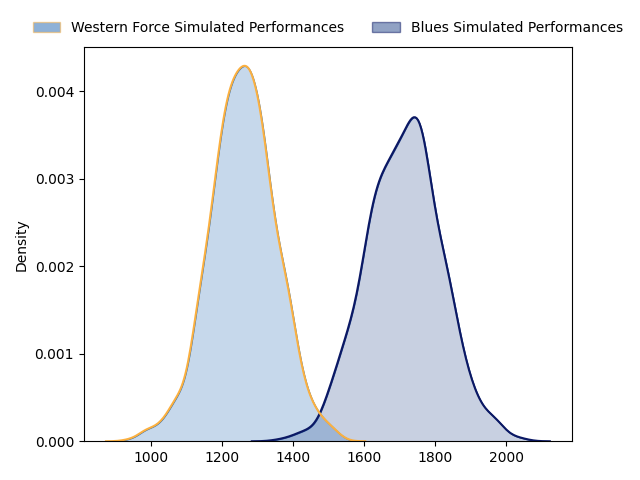
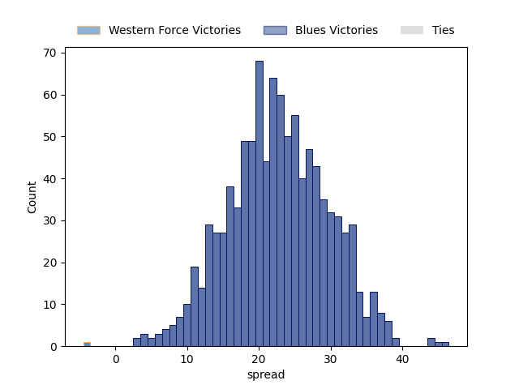

---  
layout: page  
title: Western Force at Blues  
date: 2023-03-25 22:35:00 18:00:00 -0500  
categories: match projection  
---
# Western Force at Blues

# Club Level Predictions

The first set of predictions treats a club as the smallest object, as the club develops its members, organizes a gameplan, and deploys its players as needed for each match. This club model has a prediction of 0.925, which translates to predicting Blues to win by 22.4.

Each club has a rating and a rating deviation (simiar to a Glicko system), and expected performances can be generated. This allows for simulated matches and spreads like the ones below.
## Projected Performances

## Projected Spreads

## Projected Results

# Player Level Predictions

Treating teams instead as an entity made up of the currently active players, I have ratings for each player in an altogether different system. These can be combined to form team ratings once teamsheets are announced, weighting starters a bit higher than the reserves. After the match is played, players can be weighted by their minutes on the field, allowing for an accurate measure of the team's composition. With these compiled team ratings, we can make predictions, measure inaccuracy, and update the individual player ratings.
## Prediction without Player Minutes: Blues by 21.0

Blues by 17.0 on a neutral field

| Away Player                                                               |   Away elo |   Away Percentile |   Number |   Home Percentile |   Home elo | Home Player                                                                               |
|:--------------------------------------------------------------------------|-----------:|------------------:|---------:|------------------:|-----------:|:------------------------------------------------------------------------------------------|
| [Folau Fainga'a](..//playerfiles//FolauFainga'a_cleaned.md)               |     130.06 |                98 |        2 |                92 |     115.04 | [Kurt Eklund](..//playerfiles//KurtEklund_cleaned.md)                                     |
| [Santiago Medrano](..//playerfiles//SantiagoMedrano_cleaned.md)           |     118.74 |                94 |        3 |                89 |     111.3  | [Ofa Tu'ungafasi](..//playerfiles//OfaTu'ungafasi_cleaned.md)                             |
| [Felix Kalapu](..//playerfiles//FelixKalapu_cleaned.md)                   |      48.91 |                 1 |        4 |                84 |     111.09 | [James Tucker](..//playerfiles//JamesTucker_cleaned.md)                                   |
| [Jeremy Williams](..//playerfiles//JeremyWilliams_cleaned.md)             |      77.69 |                10 |        5 |                77 |     106.58 | [Cameron Suafoa](..//playerfiles//CameronSuafoa_cleaned.md)                               |
| [Tim Anstee](..//playerfiles//TimAnstee_cleaned.md)                       |      55.67 |                 0 |        7 |                33 |      89.82 | [Adrian Choat](..//playerfiles//AdrianChoat_cleaned.md)                                   |
| [Rahboni Vosayaco](..//playerfiles//RahboniVosayaco_cleaned.md)           |      91.55 |                34 |        8 |                97 |     127.32 | [Hoskins Sotutu](..//playerfiles//HoskinsSotutu_cleaned.md)                               |
| [Bryce Hegarty](..//playerfiles//BryceHegarty_cleaned.md)                 |      99.96 |                61 |       10 |                88 |     116.21 | [Stephen Perofeta](..//playerfiles//StephenPerofeta_cleaned.md)                           |
| [Toni Pulu](..//playerfiles//ToniPulu_cleaned.md)                         |     126.49 |                95 |       11 |                86 |     113.57 | [Mark Telea](..//playerfiles//MarkTelea_cleaned.md)                                       |
| [Sam Spink](..//playerfiles//SamSpink_cleaned.md)                         |      96.73 |                51 |       13 |                90 |     118.49 | [Bryce Heem](..//playerfiles//BryceHeem_cleaned.md)                                       |
| [Zach Kibirige](..//playerfiles//ZachKibirige_cleaned.md)                 |      73.67 |                 7 |       14 |                94 |     126.27 | [Jacob Ratumaitavuki-Kneepkens](..//playerfiles//JacobRatumaitavuki-Kneepkens_cleaned.md) |
| [Chase Tiatia](..//playerfiles//ChaseTiatia_cleaned.md)                   |     103.77 |                67 |       15 |                53 |      96.94 | [Zarn Sullivan](..//playerfiles//ZarnSullivan_cleaned.md)                                 |
| [Tom Horton](..//playerfiles//TomHorton_cleaned.md)                       |     103.34 |                76 |       16 |                46 |      93.7  | [Ricky Riccitelli](..//playerfiles//RickyRiccitelli_cleaned.md)                           |
| [Ryan McCauley](..//playerfiles//RyanMcCauley_cleaned.md)                 |      77.71 |                10 |       19 |                90 |     116.22 | [Tom Robinson](..//playerfiles//TomRobinson_cleaned.md)                                   |
| [Issak Fines-Leleiwasa](..//playerfiles//IssakFines-Leleiwasa_cleaned.md) |      94.88 |                52 |       21 |                41 |      94.19 | [Taine Plumtree](..//playerfiles//TainePlumtree_cleaned.md)                               |
| [Bayley Kuenzle](..//playerfiles//BayleyKuenzle_cleaned.md)               |      80    |                12 |       22 |                18 |      84.4  | [Taufa Funaki](..//playerfiles//TaufaFunaki_cleaned.md)                                   |

