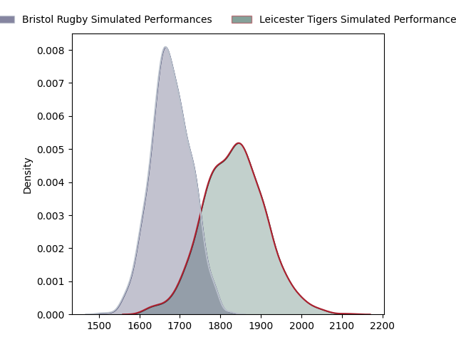
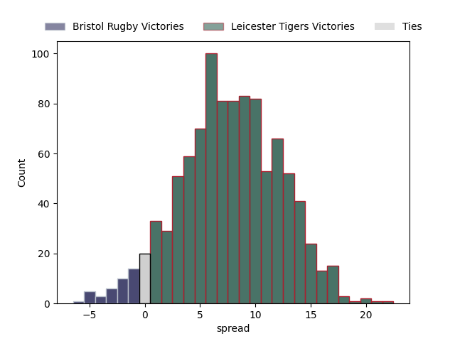

---  
layout: page  
title: Bristol Rugby at Leicester Tigers  
date: 2023-03-25 08:30:00 18:00:00 -0500  
categories: match projection  
---
# Bristol Rugby at Leicester Tigers

# Club Level Predictions

The first set of predictions treats a club as the smallest object, as the club develops its members, organizes a gameplan, and deploys its players as needed for each match. This club model has a prediction of 0.709, which translates to predicting Leicester Tigers to win by 7.7.

Each club has a rating and a rating deviation (simiar to a Glicko system), and expected performances can be generated. This allows for simulated matches and spreads like the ones below.
## Projected Performances

## Projected Spreads

## Projected Results

# Player Level Predictions

Treating teams instead as an entity made up of the currently active players, I have ratings for each player in an altogether different system. These can be combined to form team ratings once teamsheets are announced, weighting starters a bit higher than the reserves. After the match is played, players can be weighted by their minutes on the field, allowing for an accurate measure of the team's composition. With these compiled team ratings, we can make predictions, measure inaccuracy, and update the individual player ratings.
## Prediction without Player Minutes: Bristol Rugby by 2.7

Bristol Rugby by 6.7 on a neutral field

| Away Player     |   Away elo |   Away Percentile |   Number |   Home Percentile |   Home elo | Home Player         |
|:----------------|-----------:|------------------:|---------:|------------------:|-----------:|:--------------------|
| Yann Thomas     |      91.8  |                36 |        1 |                88 |     110.16 | Tom West            |
| Harry Thacker   |      94.41 |                48 |        2 |                27 |      88.18 | Julian Montoya      |
| Max Lahiff      |      94.69 |                48 |        3 |                81 |     105.28 | Joe Heyes           |
| Joe Joyce       |     146.97 |                98 |        4 |                69 |     102.28 | George Martin       |
| Chris Vui       |     111.41 |                85 |        5 |                93 |     123.36 | Cameron Henderson   |
| Steven Luatua   |     133.36 |                97 |        6 |                94 |     124.92 | Hanro Liebenberg    |
| Fitz Harding    |     114.07 |                87 |        7 |                78 |     107.34 | Olly Cracknell      |
| Magnus Bradbury |      92.01 |                36 |        8 |                79 |     107.34 | Jasper Wiese        |
| Harry Randall   |     111.72 |                87 |        9 |                37 |      91.37 | Ben Youngs          |
| AJ MacGinty     |     108.32 |                79 |       10 |                95 |     129.64 | Handre Pollard      |
| Gabriel Ibitoye |     110.47 |                83 |       11 |                58 |      98.45 | Harry Potter        |
| James Williams  |     104.54 |                73 |       12 |                75 |     106.11 | Jimmy Gopperth      |
| Semi Radradra   |     128.53 |                96 |       13 |                29 |      88.92 | Matt Scott          |
| Ioan Lloyd      |      88.56 |                11 |       14 |                24 |      87.32 | Anthony Watson      |
| Charles Piutau  |     119.85 |                91 |       15 |                80 |     109.05 | Mike Brown          |
| Ellis Genge     |      97.4  |                58 |       17 |                92 |     115.34 | James Cronin        |
| Jake Heenan     |      91.57 |                29 |       19 |                43 |      93.37 | Eli Snyman          |
| Samuel Lewis    |     103.98 |                72 |       20 |                80 |     112.34 | Tommy Reffell       |
| Andy Uren       |      75.7  |                 6 |       21 |                39 |      91.88 | Jack van Poortvliet |
| Sam Bedlow      |     119.56 |                86 |       22 |                50 |      98.91 | Charlie Atkinson    |
| Noah Heward     |      98.05 |                53 |       23 |                58 |      99.25 | Freddie Steward     |

