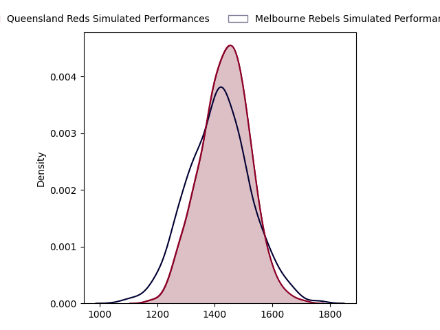

---  
layout: page  
title: Queensland Reds at Melbourne Rebels  
date: 2023-03-25 04:35:00 18:00:00 -0500  
categories: match projection  
---
# Queensland Reds at Melbourne Rebels

# Club Level Predictions

The first set of predictions treats a club as the smallest object, as the club develops its members, organizes a gameplan, and deploys its players as needed for each match. This club model has a prediction of 0.469, which translates to predicting Queensland Reds to win by 1.1.

Each club has a rating and a rating deviation (simiar to a Glicko system), and expected performances can be generated. This allows for simulated matches and spreads like the ones below.
## Projected Performances

## Projected Spreads

## Projected Results

# Player Level Predictions

Treating teams instead as an entity made up of the currently active players, I have ratings for each player in an altogether different system. These can be combined to form team ratings once teamsheets are announced, weighting starters a bit higher than the reserves. After the match is played, players can be weighted by their minutes on the field, allowing for an accurate measure of the team's composition. With these compiled team ratings, we can make predictions, measure inaccuracy, and update the individual player ratings.
## Prediction without Player Minutes: Melbourne Rebels by 1.0

Queensland Reds by 3.0 on a neutral field

| Away Player     |   Away elo |   Away Percentile |   Number |   Home Percentile |   Home elo | Home Player         |
|:----------------|-----------:|------------------:|---------:|------------------:|-----------:|:--------------------|
| Dane Zander     |     106.02 |                83 |        1 |                92 |     114.04 | Matt Gibbon         |
| Matt Faessler   |      97.3  |                58 |        2 |                62 |      98.45 | Alex Mafi           |
| Zane Nonggorr   |      98.32 |                61 |        3 |                41 |      93.02 | Sam Talakai         |
| Ryan Smith      |      95.31 |                49 |        4 |                46 |      94.12 | Trevor Hosea        |
| Seru Uru        |      97.62 |                56 |        5 |                40 |      92.38 | Tuaina Taii Tualima |
| Liam Wright     |     127.68 |                95 |        6 |                38 |      91.73 | Josh Kemeny         |
| Fraser McReight |     110.45 |                83 |        7 |                65 |     101.18 | Brad Wilkin         |
| Harry Wilson    |     106.76 |                77 |        8 |                48 |      90.34 | Vaiolini Ekuasi     |
| James O'Connor  |      92.88 |                39 |       10 |                58 |      99.01 | Carter Gordon       |
| Filipo Daugunu  |     121.01 |                92 |       11 |                94 |     124.41 | Monty Ioane         |
| Josh Flook      |      97.09 |                53 |       13 |                88 |     115.15 | Stacey Ili          |
| Jordan Petaia   |      95.5  |                48 |       14 |                39 |      91.92 | Lachie Anderson     |
| Jock Campbell   |     101.09 |                62 |       15 |                60 |     100.34 | Joe Pincus          |
| Richie Asiata   |     116.04 |                89 |       16 |                95 |     118.98 | Anaru Rangi         |
| Tate McDermott  |     101.75 |                68 |       21 |                60 |      98.09 | James Tuttle        |
| Taj Annan       |      89.57 |                32 |       23 |                 7 |      71.57 | Nick Jooste         |

