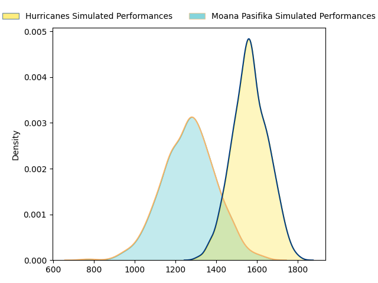
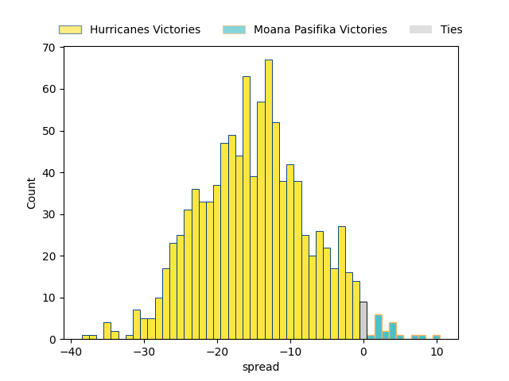
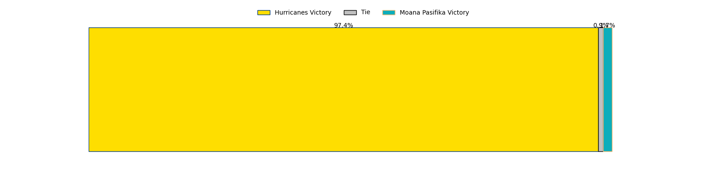

---  
layout: page  
title: Hurricanes at Moana Pasifika  
date: 2023-03-25 02:05:00 18:00:00 -0500  
categories: match projection  
---
# Hurricanes at Moana Pasifika

# Club Level Predictions

The first set of predictions treats a club as the smallest object, as the club develops its members, organizes a gameplan, and deploys its players as needed for each match. This club model has a prediction of 0.167, which translates to predicting Hurricanes to win by 14.9.

Each club has a rating and a rating deviation (simiar to a Glicko system), and expected performances can be generated. This allows for simulated matches and spreads like the ones below.
## Projected Performances

## Projected Spreads

## Projected Results

# Player Level Predictions

Treating teams instead as an entity made up of the currently active players, I have ratings for each player in an altogether different system. These can be combined to form team ratings once teamsheets are announced, weighting starters a bit higher than the reserves. After the match is played, players can be weighted by their minutes on the field, allowing for an accurate measure of the team's composition. With these compiled team ratings, we can make predictions, measure inaccuracy, and update the individual player ratings.
## Prediction without Player Minutes: Hurricanes by 13.3

Hurricanes by 17.3 on a neutral field

| Away Player          |   Away elo |   Away Percentile |   Number |   Home Percentile |   Home elo | Home Player           |
|:---------------------|-----------:|------------------:|---------:|------------------:|-----------:|:----------------------|
| Xavier Numia         |     118.52 |                94 |        1 |                80 |     104.64 | Abraham Pole          |
| Asafo Aumua          |     122.5  |                96 |        2 |                 8 |      78.19 | Samiuela Moli         |
| Owen Franks          |      93.55 |                45 |        3 |                11 |      80.85 | Suetena Asomua        |
| Dominic Bird         |     119.47 |                92 |        4 |                 8 |      75.09 | Samuel Slade          |
| Isaia Walker-Leawere |     116.17 |                90 |        5 |                10 |      77.66 | Mike McKee            |
| Devan Flanders       |      96.37 |                51 |        6 |                39 |      92    | Solomone Funaki       |
| Peter Lakai          |     101.16 |                64 |        7 |                23 |      87.07 | Alamanda Motuga       |
| Ardie Savea          |     122.84 |                93 |        8 |                64 |     101.3  | Lotu Inisi            |
| Cam Roigard          |      93.53 |                44 |        9 |                70 |     102.69 | Ere Enari             |
| Brett Cameron        |      93.94 |                43 |       10 |                88 |     117.4  | Christian Leali'ifano |
| Salesi Rayasi        |      91.98 |                40 |       11 |                 5 |      70.03 | Anzelo Tuitavuki      |
| Billy Proctor        |     118.89 |                91 |       12 |                17 |      83.71 | Henry Taefu           |
| Bailyn Sullivan      |     104.16 |                72 |       13 |                93 |     122.16 | Levi Aumua            |
| Joshua Moorby        |      92.62 |                42 |       15 |                93 |     122.36 | William Havili        |
| Hame Faiva           |      85.95 |                19 |       16 |                43 |      92.91 | Ray Niuia             |
| Tevita Mafileo       |     106.08 |                82 |       17 |                 5 |      73.98 | Ezekiel Lindenmuth    |
| Brayden Iose         |      57.49 |                 1 |       20 |                55 |      97.46 | Miracle Faiilagi      |
| Jamie Booth          |      66.43 |                 4 |       21 |                42 |      92.98 | Manu Paea             |
| Julian Savea         |     136.36 |                98 |       23 |                 7 |      73.92 | Fine Inisi            |

