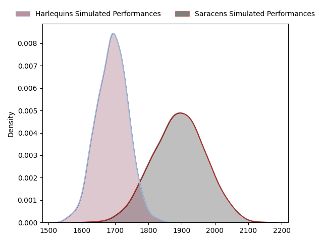
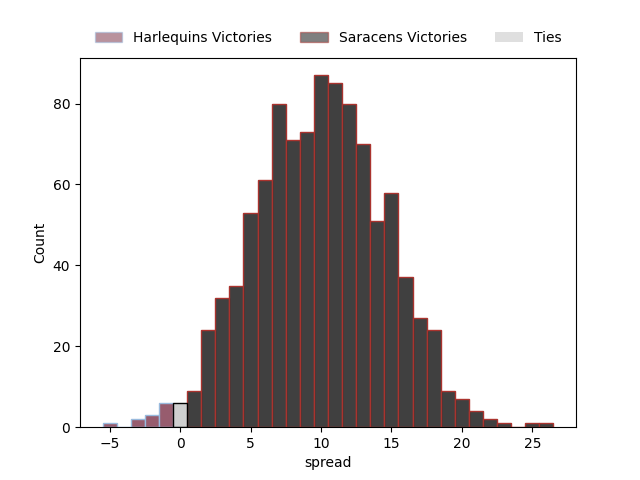

---  
layout: page  
title: Harlequins at Saracens  
date: 2023-03-25 11:00:00 18:00:00 -0500  
categories: match projection  
---
# Harlequins at Saracens

# Club Level Predictions

The first set of predictions treats a club as the smallest object, as the club develops its members, organizes a gameplan, and deploys its players as needed for each match. This club model has a prediction of 0.758, which translates to predicting Saracens to win by 10.0.

Each club has a rating and a rating deviation (simiar to a Glicko system), and expected performances can be generated. This allows for simulated matches and spreads like the ones below.
## Projected Performances

## Projected Spreads

## Projected Results

# Player Level Predictions

Treating teams instead as an entity made up of the currently active players, I have ratings for each player in an altogether different system. These can be combined to form team ratings once teamsheets are announced, weighting starters a bit higher than the reserves. After the match is played, players can be weighted by their minutes on the field, allowing for an accurate measure of the team's composition. With these compiled team ratings, we can make predictions, measure inaccuracy, and update the individual player ratings.
## Prediction without Player Minutes: Saracens by 13.4

Saracens by 9.4 on a neutral field

| Away Player                                                       |   Away elo |   Away Percentile |   Number |   Home Percentile |   Home elo | Home Player                                                 |
|:------------------------------------------------------------------|-----------:|------------------:|---------:|------------------:|-----------:|:------------------------------------------------------------|
| [Joe Marler](..//playerfiles//JoeMarler_cleaned.md)               |      97.71 |                61 |        1 |                97 |     126.01 | [Mako Vunipola](..//playerfiles//MakoVunipola_cleaned.md)   |
| [Jack Walker](..//playerfiles//JackWalker_cleaned.md)             |      77.75 |                 9 |        2 |               100 |     163.08 | [Jamie George](..//playerfiles//JamieGeorge_cleaned.md)     |
| [Wilco Louw](..//playerfiles//WilcoLouw_cleaned.md)               |     115.2  |                92 |        3 |                81 |     105.05 | [Marco Riccioni](..//playerfiles//MarcoRiccioni_cleaned.md) |
| [Irne Herbst](..//playerfiles//IrneHerbst_cleaned.md)             |     112.37 |                86 |        4 |                82 |     109.25 | [Maro Itoje](..//playerfiles//MaroItoje_cleaned.md)         |
| [Stephan Lewies](..//playerfiles//StephanLewies_cleaned.md)       |     118.72 |                92 |        5 |                31 |      89.76 | [Hugh Tizard](..//playerfiles//HughTizard_cleaned.md)       |
| [Jack Kenningham](..//playerfiles//JackKenningham_cleaned.md)     |      86.66 |                21 |        6 |                28 |      88.72 | [Andy Christie](..//playerfiles//AndyChristie_cleaned.md)   |
| [James Chisholm](..//playerfiles//JamesChisholm_cleaned.md)       |     126.24 |                95 |        7 |                93 |     121.83 | [Ben Earl](..//playerfiles//BenEarl_cleaned.md)             |
| [Alex Dombrandt](..//playerfiles//AlexDombrandt_cleaned.md)       |     137.31 |                99 |        8 |                85 |     111.7  | [Billy Vunipola](..//playerfiles//BillyVunipola_cleaned.md) |
| [Danny Care](..//playerfiles//DannyCare_cleaned.md)               |     107.97 |                81 |        9 |                91 |     115.06 | [Ivan van Zyl](..//playerfiles//IvanvanZyl_cleaned.md)      |
| [Marcus Smith](..//playerfiles//MarcusSmith_cleaned.md)           |     126.22 |                93 |       10 |                96 |     131.67 | [Owen Farrell](..//playerfiles//OwenFarrell_cleaned.md)     |
| [Joe Marchant](..//playerfiles//JoeMarchant_cleaned.md)           |      99.97 |                53 |       11 |                88 |     115.92 | [Sean Maitland](..//playerfiles//SeanMaitland_cleaned.md)   |
| [Andre Esterhuizen](..//playerfiles//AndreEsterhuizen_cleaned.md) |     113.86 |                86 |       12 |                99 |     157.17 | [Nick Tompkins](..//playerfiles//NickTompkins_cleaned.md)   |
| [Luke Northmore](..//playerfiles//LukeNorthmore_cleaned.md)       |     114.72 |                87 |       13 |                47 |      95.41 | [Alex Lozowski](..//playerfiles//AlexLozowski_cleaned.md)   |
| [Cadan Murley](..//playerfiles//CadanMurley_cleaned.md)           |      93.22 |                43 |       14 |                14 |      82.3  | [Max Malins](..//playerfiles//MaxMalins_cleaned.md)         |
| [Nick David](..//playerfiles//NickDavid_cleaned.md)               |      92.63 |                42 |       15 |                65 |     102.55 | [Alex Goode](..//playerfiles//AlexGoode_cleaned.md)         |
| [Sam Riley](..//playerfiles//SamRiley_cleaned.md)                 |      89.05 |                29 |       16 |                40 |      92.3  | [Theo Dan](..//playerfiles//TheoDan_cleaned.md)             |
| [Fin Baxter](..//playerfiles//FinBaxter_cleaned.md)               |      92.24 |                38 |       17 |                15 |      84.07 | [Eroni Mawi](..//playerfiles//EroniMawi_cleaned.md)         |
| [Will Collier](..//playerfiles//WillCollier_cleaned.md)           |      97.02 |                58 |       18 |                24 |      88.27 | [Alec Clarey](..//playerfiles//AlecClarey_cleaned.md)       |
| [Dino Lamb](..//playerfiles//DinoLamb_cleaned.md)                 |     111.9  |                86 |       19 |                33 |      91.59 | [Nick Isiekwe](..//playerfiles//NickIsiekwe_cleaned.md)     |
| [Will Evans](..//playerfiles//WillEvans_cleaned.md)               |      98.2  |                53 |       20 |                99 |     145.35 | [Jackson Wray](..//playerfiles//JacksonWray_cleaned.md)     |
| [Tommaso Allan](..//playerfiles//TommasoAllan_cleaned.md)         |     100.31 |                60 |       22 |                80 |     108.78 | [Duncan Taylor](..//playerfiles//DuncanTaylor_cleaned.md)   |
| [Oscar Beard](..//playerfiles//OscarBeard_cleaned.md)             |     106.14 |                77 |       23 |                41 |      92.44 | [Alex Lewington](..//playerfiles//AlexLewington_cleaned.md) |

