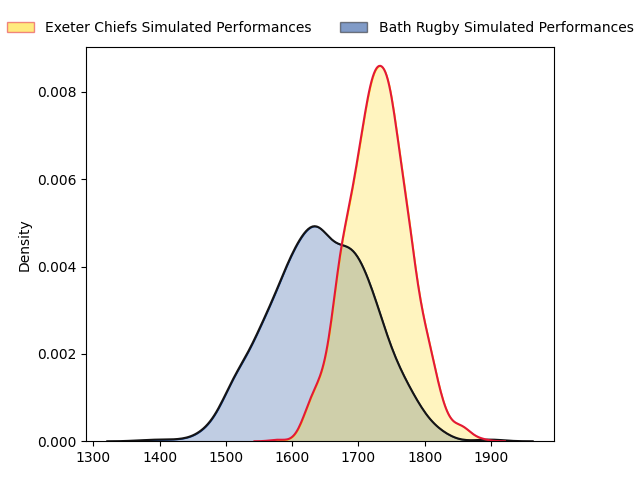
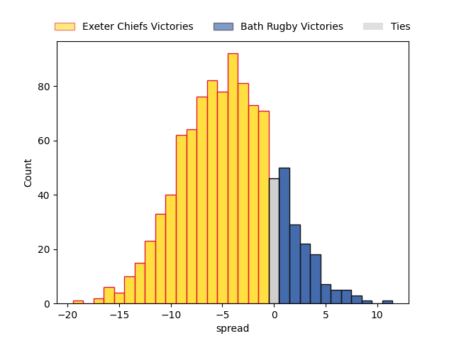
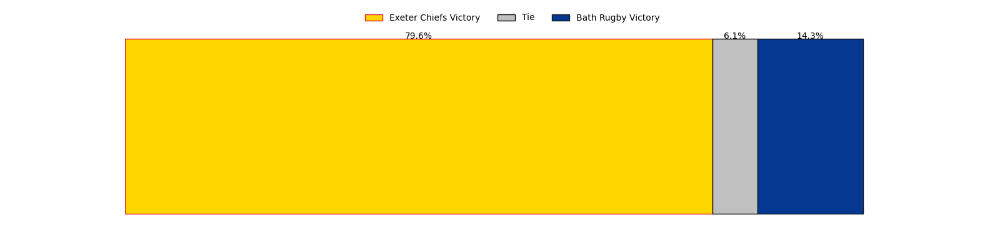

---  
layout: page  
title: Exeter Chiefs at Bath Rugby  
date: 2023-03-26 10:00:00 18:00:00 -0500  
categories: match projection  
---
# Exeter Chiefs at Bath Rugby

# Club Level Predictions

The first set of predictions treats a club as the smallest object, as the club develops its members, organizes a gameplan, and deploys its players as needed for each match. This club model has a prediction of 0.377, which translates to predicting Exeter Chiefs to win by 4.4.

Each club has a rating and a rating deviation (simiar to a Glicko system), and expected performances can be generated. This allows for simulated matches and spreads like the ones below.
## Projected Performances

## Projected Spreads

## Projected Results

# Player Level Predictions

Treating teams instead as an entity made up of the currently active players, I have ratings for each player in an altogether different system. These can be combined to form team ratings once teamsheets are announced, weighting starters a bit higher than the reserves. After the match is played, players can be weighted by their minutes on the field, allowing for an accurate measure of the team's composition. With these compiled team ratings, we can make predictions, measure inaccuracy, and update the individual player ratings.
## Prediction without Player Minutes: Exeter Chiefs by 5.7

Exeter Chiefs by 9.7 on a neutral field

| Away Player                                                             |   Away elo |   Away Percentile |   Number |   Home Percentile |   Home elo | Home Player                                                           |
|:------------------------------------------------------------------------|-----------:|------------------:|---------:|------------------:|-----------:|:----------------------------------------------------------------------|
| [Scott Sio](..//playerfiles//ScottSio_cleaned.md)                       |      99.86 |                66 |        1 |                86 |     107.95 | [Beno Obano](..//playerfiles//BenoObano_cleaned.md)                   |
| [Dan Frost](..//playerfiles//DanFrost_cleaned.md)                       |     139.06 |                99 |        2 |                96 |     122.67 | [Tom Dunn](..//playerfiles//TomDunn_cleaned.md)                       |
| [Marcus Street](..//playerfiles//MarcusStreet_cleaned.md)               |      85    |                16 |        3 |                 9 |      79.48 | [Will Stuart](..//playerfiles//WillStuart_cleaned.md)                 |
| [Jack Dunne](..//playerfiles//JackDunne_cleaned.md)                     |      99.52 |                62 |        4 |                85 |     111.16 | [Josh McNally](..//playerfiles//JoshMcNally_cleaned.md)               |
| [Dafydd Jenkins](..//playerfiles//DafyddJenkins_cleaned.md)             |     123.76 |                91 |        5 |                39 |      92.12 | [GJ van Velze](..//playerfiles//GJvanVelze_cleaned.md)                |
| [Dave Ewers](..//playerfiles//DaveEwers_cleaned.md)                     |     144.57 |                98 |        6 |                50 |      95.95 | [Ted Hill](..//playerfiles//TedHill_cleaned.md)                       |
| [Christ Tshiunza](..//playerfiles//ChristTshiunza_cleaned.md)           |      89.24 |                30 |        7 |                92 |     119.88 | [Chris Cloete](..//playerfiles//ChrisCloete_cleaned.md)               |
| [Sam Simmonds](..//playerfiles//SamSimmonds_cleaned.md)                 |     123.44 |                94 |        8 |                89 |     116.64 | [Miles Reid](..//playerfiles//MilesReid_cleaned.md)                   |
| [Sam Maunder](..//playerfiles//SamMaunder_cleaned.md)                   |      70    |                 4 |        9 |                89 |     112.75 | [Ben Spencer](..//playerfiles//BenSpencer_cleaned.md)                 |
| [Harvey Skinner](..//playerfiles//HarveySkinner_cleaned.md)             |      90.1  |                31 |       10 |                 2 |      63.89 | [Orlando Bailey](..//playerfiles//OrlandoBailey_cleaned.md)           |
| [Olly Woodburn](..//playerfiles//OllyWoodburn_cleaned.md)               |     130.61 |                96 |       11 |                60 |      98.82 | [Cameron Redpath](..//playerfiles//CameronRedpath_cleaned.md)         |
| [Solomone Kata](..//playerfiles//SolomoneKata_cleaned.md)               |     120.88 |                92 |       12 |                 9 |      76.92 | [Ollie Lawrence](..//playerfiles//OllieLawrence_cleaned.md)           |
| [Henry Slade](..//playerfiles//HenrySlade_cleaned.md)                   |     101.78 |                66 |       13 |                62 |      99.8  | [Ruaridh McConnochie](..//playerfiles//RuaridhMcConnochie_cleaned.md) |
| [Jack Nowell](..//playerfiles//JackNowell_cleaned.md)                   |      80.34 |                12 |       14 |                50 |      95.93 | [Joe Cokanasiga](..//playerfiles//JoeCokanasiga_cleaned.md)           |
| [Josh Hodge](..//playerfiles//JoshHodge_cleaned.md)                     |      75.53 |                 9 |       15 |                78 |     107.06 | [Matt Gallagher](..//playerfiles//MattGallagher_cleaned.md)           |
| [Jack Yeandle](..//playerfiles//JackYeandle_cleaned.md)                 |     126.06 |                97 |       16 |                64 |      97.84 | [Niall Annett](..//playerfiles//NiallAnnett_cleaned.md)               |
| [Patrick Schickerling](..//playerfiles//PatrickSchickerling_cleaned.md) |     104.64 |                73 |       18 |                 0 |      32.28 | [D'Arcy Rae](..//playerfiles//D'ArcyRae_cleaned.md)                   |
| [Mike Williams](..//playerfiles//MikeWilliams_cleaned.md)               |      76.7  |                11 |       19 |                 3 |      67.45 | [Fergus Lee-Warner](..//playerfiles//FergusLee-Warner_cleaned.md)     |
| [Aidon Davis](..//playerfiles//AidonDavis_cleaned.md)                   |      77.68 |                 8 |       20 |                48 |      95.23 | [Josh Bayliss](..//playerfiles//JoshBayliss_cleaned.md)               |
| [Jack Maunder](..//playerfiles//JackMaunder_cleaned.md)                 |      81.82 |                14 |       21 |                55 |      97.26 | [Louis Schreuder](..//playerfiles//LouisSchreuder_cleaned.md)         |
| [Joe Simmonds](..//playerfiles//JoeSimmonds_cleaned.md)                 |     129.12 |                95 |       22 |                93 |     124.81 | [Piers Francis](..//playerfiles//PiersFrancis_cleaned.md)             |

