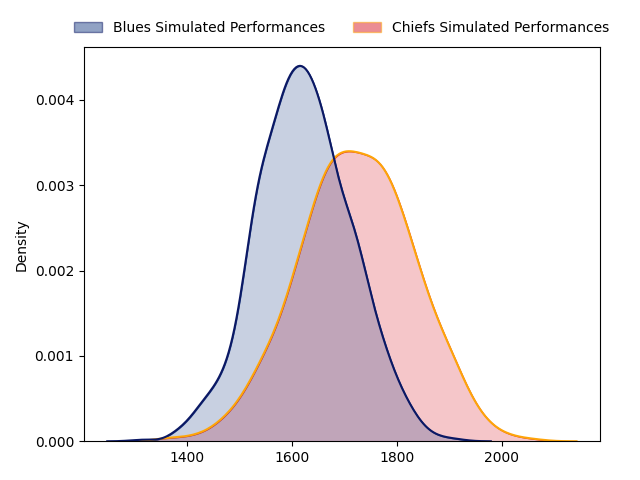
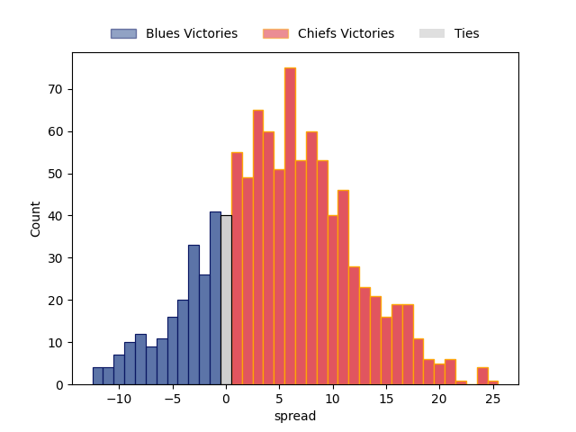

---  
layout: page  
title: Blues at Chiefs  
date: 2023-04-01 02:05:00 18:00:00 -0500  
categories: match projection  
---
# Blues at Chiefs

# Club Level Predictions

The first set of predictions treats a club as the smallest object, as the club develops its members, organizes a gameplan, and deploys its players as needed for each match. This club model has a prediction of 0.637, which translates to predicting Chiefs to win by 4.8.

Each club has a rating and a rating deviation (simiar to a Glicko system), and expected performances can be generated. This allows for simulated matches and spreads like the ones below.
## Projected Performances

## Projected Spreads

## Projected Results

# Player Level Predictions

Treating teams instead as an entity made up of the currently active players, I have ratings for each player in an altogether different system. These can be combined to form team ratings once teamsheets are announced, weighting starters a bit higher than the reserves. After the match is played, players can be weighted by their minutes on the field, allowing for an accurate measure of the team's composition. With these compiled team ratings, we can make predictions, measure inaccuracy, and update the individual player ratings.
## Prediction without Player Minutes: Chiefs by 8.0

Chiefs by 4.0 on a neutral field

| Away Player                                                                               |   Away elo |   Away Percentile |   Number |   Home Percentile |   Home elo | Home Player                                                             |
|:------------------------------------------------------------------------------------------|-----------:|------------------:|---------:|------------------:|-----------:|:------------------------------------------------------------------------|
| [Jordan Lay](..//playerfiles//JordanLay_cleaned.md)                                       |      92.67 |                44 |        1 |                37 |      93.32 | [Ollie Norris](..//playerfiles//OllieNorris_cleaned.md)                 |
| [Ricky Riccitelli](..//playerfiles//RickyRiccitelli_cleaned.md)                           |      93.7  |                46 |        2 |                90 |     115.04 | [Samisoni Taukei'aho](..//playerfiles//SamisoniTaukei'aho_cleaned.md)   |
| [Nepo Laulala](..//playerfiles//NepoLaulala_cleaned.md)                                   |     120.26 |                96 |        3 |                84 |     106.54 | [John Ryan](..//playerfiles//JohnRyan_cleaned.md)                       |
| [Cameron Suafoa](..//playerfiles//CameronSuafoa_cleaned.md)                               |     106.58 |                77 |        4 |                93 |     120.29 | [Brodie Retallick](..//playerfiles//BrodieRetallick_cleaned.md)         |
| [Sam Darry](..//playerfiles//SamDarry_cleaned.md)                                         |     103.57 |                69 |        5 |                48 |      94.83 | [Tupou Vaa'i](..//playerfiles//TupouVaa'i_cleaned.md)                   |
| [Anton Segner](..//playerfiles//AntonSegner_cleaned.md)                                   |      89.67 |                32 |        6 |                83 |     110.12 | [Samipeni Finau](..//playerfiles//SamipeniFinau_cleaned.md)             |
| [Dalton Papali'i](..//playerfiles//DaltonPapali'i_cleaned.md)                             |     103.65 |                71 |        7 |                98 |     140.36 | [Sam Cane](..//playerfiles//SamCane_cleaned.md)                         |
| [Hoskins Sotutu](..//playerfiles//HoskinsSotutu_cleaned.md)                               |     127.32 |                97 |        8 |                98 |     138.4  | [Luke Jacobson](..//playerfiles//LukeJacobson_cleaned.md)               |
| [Finlay Christie](..//playerfiles//FinlayChristie_cleaned.md)                             |     104.04 |                74 |        9 |                99 |     138.35 | [Brad Weber](..//playerfiles//BradWeber_cleaned.md)                     |
| [Beauden Barrett](..//playerfiles//BeaudenBarrett_cleaned.md)                             |     157.18 |               100 |       10 |                49 |      96.11 | [Damian McKenzie](..//playerfiles//DamianMcKenzie_cleaned.md)           |
| [Caleb Clarke](..//playerfiles//CalebClarke_cleaned.md)                                   |      99.4  |                60 |       11 |                66 |     101.53 | [Etene Nanai-Seturo](..//playerfiles//EteneNanai-Seturo_cleaned.md)     |
| [Harry Plummer](..//playerfiles//HarryPlummer_cleaned.md)                                 |     118.75 |                91 |       12 |                45 |      94.52 | [Rameka Poihipi](..//playerfiles//RamekaPoihipi_cleaned.md)             |
| [Rieko Ioane](..//playerfiles//RiekoIoane_cleaned.md)                                     |      78.41 |                10 |       13 |                51 |      97.56 | [Daniel Rona](..//playerfiles//DanielRona_cleaned.md)                   |
| [AJ Lam](..//playerfiles//AJLam_cleaned.md)                                               |      90.59 |                35 |       14 |                81 |     109.31 | [Emoni Narawa](..//playerfiles//EmoniNarawa_cleaned.md)                 |
| [Stephen Perofeta](..//playerfiles//StephenPerofeta_cleaned.md)                           |     116.21 |                88 |       15 |                70 |     104.95 | [Shaun Stevenson](..//playerfiles//ShaunStevenson_cleaned.md)           |
| [Kurt Eklund](..//playerfiles//KurtEklund_cleaned.md)                                     |     115.04 |                92 |       16 |                61 |      98.14 | [Tyrone Thompson](..//playerfiles//TyroneThompson_cleaned.md)           |
| [Ofa Tu'ungafasi](..//playerfiles//OfaTu'ungafasi_cleaned.md)                             |     111.3  |                89 |       17 |                85 |     107.24 | [Aidan Ross](..//playerfiles//AidanRoss_cleaned.md)                     |
| [James Lay](..//playerfiles//JamesLay_cleaned.md)                                         |     104.21 |                78 |       18 |                35 |      94.69 | [George Dyer](..//playerfiles//GeorgeDyer_cleaned.md)                   |
| [Patrick Tuipulotu](..//playerfiles//PatrickTuipulotu_cleaned.md)                         |     129.6  |                97 |       19 |                94 |     124.71 | [Naitoa Ah Kuoi](..//playerfiles//NaitoaAhKuoi_cleaned.md)              |
| [Tom Robinson](..//playerfiles//TomRobinson_cleaned.md)                                   |     116.22 |                90 |       20 |                69 |     102.75 | [Pita Gus Sowakula](..//playerfiles//PitaGusSowakula_cleaned.md)        |
| [Sam Nock](..//playerfiles//SamNock_cleaned.md)                                           |     105.43 |                76 |       21 |                88 |     113.23 | [Cortez Ratima](..//playerfiles//CortezRatima_cleaned.md)               |
| [Jacob Ratumaitavuki-Kneepkens](..//playerfiles//JacobRatumaitavuki-Kneepkens_cleaned.md) |     126.27 |                94 |       23 |                87 |     114.6  | [Liam Coombes-Fabling](..//playerfiles//LiamCoombes-Fabling_cleaned.md) |

