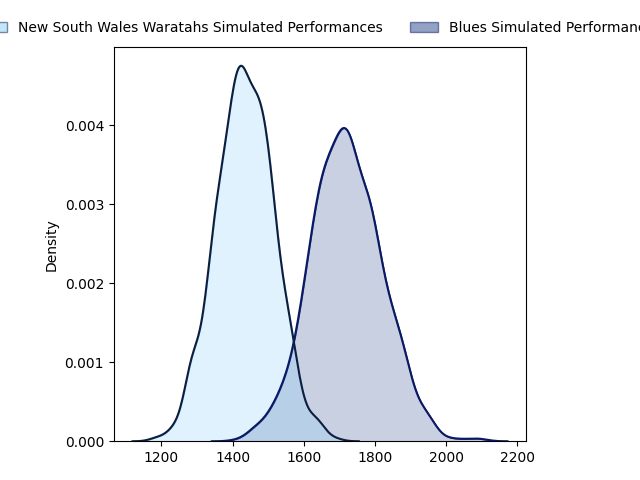
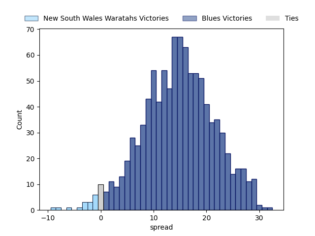

---  
layout: page  
title: New South Wales Waratahs at Blues  
date: 2023-04-22 03:05:00 18:00:00 -0500  
categories: match projection  
---
# New South Wales Waratahs at Blues

# Club Level Predictions

The first set of predictions treats a club as the smallest object, as the club develops its members, organizes a gameplan, and deploys its players as needed for each match. This club model has a prediction of 0.829, which translates to predicting Blues to win by 14.2.

Each club has a rating and a rating deviation (simiar to a Glicko system), and expected performances can be generated. This allows for simulated matches and spreads like the ones below.
## Projected Performances

## Projected Spreads

## Projected Results

# Player Level Predictions

Treating teams instead as an entity made up of the currently active players, I have ratings for each player in an altogether different system. These can be combined to form team ratings once teamsheets are announced, weighting starters a bit higher than the reserves. After the match is played, players can be weighted by their minutes on the field, allowing for an accurate measure of the team's composition. With these compiled team ratings, we can make predictions, measure inaccuracy, and update the individual player ratings.
## Prediction without Player Minutes: Blues by 17.0

Blues by 13.0 on a neutral field

| Away Player          |   Away elo |   Away Percentile |   Number |   Home Percentile |   Home elo | Home Player       |
|:---------------------|-----------:|------------------:|---------:|------------------:|-----------:|:------------------|
| Tom Lambert          |     106.68 |                84 |        1 |                88 |     110.62 | Ofa Tu'ungafasi   |
| Mahe Vailanu         |      73.98 |                 5 |        2 |                46 |      93.9  | Ricky Riccitelli  |
| Harry Johnson-Holmes |      79.04 |                 8 |        3 |                96 |     121.01 | Nepo Laulala      |
| Jed Holloway         |      87.25 |                23 |        4 |                97 |     130.85 | Patrick Tuipulotu |
| Taleni Seu           |     113.2  |                86 |        6 |                23 |      87.28 | Anton Segner      |
| Will Harris          |     106.61 |                74 |        8 |                96 |     125.55 | Hoskins Sotutu    |
| Jake Gordon          |     126.98 |                97 |        9 |                75 |     104.79 | Finlay Christie   |
| Ben Donaldson        |     109.28 |                80 |       10 |                99 |     158.13 | Beauden Barrett   |
| Dylan Pietsch        |     118.6  |                90 |       11 |                61 |     100.09 | Caleb Clarke      |
| Joey Walton          |     109.61 |                79 |       12 |                89 |     116.31 | Harry Plummer     |
| Izaia Perese         |      86.08 |                22 |       13 |                10 |      79.36 | Rieko Ioane       |
| Max Jorgensen        |     114.82 |                88 |       14 |                86 |     113.47 | Mark Telea        |
| Charlie Gamble       |      99.6  |                61 |       20 |                97 |     134.4  | Akira Ioane       |

