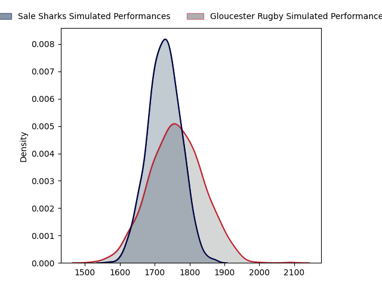
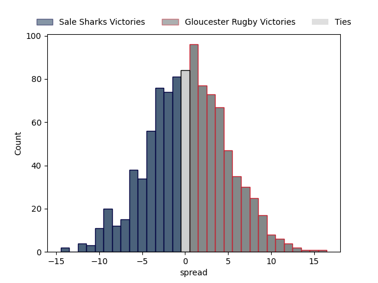

---  
layout: page  
title: Sale Sharks at Gloucester Rugby  
date: 2023-04-22 12:30:00 18:00:00 -0500  
categories: match projection  
---
# Sale Sharks at Gloucester Rugby

# Club Level Predictions

The first set of predictions treats a club as the smallest object, as the club develops its members, organizes a gameplan, and deploys its players as needed for each match. This club model has a prediction of 0.515, which translates to predicting Gloucester Rugby to win by 0.3.

Each club has a rating and a rating deviation (simiar to a Glicko system), and expected performances can be generated. This allows for simulated matches and spreads like the ones below.
## Projected Performances

## Projected Spreads

## Projected Results

# Player Level Predictions

Treating teams instead as an entity made up of the currently active players, I have ratings for each player in an altogether different system. These can be combined to form team ratings once teamsheets are announced, weighting starters a bit higher than the reserves. After the match is played, players can be weighted by their minutes on the field, allowing for an accurate measure of the team's composition. With these compiled team ratings, we can make predictions, measure inaccuracy, and update the individual player ratings.
## Prediction without Player Minutes: Sale Sharks by 2.8

Sale Sharks by 6.8 on a neutral field

| Away Player       |   Away elo |   Away Percentile |   Number |   Home Percentile |   Home elo | Home Player         |
|:------------------|-----------:|------------------:|---------:|------------------:|-----------:|:--------------------|
| Simon McIntyre    |     107.73 |                85 |        1 |                56 |      96.63 | Mayco Vivas         |
| Nic Schonert      |      89.36 |                27 |        3 |                90 |     112.42 | Kirill Gotovtsev    |
| Jean-Luc du Preez |     111.32 |                86 |        4 |                40 |      92.67 | Freddie Clarke      |
| Jonny Hill        |      98.99 |                60 |        5 |                74 |     104.1  | Matias Alemanno     |
| Tom Curry         |      89.94 |                32 |        6 |                50 |      95.84 | Jack Clement        |
| Ben Curry         |      88.49 |                27 |        7 |                53 |      97.06 | Lewis Ludlow        |
| Jono Ross         |     106.69 |                77 |        8 |                94 |     123.61 | Ben Morgan          |
| Gus Warr          |      89.3  |                29 |        9 |                 7 |      74.52 | Stephen Varney      |
| Tom O'Flaherty    |      92.44 |                42 |       11 |                79 |     107.53 | Jonny May           |
| Manu Tuilagi      |     137.53 |                99 |       12 |                 0 |      47.59 | Sebastien Atkinson  |
| Robert du Preez   |     109.33 |                80 |       13 |                81 |     110.35 | Chris Harris        |
| Tom Roebuck       |     109.48 |                81 |       14 |                61 |      99.72 | Louis Rees-Zammit   |
| Joe Carpenter     |      68.52 |                 4 |       15 |                98 |     138.99 | Santiago Carreras   |
| Ewan Ashman       |      92.03 |                33 |       16 |                 2 |      67.52 | Sebastian Blake     |
| Bevan Rodd        |     112.67 |                90 |       17 |                45 |      93.77 | Harry Elrington     |
| Coenie Oosthuizen |     120.88 |                96 |       18 |                24 |      88.45 | Jamal Ford-Robinson |
| Josh Beaumont     |     113.09 |                87 |       19 |                31 |      82.27 | Cameron Jordan      |
| Raffi Quirke      |     102.49 |                70 |       21 |                77 |      94.31 | Charlie Chapman     |
| Sam James         |     121.2  |                92 |       22 |                96 |     133.82 | Billy Twelvetrees   |
| Arron Reed        |     111.67 |                83 |       23 |                80 |     107.55 | Alex Hearle         |

