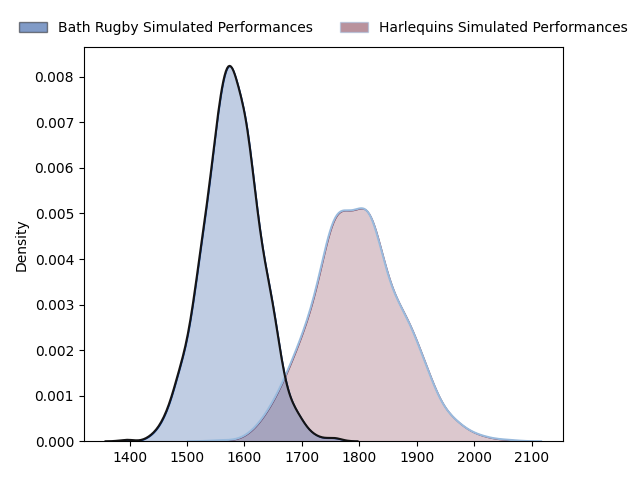

---  
layout: page  
title: Bath Rugby at Harlequins  
date: 2023-04-22 10:00:00 18:00:00 -0500  
categories: match projection  
---
# Bath Rugby at Harlequins

# Club Level Predictions

The first set of predictions treats a club as the smallest object, as the club develops its members, organizes a gameplan, and deploys its players as needed for each match. This club model has a prediction of 0.779, which translates to predicting Harlequins to win by 10.9.

Each club has a rating and a rating deviation (simiar to a Glicko system), and expected performances can be generated. This allows for simulated matches and spreads like the ones below.
## Projected Performances

## Projected Spreads

## Projected Results

# Player Level Predictions

Treating teams instead as an entity made up of the currently active players, I have ratings for each player in an altogether different system. These can be combined to form team ratings once teamsheets are announced, weighting starters a bit higher than the reserves. After the match is played, players can be weighted by their minutes on the field, allowing for an accurate measure of the team's composition. With these compiled team ratings, we can make predictions, measure inaccuracy, and update the individual player ratings.
## Prediction without Player Minutes: Harlequins by 3.3

Bath Rugby by 0.7 on a neutral field

| Away Player           |   Away elo |   Away Percentile |   Number |   Home Percentile |   Home elo | Home Player       |
|:----------------------|-----------:|------------------:|---------:|------------------:|-----------:|:------------------|
| Beno Obano            |     110.16 |                88 |        1 |                65 |      99.38 | Joe Marler        |
| Tom Dunn              |     124.87 |                97 |        2 |                11 |      80.84 | Jack Walker       |
| Will Stuart           |      81.67 |                11 |        3 |                58 |      97.18 | Will Collier      |
| Josh McNally          |     113.53 |                88 |        4 |                89 |     114.81 | Dino Lamb         |
| GJ van Velze          |     100.36 |                65 |        5 |                89 |     113.97 | Irne Herbst       |
| Ted Hill              |      99.18 |                60 |        6 |                11 |      80.59 | Luke Wallace      |
| Chris Cloete          |     125.59 |                94 |        7 |                28 |      88.76 | Will Evans        |
| Miles Reid            |     123.39 |                94 |        8 |                98 |     137.91 | Alex Dombrandt    |
| Ben Spencer           |     116.8  |                91 |        9 |                83 |     109.05 | Danny Care        |
| Orlando Bailey        |      76.3  |                 8 |       10 |                91 |     122.15 | Marcus Smith      |
| Ruaridh McConnochie   |     117.91 |                89 |       11 |                65 |     101.52 | Cadan Murley      |
| Max Ojomoh            |      85.29 |                20 |       12 |                88 |     115.55 | Andre Esterhuizen |
| Ollie Lawrence        |      85.88 |                21 |       13 |                49 |      95.82 | Joe Marchant      |
| Joe Cokanasiga        |      99.07 |                59 |       14 |                88 |     116.62 | Louis Lynagh      |
| Matt Gallagher        |     130.5  |                96 |       15 |                68 |     103.6  | Josh Bassett      |
| Niall Annett          |     103.17 |                73 |       16 |                51 |      96.07 | Sam Riley         |
| Juan Schoeman         |     112.61 |                91 |       17 |                44 |      94.72 | Fin Baxter        |
| D'Arcy Rae            |      41.76 |                 0 |       18 |                75 |     107.81 | Simon Kerrod      |
| Richard de Carpentier |     110.89 |                84 |       20 |                25 |      89.83 | Jack Kenningham   |
| Max Green             |      98.68 |                60 |       21 |                58 |      98.11 | Lewis Gjaltema    |
| Piers Francis         |     124.7  |                92 |       22 |                91 |     117.39 | Luke Northmore    |
| Josh Bayliss          |      97.36 |                53 |       23 |                51 |      96.25 | Nick David        |

