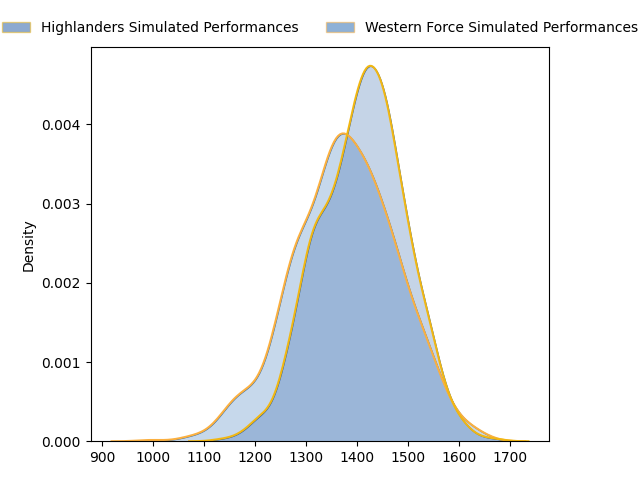
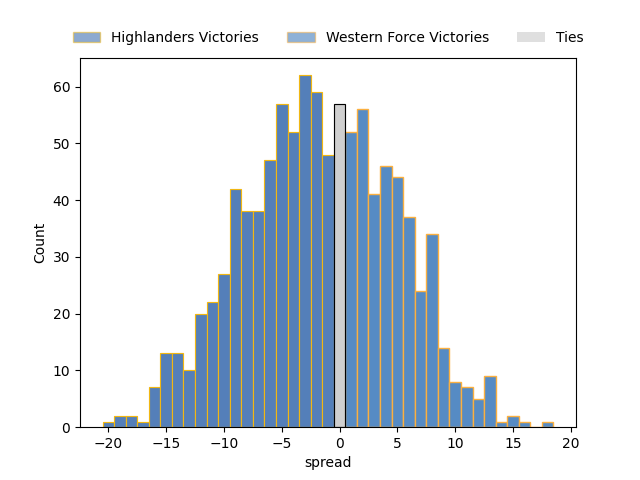

---  
layout: page  
title: Highlanders at Western Force  
date: 2023-04-22 05:35:00 18:00:00 -0500  
categories: match projection  
---
# Highlanders at Western Force

# Club Level Predictions

The first set of predictions treats a club as the smallest object, as the club develops its members, organizes a gameplan, and deploys its players as needed for each match. This club model has a prediction of 0.45, which translates to predicting Highlanders to win by 1.6.

Each club has a rating and a rating deviation (simiar to a Glicko system), and expected performances can be generated. This allows for simulated matches and spreads like the ones below.
## Projected Performances

## Projected Spreads

## Projected Results

# Player Level Predictions

Treating teams instead as an entity made up of the currently active players, I have ratings for each player in an altogether different system. These can be combined to form team ratings once teamsheets are announced, weighting starters a bit higher than the reserves. After the match is played, players can be weighted by their minutes on the field, allowing for an accurate measure of the team's composition. With these compiled team ratings, we can make predictions, measure inaccuracy, and update the individual player ratings.
## Prediction without Player Minutes: Highlanders by 5.9

Highlanders by 9.9 on a neutral field

| Away Player          |   Away elo |   Away Percentile |   Number |   Home Percentile |   Home elo | Home Player           |
|:---------------------|-----------:|------------------:|---------:|------------------:|-----------:|:----------------------|
| Ethan de Groot       |     111.42 |                89 |        1 |                93 |     115.56 | Tom Robertson         |
| Andrew Makalio       |     102.78 |                75 |        2 |                81 |     106.3  | Tom Horton            |
| Jermaine Ainsley     |     106.64 |                84 |        3 |                95 |     120.15 | Santiago Medrano      |
| Pari Pari Parkinson  |     154.08 |                99 |        4 |                 2 |      53.98 | Felix Kalapu          |
| Will Tucker          |      94.53 |                46 |        5 |                29 |      89.16 | Jeremy Williams       |
| Shannon Frizell      |     117.45 |                90 |        6 |                 3 |      67.79 | Tim Anstee            |
| Billy Harmon         |     116.98 |                90 |        7 |                21 |      86.53 | Ollie Callan          |
| Marino Mikaele-Tu'u  |      98.69 |                55 |        8 |                45 |      93.83 | Michael Wells         |
| James Arscott        |     103.02 |                72 |        9 |                48 |      94.92 | Issak Fines-Leleiwasa |
| Mitch Hunt           |     122.7  |                92 |       10 |                58 |      99.46 | Bryce Hegarty         |
| Jonah Lowe           |     105.84 |                76 |       11 |                91 |     119.41 | Manasa Mataele        |
| Thomas Umaga-Jensen  |      88.87 |                29 |       12 |                97 |     130.03 | Hamish Stewart        |
| Fetuli Paea          |     118.57 |                91 |       13 |                74 |     105.83 | Sam Spink             |
| Connor Garden-Bachop |      94.91 |                46 |       14 |                95 |     127.78 | Toni Pulu             |
| Sam Gilbert          |      86.06 |                22 |       15 |                70 |     104.29 | Chase Tiatia          |
| Leni Apisai          |      83.22 |                15 |       16 |                14 |      84.8  | Feleti Kaitu'u        |
| Dan Lienert-Brown    |     100.23 |                70 |       17 |                52 |      94.83 | Angus Wagner          |
| Fabian Holland       |     103.62 |                73 |       19 |                 9 |      81.33 | Ryan McCauley         |
| Sean Withy           |      89.03 |                34 |       20 |                71 |     105.06 | Rahboni Vosayaco      |
| Freddie Burns        |     113.83 |                87 |       22 |                29 |      87.69 | Bayley Kuenzle        |

