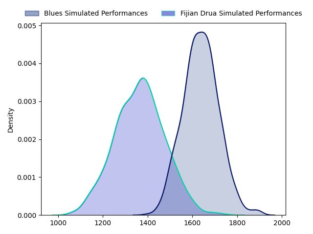
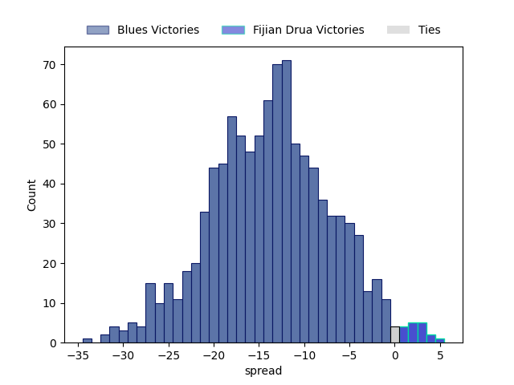

---  
layout: page  
title: Blues at Fijian Drua  
date: 2023-04-28 22:05:00 18:00:00 -0500  
categories: match projection  
---
# Blues at Fijian Drua

# Club Level Predictions

The first set of predictions treats a club as the smallest object, as the club develops its members, organizes a gameplan, and deploys its players as needed for each match. This club model has a prediction of 0.174, which translates to predicting Blues to win by 13.6.

Each club has a rating and a rating deviation (simiar to a Glicko system), and expected performances can be generated. This allows for simulated matches and spreads like the ones below.
## Projected Performances

## Projected Spreads

## Projected Results

# Player Level Predictions

Treating teams instead as an entity made up of the currently active players, I have ratings for each player in an altogether different system. These can be combined to form team ratings once teamsheets are announced, weighting starters a bit higher than the reserves. After the match is played, players can be weighted by their minutes on the field, allowing for an accurate measure of the team's composition. With these compiled team ratings, we can make predictions, measure inaccuracy, and update the individual player ratings.
## Prediction without Player Minutes: Blues by 9.1

Blues by 13.1 on a neutral field

| Away Player     |   Away elo |   Away Percentile |   Number |   Home Percentile |   Home elo | Home Player             |
|:----------------|-----------:|------------------:|---------:|------------------:|-----------:|:------------------------|
| Ofa Tu'ungafasi |     102.16 |                92 |        1 |                88 |      97.28 | Haereiti Hetet          |
| Soane Vikena    |      87.4  |                71 |        2 |                96 |     112.59 | Tevita Ikanivere        |
| Marcel Renata   |      81.34 |                60 |        3 |                37 |      72.17 | Samuela Tawake          |
| Cameron Suafoa  |     101.95 |                88 |        4 |                94 |     111.03 | Isoa Nasilasila         |
| Sam Darry       |     101.31 |                88 |        5 |                95 |     111.98 | Te Ahiwaru Cirikidaveta |
| Adrian Choat    |      83.19 |                63 |        6 |                55 |      79.21 | Vilive Miramira         |
| Dalton Papali'i |     106.03 |                91 |        7 |                20 |      61.32 | Kitione Salawa          |
| Hoskins Sotutu  |     118.86 |                97 |        8 |                53 |      78.33 | Elia Canakaivata        |
| Finlay Christie |      98.88 |                83 |        9 |                33 |      68.69 | Frank Lomani            |
| Beauden Barrett |     138.02 |                99 |       10 |                81 |      96.04 | Teti Tela               |
| Caleb Clarke    |     103.54 |                89 |       11 |                63 |      83.33 | Eroni Sau               |
| Harry Plummer   |     108.36 |                92 |       12 |                99 |     137.81 | Kalaveti Ravouvou       |
| Rieko Ioane     |      76.66 |                47 |       13 |                65 |      85.95 | Iosefo Masi             |
| Mark Telea      |     113.38 |                94 |       14 |                50 |      79.07 | Selestino Ravutaumada   |
| Zarn Sullivan   |      88.23 |                64 |       15 |                81 |      96.02 | Ilaisa Droasese         |
| Jordan Lay      |      70.99 |                34 |       17 |                75 |      88.29 | Emosi Tuqiri            |
| James Lay       |      85.19 |                66 |       18 |                68 |      82.96 | Jone Tiko               |
| Akira Ioane     |     115.8  |                96 |       20 |                36 |      70.88 | Joseva Tamani           |
| Sam Nock        |      91.71 |                75 |       21 |                68 |      87.57 | Peni Matawalu           |
| AJ Lam          |      78.36 |                53 |       23 |                82 |      98.97 | Apisalome Vota          |

