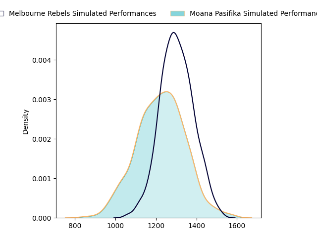
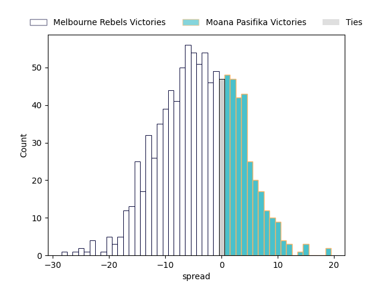

---  
layout: page  
title: Melbourne Rebels at Moana Pasifika  
date: 2023-04-29 00:35:00 18:00:00 -0500  
categories: match projection  
---
# Melbourne Rebels at Moana Pasifika

# Club Level Predictions

The first set of predictions treats a club as the smallest object, as the club develops its members, organizes a gameplan, and deploys its players as needed for each match. This club model has a prediction of 0.399, which translates to predicting Melbourne Rebels to win by 3.9.

Each club has a rating and a rating deviation (simiar to a Glicko system), and expected performances can be generated. This allows for simulated matches and spreads like the ones below.
## Projected Performances

## Projected Spreads

## Projected Results

# Player Level Predictions

Treating teams instead as an entity made up of the currently active players, I have ratings for each player in an altogether different system. These can be combined to form team ratings once teamsheets are announced, weighting starters a bit higher than the reserves. After the match is played, players can be weighted by their minutes on the field, allowing for an accurate measure of the team's composition. With these compiled team ratings, we can make predictions, measure inaccuracy, and update the individual player ratings.
## Prediction without Player Minutes: Melbourne Rebels by 2.9

Melbourne Rebels by 6.9 on a neutral field

| Away Player      |   Away elo |   Away Percentile |   Number |   Home Percentile |   Home elo | Home Player           |
|:-----------------|-----------:|------------------:|---------:|------------------:|-----------:|:----------------------|
| Matt Gibbon      |      92.04 |                82 |        1 |                64 |      81.22 | Abraham Pole          |
| Alex Mafi        |      84.8  |                68 |        2 |                23 |      62.44 | Samiuela Moli         |
| Sam Talakai      |      90.02 |                78 |        3 |                 7 |      51.12 | Isileli Tu'ungafasi   |
| Trevor Hosea     |      76.86 |                49 |        5 |                42 |      73.78 | Mike McKee            |
| Josh Kemeny      |      69.62 |                33 |        6 |                32 |      69.07 | Miracle Faiilagi      |
| Brad Wilkin      |      83.24 |                63 |        7 |                57 |      83.72 | Jonah Mau'u           |
| Vaiolini Ekuasi  |      78.31 |                48 |        8 |                51 |      79.41 | Solomone Funaki       |
| Ryan Louwrens    |     102.66 |                87 |        9 |                83 |      98.33 | Ere Enari             |
| Carter Gordon    |      86.53 |                66 |       10 |                87 |     101.4  | Christian Leali'ifano |
| Monty Ioane      |     117.13 |                96 |       11 |                54 |      78.44 | Neria Fomai           |
| David Feliuai    |      86.16 |                69 |       12 |                70 |      89.19 | Danny Toala           |
| Reece Hodge      |     102.87 |                87 |       13 |                94 |     111.63 | Levi Aumua            |
| Lachie Anderson  |      72.78 |                41 |       14 |                46 |      75.6  | Timoci Tavatavanawai  |
| Andrew Kellaway  |      97.78 |                81 |       15 |                85 |     101.15 | William Havili        |
| Jordan Uelese    |      82.31 |                63 |       16 |                77 |      88.65 | Ray Niuia             |
| Cabous Eloff     |      73.9  |                42 |       17 |                37 |      72.12 | Ezekiel Lindenmuth    |
| Pone Fa'amausili |      85.51 |                70 |       18 |                39 |      71.87 | Chris Apoua           |
| Tamati Ioane     |      82.2  |                52 |       20 |                77 |      92.34 | Lotu Inisi            |
| Joe Pincus       |      80.54 |                55 |       22 |                69 |      89.12 | Lincoln McClutchie    |

