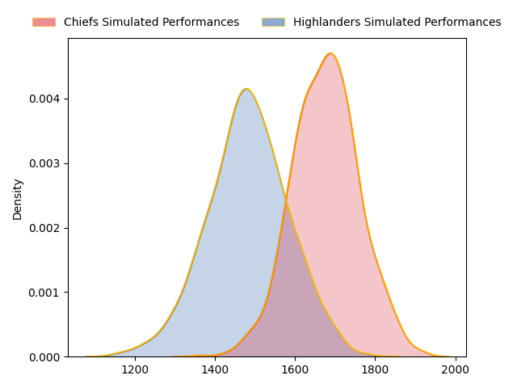
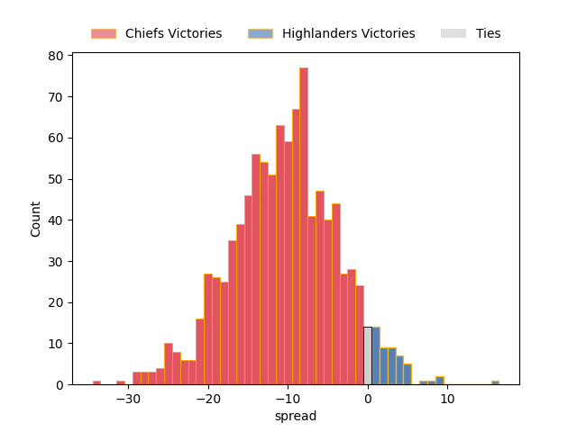

---  
layout: page  
title: Chiefs at Highlanders  
date: 2023-05-05 03:05:00 18:00:00 -0500  
categories: match projection  
---
# Chiefs at Highlanders

# Club Level Predictions

The first set of predictions treats a club as the smallest object, as the club develops its members, organizes a gameplan, and deploys its players as needed for each match. This club model has a prediction of 0.244, which translates to predicting Chiefs to win by 10.4.

Each club has a rating and a rating deviation (simiar to a Glicko system), and expected performances can be generated. This allows for simulated matches and spreads like the ones below.
## Projected Performances

## Projected Spreads

## Projected Results

# Player Level Predictions

Treating teams instead as an entity made up of the currently active players, I have ratings for each player in an altogether different system. These can be combined to form team ratings once teamsheets are announced, weighting starters a bit higher than the reserves. After the match is played, players can be weighted by their minutes on the field, allowing for an accurate measure of the team's composition. With these compiled team ratings, we can make predictions, measure inaccuracy, and update the individual player ratings.
## Prediction without Player Minutes: Chiefs by 9.3

Chiefs by 13.3 on a neutral field

| Away Player         |   Away elo |   Away Percentile |   Number |   Home Percentile |   Home elo | Home Player          |
|:--------------------|-----------:|------------------:|---------:|------------------:|-----------:|:---------------------|
| Aidan Ross          |      90.12 |                78 |        1 |                75 |      88.59 | Ethan de Groot       |
| Samisoni Taukei'aho |     112.67 |                96 |        2 |                81 |      92.24 | Andrew Makalio       |
| George Dyer         |      83.31 |                64 |        3 |                75 |      88.58 | Jermaine Ainsley     |
| Tupou Vaa'i         |      71.45 |                37 |        4 |                85 |      97.78 | Fabian Holland       |
| Naitoa Ah Kuoi      |     103.35 |                87 |        5 |                67 |      84.61 | Will Tucker          |
| Pita Gus Sowakula   |     100.27 |                87 |        6 |                88 |     100.6  | Shannon Frizell      |
| Sam Cane            |     131.56 |                99 |        7 |                94 |     111.51 | Billy Harmon         |
| Luke Jacobson       |     130.11 |                98 |        8 |                13 |      56.06 | Hugh Renton          |
| Brad Weber          |     140.27 |               100 |        9 |                83 |      98.16 | Aaron Smith          |
| Damian McKenzie     |      85.97 |                64 |       10 |                91 |     111.52 | Freddie Burns        |
| Peniasi Malimali    |      60.43 |                19 |       11 |                60 |      81.2  | Scott Gregory        |
| Anton Lienert-Brown |     127.95 |                98 |       12 |                46 |      76.97 | Thomas Umaga-Jensen  |
| Daniel Rona         |      83.84 |                62 |       13 |                76 |      93.42 | Fetuli Paea          |
| Emoni Narawa        |      90.83 |                75 |       14 |                84 |     101.59 | Connor Garden-Bachop |
| Shaun Stevenson     |      93.98 |                75 |       15 |                70 |      89.19 | Sam Gilbert          |
| Bradley Slater      |     106.87 |                94 |       16 |                76 |      88.66 | Rhys Marshall        |
| Ollie Norris        |      91.3  |                81 |       17 |                77 |      88.77 | Dan Lienert-Brown    |
| John Ryan           |     101.26 |                91 |       18 |                74 |      85.24 | Saula Mau            |
| Josh Lord           |      93.59 |                79 |       19 |                83 |      96.55 | Josh Dickson         |
| Kaylum Boshier      |      86    |                70 |       20 |                51 |      77.63 | Sean Withy           |
| Cortez Ratima       |     103.06 |                88 |       21 |                50 |      78.09 | Folau Fakatava       |
| Bryn Gatland        |      90.16 |                71 |       22 |                85 |      99.63 | Mitch Hunt           |
| Alex Nankivell      |     102.14 |                86 |       23 |                75 |      92.38 | Jona Nareki          |

