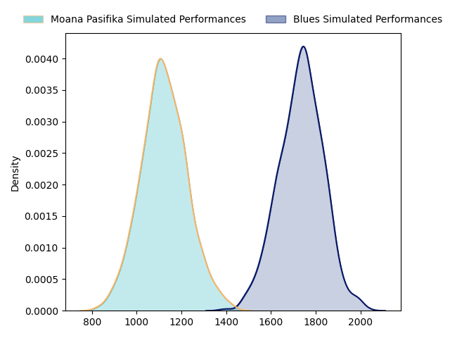
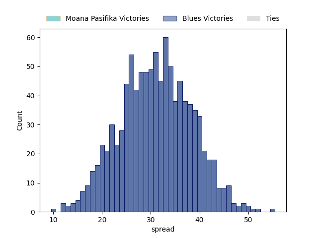

---  
layout: page  
title: Moana Pasifika at Blues  
date: 2023-05-06 03:05:00 18:00:00 -0500  
categories: match projection  
---
# Moana Pasifika at Blues

# Club Level Predictions

The first set of predictions treats a club as the smallest object, as the club develops its members, organizes a gameplan, and deploys its players as needed for each match. This club model has a prediction of 0.966, which translates to predicting Blues to win by 30.5.

Each club has a rating and a rating deviation (simiar to a Glicko system), and expected performances can be generated. This allows for simulated matches and spreads like the ones below.
## Projected Performances

## Projected Spreads

## Projected Results

# Player Level Predictions

Treating teams instead as an entity made up of the currently active players, I have ratings for each player in an altogether different system. These can be combined to form team ratings once teamsheets are announced, weighting starters a bit higher than the reserves. After the match is played, players can be weighted by their minutes on the field, allowing for an accurate measure of the team's composition. With these compiled team ratings, we can make predictions, measure inaccuracy, and update the individual player ratings.
## Prediction without Player Minutes: Blues by 27.6

Blues by 23.6 on a neutral field

| Away Player           |   Away elo |   Away Percentile |   Number |   Home Percentile |   Home elo | Home Player                   |
|:----------------------|-----------:|------------------:|---------:|------------------:|-----------:|:------------------------------|
| Abraham Pole          |      79.29 |                57 |        1 |                92 |     102.88 | Ofa Tu'ungafasi               |
| Samiuela Moli         |      61.91 |                22 |        2 |                98 |     118.17 | Kurt Eklund                   |
| Chris Apoua           |      69.36 |                39 |        3 |                63 |      81.7  | Marcel Renata                 |
| Michael Curry         |      88.55 |                72 |        4 |                75 |      90.77 | James Tucker                  |
| Mike McKee            |      71.59 |                39 |        5 |                88 |     101.93 | Sam Darry                     |
| Miracle Faiilagi      |      64.95 |                26 |        6 |                95 |     113.87 | Akira Ioane                   |
| Alamanda Motuga       |      70.92 |                36 |        7 |                92 |     106.68 | Dalton Papali'i               |
| Solomone Funaki       |      78.97 |                53 |        8 |                89 |     103.08 | Cameron Suafoa                |
| Ere Enari             |      99.13 |                84 |        9 |                44 |      72.71 | Taufa Funaki                  |
| Christian Leali'ifano |      99.8  |                85 |       10 |                92 |     109.93 | Harry Plummer                 |
| Neria Fomai           |      75.92 |                49 |       11 |                90 |     104.88 | Caleb Clarke                  |
| D'Angelo Leuila       |     103.07 |                88 |       12 |                36 |      71.73 | Roger Tuivasa-Sheck           |
| Levi Aumua            |     109.45 |                92 |       13 |                84 |     101.55 | Bryce Heem                    |
| Timoci Tavatavanawai  |      73.33 |                43 |       14 |                55 |      78.95 | AJ Lam                        |
| William Havili        |      99.48 |                83 |       15 |                99 |     137.01 | Beauden Barrett               |
| Luteru Tolai          |     104.27 |                92 |       16 |                79 |      90.69 | Soane Vikena                  |
| Ezekiel Lindenmuth    |      72.24 |                41 |       17 |                75 |      88.22 | Josh Fusitua                  |
| Tau Koloamatangi      |     111.58 |                96 |       18 |                68 |      85.53 | James Lay                     |
| Alex McRobbie         |      64.05 |                26 |       19 |                90 |     100.41 | Tom Robinson                  |
| Jonah Mau'u           |      80.7  |                57 |       20 |                41 |      72.91 | Anton Segner                  |
| Jonathan Taumateine   |      67.17 |                30 |       21 |                83 |      98.81 | Finlay Christie               |
| Lincoln McClutchie    |      87.71 |                69 |       22 |                51 |      77.98 | Rieko Ioane                   |
| Fine Inisi            |      73.04 |                44 |       23 |                97 |     118.28 | Jacob Ratumaitavuki-Kneepkens |

