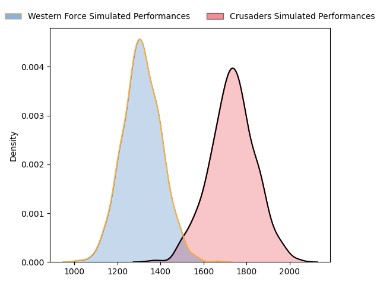
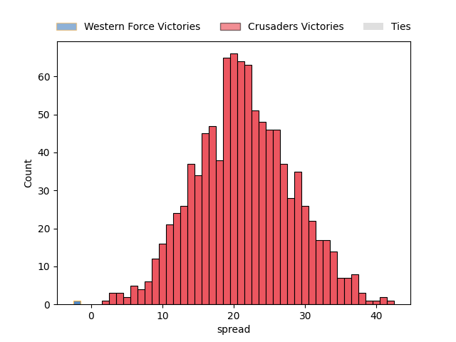
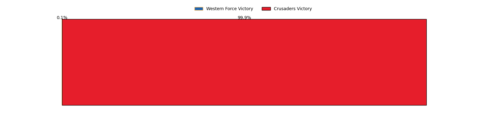

---  
layout: page  
title: Western Force at Crusaders  
date: 2023-05-06 00:35:00 18:00:00 -0500  
categories: match projection  
---
# Western Force at Crusaders

# Club Level Predictions

The first set of predictions treats a club as the smallest object, as the club develops its members, organizes a gameplan, and deploys its players as needed for each match. This club model has a prediction of 0.914, which translates to predicting Crusaders to win by 21.4.

Each club has a rating and a rating deviation (simiar to a Glicko system), and expected performances can be generated. This allows for simulated matches and spreads like the ones below.
## Projected Performances

## Projected Spreads

## Projected Results

# Player Level Predictions

Treating teams instead as an entity made up of the currently active players, I have ratings for each player in an altogether different system. These can be combined to form team ratings once teamsheets are announced, weighting starters a bit higher than the reserves. After the match is played, players can be weighted by their minutes on the field, allowing for an accurate measure of the team's composition. With these compiled team ratings, we can make predictions, measure inaccuracy, and update the individual player ratings.
## Prediction without Player Minutes: Crusaders by 23.5

Crusaders by 19.5 on a neutral field

| Away Player           |   Away elo |   Away Percentile |   Number |   Home Percentile |   Home elo | Home Player            |
|:----------------------|-----------:|------------------:|---------:|------------------:|-----------:|:-----------------------|
| Charlie Hancock       |      78.33 |                54 |        1 |                68 |      84.45 | Joe Moody              |
| Tom Horton            |      99.14 |                89 |        2 |                89 |     100.95 | Brodie McAlister       |
| Santiago Medrano      |      89.21 |                77 |        3 |                78 |      89.33 | Tamaiti Williams       |
| Felix Kalapu          |      33.74 |                 1 |        4 |                96 |     117.02 | Scott Barrett          |
| Jeremy Williams       |      68.69 |                32 |        5 |                49 |      76.55 | Quinten Strange        |
| Michael Wells         |      86.86 |                68 |        6 |                65 |      84.32 | Dom Gardiner           |
| Carlo Tizzano         |      85.53 |                69 |        7 |                81 |      93.03 | Tom Christie           |
| Issak Fines-Leleiwasa |      90.95 |                73 |        9 |                85 |     100.5  | Noah Hotham            |
| Manasa Mataele        |     104.93 |                90 |       11 |                53 |      77.78 | Leicester Fainga'anuku |
| Hamish Stewart        |     120.59 |                97 |       12 |                94 |     112.51 | David Havili           |
| Sam Spink             |      94.53 |                78 |       13 |                88 |     104.3  | Braydon Ennor          |
| Zach Kibirige         |      69.31 |                35 |       14 |                71 |      87.38 | Macca Springer         |
| Feleti Kaitu'u        |      71.18 |                36 |       16 |                88 |      98.26 | Codie Taylor           |
| Ryan McCauley         |      89.99 |                68 |       19 |                65 |      83.47 | Zach Gallagher         |
| Jackson Pugh          |      72.96 |                46 |       20 |                49 |      77.41 | Christian Lio-Willie   |
| Ian Prior             |      93.12 |                78 |       21 |                62 |      83.51 | Mitchell Drummond      |
| Nikolai Foliaki       |      48.36 |                 7 |       22 |                54 |      80.98 | Fergus Burke           |

