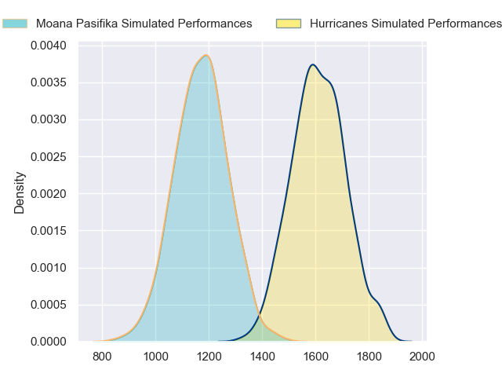
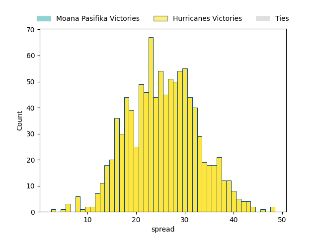
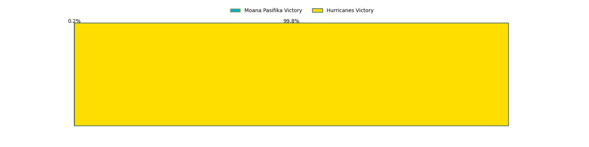

---  
layout: page  
title: Moana Pasifika at Hurricanes  
date: 2023-05-13 00:35:00 18:00:00 -0500  
categories: match projection  
---
# Moana Pasifika at Hurricanes

# Club Level Predictions

The first set of predictions treats a club as the smallest object, as the club develops its members, organizes a gameplan, and deploys its players as needed for each match. This club model has a prediction of 0.92, which translates to predicting Hurricanes to win by 22.0.

Each club has a rating and a rating deviation (simiar to a Glicko system), and expected performances can be generated. This allows for simulated matches and spreads like the ones below.
## Projected Performances

## Projected Spreads

## Projected Results

# Player Level Predictions

Treating teams instead as an entity made up of the currently active players, I have ratings for each player in an altogether different system. These can be combined to form team ratings once teamsheets are announced, weighting starters a bit higher than the reserves. After the match is played, players can be weighted by their minutes on the field, allowing for an accurate measure of the team's composition. With these compiled team ratings, we can make predictions, measure inaccuracy, and update the individual player ratings.
## Prediction without Player Minutes: Hurricanes by 29.4

Hurricanes by 25.4 on a neutral field

| Away Player         |   Away elo |   Away Percentile |   Number |   Home Percentile |   Home elo | Home Player          |
|:--------------------|-----------:|------------------:|---------:|------------------:|-----------:|:---------------------|
| Ezekiel Lindenmuth  |      76.04 |                48 |        1 |                88 |      93.22 | Tevita Mafileo       |
| Isileli Tu'ungafasi |      50.65 |                 6 |        3 |                99 |     137.05 | Tyrel Lomax          |
| Alex McRobbie       |      68.67 |                31 |        4 |                66 |      84.12 | James Blackwell      |
| Mahroni Ngakuru     |      51.33 |                 8 |        5 |                90 |     105.4  | Isaia Walker-Leawere |
| Lotu Inisi          |      92.7  |                79 |        8 |                98 |     117.85 | Ardie Savea          |
| Jonathan Taumateine |      64.49 |                23 |        9 |                 7 |      50.97 | Jamie Booth          |
| Lincoln McClutchie  |      90.82 |                73 |       10 |                61 |      83.96 | Aidan Morgan         |
| Anzelo Tuitavuki    |      42.86 |                 4 |       11 |                92 |     106.96 | Kini Naholo          |
| Henry Taefu         |      50.73 |                 8 |       12 |                91 |     107.61 | Jordie Barrett       |
| Danny Toala         |      92.07 |                74 |       13 |                91 |     108.27 | Billy Proctor        |
| Tima Fainga'anuku   |     101.19 |                88 |       14 |                56 |      78.32 | Salesi Rayasi        |
| Tau Koloamatangi    |     112.05 |                96 |       17 |                64 |      83.32 | Pouri Rakete-Stones  |
| Potu Leavasa        |      65.95 |                32 |       19 |                82 |      94.06 | Caleb Delany         |
| Jonah Mau'u         |      82.31 |                59 |       20 |                19 |      60.1  | Brayden Iose         |
| D'Angelo Leuila     |      98.4  |                81 |       22 |                63 |      84.99 | Peter Umaga-Jensen   |

