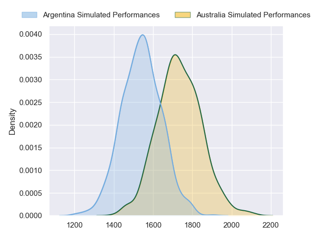
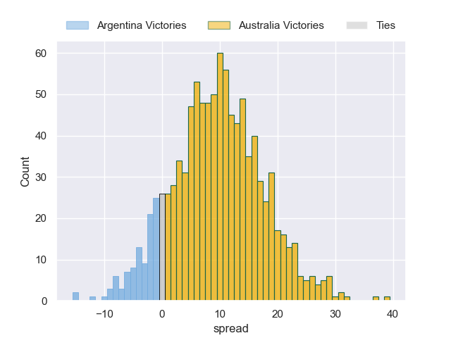
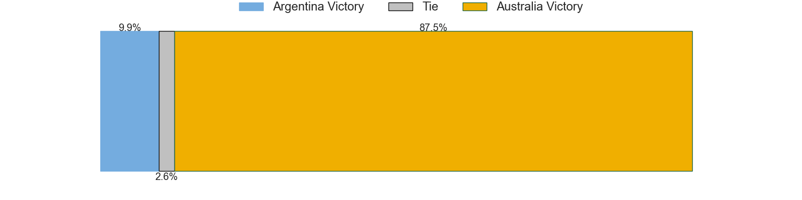

---  
layout: page  
title: Argentina at Australia  
date: 2023-07-15 05:45:00 18:00:00 -0500  
categories: match projection  
---
# Argentina at Australia

# Club Level Predictions

The first set of predictions treats a club as the smallest object, as the club develops its members, organizes a gameplan, and deploys its players as needed for each match. This club model has a prediction of 0.743, which translates to predicting Australia to win by 9.7.

Each club has a rating and a rating deviation (simiar to a Glicko system), and expected performances can be generated. This allows for simulated matches and spreads like the ones below.
## Projected Performances

## Projected Spreads

## Projected Results

# Player Level Predictions

Treating teams instead as an entity made up of the currently active players, I have ratings for each player in an altogether different system. These can be combined to form team ratings once teamsheets are announced, weighting starters a bit higher than the reserves. After the match is played, players can be weighted by their minutes on the field, allowing for an accurate measure of the team's composition. With these compiled team ratings, we can make predictions, measure inaccuracy, and update the individual player ratings.
## Prediction without Player Minutes: Australia by 18.5

Australia by 14.5 on a neutral field

| Away Player          |   Away elo |   Away Percentile |   Number |   Home Percentile |   Home elo | Home Player      |
|:---------------------|-----------:|------------------:|---------:|------------------:|-----------:|:-----------------|
| Thomas Gallo         |      90.98 |                77 |        1 |                99 |     138.38 | James Slipper    |
| Julian Montoya       |      90.41 |                76 |        2 |                85 |      98.77 | Dave Porecki     |
| Matias Alemanno      |     101.62 |                86 |        4 |                77 |      90.35 | Richie Arnold    |
| Tomas Lavanini       |     117.85 |                95 |        5 |                94 |     114.12 | Will Skelton     |
| Pablo Matera         |     113.56 |                94 |        6 |                49 |      77.3  | Jed Holloway     |
| Santiago Grondona    |      74.65 |                47 |        7 |                30 |      68.04 | Fraser McReight  |
| Juan Martin Gonzalez |      76    |                47 |        8 |                85 |     100.08 | Rob Valetini     |
| Gonzalo Bertranou    |      89.71 |                69 |        9 |                97 |     120.52 | Nic White        |
| Santiago Carreras    |     117.6  |                95 |       10 |                96 |     123.62 | Quade Cooper     |
| Mateo Carreras       |      69.44 |                32 |       11 |                30 |      68.56 | Marika Koroibete |
| Lucio Cinti          |      65.69 |                26 |       13 |                78 |      96.04 | Len Ikitau       |
| Emiliano Boffelli    |      61.04 |                17 |       15 |                74 |      94.4  | Tom Wright       |
| Agustin Creevy       |     114.03 |                96 |       16 |                55 |      76.43 | Jordan Uelese    |
| Eduardo Bello        |      87.23 |                73 |       18 |                64 |      84.21 | Pone Fa'amausili |
| Lautaro Bazan Velez  |      83.69 |                67 |       21 |                43 |      74.61 | Josh Kemeny      |
| Nicolas Sanchez      |     139.75 |                99 |       22 |                81 |      95.91 | Tate McDermott   |
| Matias Moroni        |      73.89 |                42 |       23 |                63 |      86.2  | Carter Gordon    |

