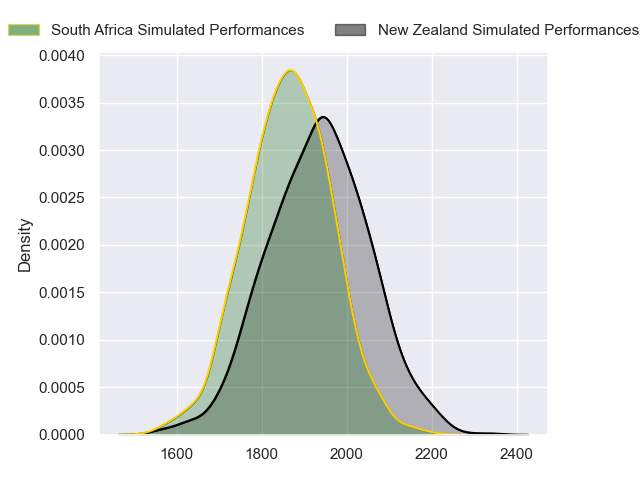
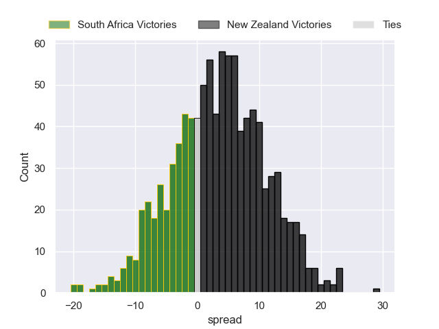

---  
layout: page  
title: South Africa at New Zealand  
date: 2023-07-15 03:05:00 18:00:00 -0500  
categories: match projection  
---
# South Africa at New Zealand

# Club Level Predictions

The first set of predictions treats a club as the smallest object, as the club develops its members, organizes a gameplan, and deploys its players as needed for each match. This club model has a prediction of 0.607, which translates to predicting New Zealand to win by 3.5.

Each club has a rating and a rating deviation (simiar to a Glicko system), and expected performances can be generated. This allows for simulated matches and spreads like the ones below.
## Projected Performances

## Projected Spreads

## Projected Results

# Player Level Predictions

Treating teams instead as an entity made up of the currently active players, I have ratings for each player in an altogether different system. These can be combined to form team ratings once teamsheets are announced, weighting starters a bit higher than the reserves. After the match is played, players can be weighted by their minutes on the field, allowing for an accurate measure of the team's composition. With these compiled team ratings, we can make predictions, measure inaccuracy, and update the individual player ratings.
## Prediction without Player Minutes: New Zealand by 21.4

New Zealand by 17.4 on a neutral field

| Away Player          |   Away elo |   Away Percentile |   Number |   Home Percentile |   Home elo | Home Player      |
|:---------------------|-----------:|------------------:|---------:|------------------:|-----------:|:-----------------|
| Steven Kitshoff      |     106.88 |                94 |        1 |                77 |      90.62 | Ethan de Groot   |
| Bongi Mbonambi       |     118.92 |                96 |        2 |                80 |      95.22 | Codie Taylor     |
| Frans Malherbe       |     135.04 |                99 |        3 |               100 |     140.24 | Tyrel Lomax      |
| Jasper Wiese         |     102.04 |                87 |        8 |                98 |     125.47 | Ardie Savea      |
| Damian Willemse      |     100.21 |                80 |       10 |               100 |     145.55 | Richie Mo'unga   |
| Lukhanyo Am          |     109.06 |                91 |       13 |                64 |      85.86 | Rieko Ioane      |
| Willie Le Roux       |     102.44 |                84 |       15 |                99 |     146.16 | Beauden Barrett  |
| Thomas du Toit       |      97.16 |                83 |       17 |                87 |      97.72 | Tamaiti Williams |
| Vincent Koch         |      63.77 |                17 |       18 |                93 |     105.38 | Nepo Laulala     |
| RG Snyman            |     107.93 |                89 |       19 |                36 |      72.66 | Tupou Vaa'i      |
| Pieter-Steph du Toit |      86.22 |                69 |       20 |                87 |     102.26 | Dalton Papali'i  |
| Duane Vermeulen      |     121.03 |                97 |       21 |                79 |      98.52 | Finlay Christie  |
| Grant Williams       |     107.85 |                88 |       22 |                89 |     106.25 | Braydon Ennor    |
| Manie Libbok         |     105.62 |                87 |       23 |                84 |      99.85 | Caleb Clarke     |

