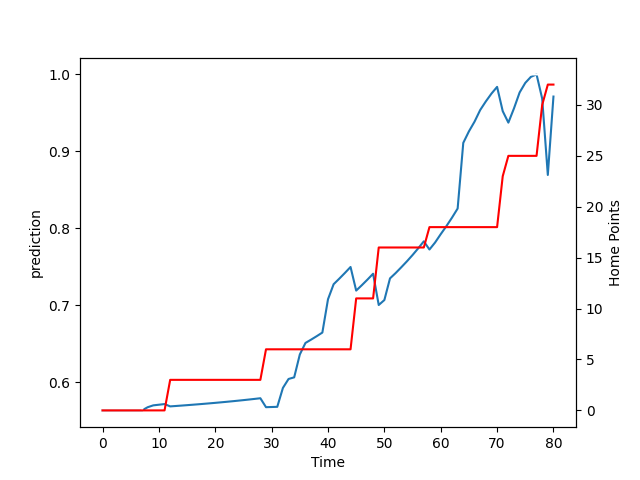

---  
layout: page  
title: Counties Manukau at Hawke's Bay; 32.0-33.0  
date: 2022-08-12 03:05:00 18:00:00 -0500  
categories: match review  
---
# Prediction: Hawke's Bay by 16.1

Hawke's Bay by 11.1 on a neutral field

# Pre-Match Prediction: Hawke's Bay by 15.6

Hawke's Bay by 10.6 on a neutral pitch
# Projection using minutes played for each player: Hawke's Bay by 16.1

Hawke's Bay by 11.1 on a neutral field

|   Away Minutes | Away Player        |   Away elo |   Away Percentile |   Number |   Home Percentile |   Home elo | Home Player          |   Home Minutes |
|---------------:|:-------------------|-----------:|------------------:|---------:|------------------:|-----------:|:---------------------|---------------:|
|             40 | Kauvaka Kaivelata  |      80.93 |                11 |        1 |                23 |      94.88 | Pouri Rakete-Stones  |             80 |
|             58 | Zuriel Togiatama   |      83.26 |                13 |        2 |                 6 |      81.24 | Kianu Kereru-Symes   |             53 |
|             51 | Sekope Kepu        |     111.98 |                95 |        3 |                73 |     104.64 | Joe Apikotoa         |             65 |
|             80 | William Furniss    |      81.3  |                12 |        4 |                86 |     108.7  | Isaia Walker-Leawere |             58 |
|             53 | Viliame Rarasea    |     100.92 |                74 |        5 |                57 |     103.12 | Tom Parsons          |             80 |
|             80 | Sam Slade          |      91.4  |                30 |        6 |                14 |      86.59 | Devan Flanders       |             80 |
|             80 | Sean Reidy         |     107.81 |                91 |        7 |                12 |      82.38 | Solomone Funaki      |             65 |
|             58 | Sam Tuifua         |      81.3  |                15 |        8 |                22 |      90.65 | Marino Mikaele-Tu'u  |             80 |
|             60 | Cam Roigard        |      84.21 |                14 |        9 |                91 |     111.15 | Brad Weber           |             53 |
|             80 | Riley Hohepa       |      78.74 |                 8 |       10 |                 2 |      78.3  | Lincoln McClutchie   |             74 |
|             60 | Ahsee Tuala        |      96.81 |                55 |       11 |                53 |      99.97 | Neria Foma'i         |             80 |
|             80 | AJ Alatimu         |     101.52 |                78 |       12 |                 5 |      80.46 | Danny Toala          |             80 |
|             80 | Nikolai Foliaki    |      68.65 |                 0 |       13 |                22 |      94.02 | Nick Grigg           |             67 |
|             65 | Jared Page         |      93.2  |                36 |       14 |                42 |      98.14 | Jonah Lowe           |             80 |
|             80 | Etene Nanai-Seturo |      71.9  |                 0 |       15 |                73 |     103.38 | Chase Tiatia         |             80 |
|             40 | Ezekiel Lindenmuth |      72.63 |                 0 |       17 |                67 |     102.36 | Mark Braidwood       |              0 |
|             20 | Liam Daniela       |      98.71 |                67 |       21 |                18 |      92.72 | Ere Enari            |             27 |

