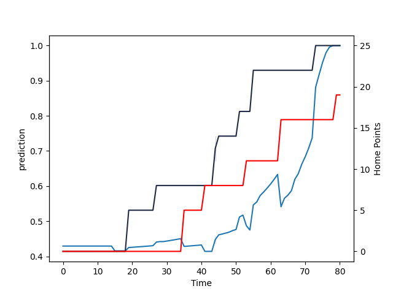

---  
layout: page  
title: Tasman at Otago; 19.0-25.0  
date: 2022-08-12 22:05:00 18:00:00 -0500  
categories: match review  
---
# Prediction: Tasman by 7.4

Tasman by 12.4 on a neutral field

# Pre-Match Prediction: Tasman by 5.5

Tasman by 10.5 on a neutral pitch
# Projection using minutes played for each player: Tasman by 7.4

Tasman by 12.4 on a neutral field

|   Away Minutes | Away Player             |   Away elo |   Away Percentile |   Number |   Home Percentile |   Home elo | Home Player            |   Home Minutes |
|---------------:|:------------------------|-----------:|------------------:|---------:|------------------:|-----------:|:-----------------------|---------------:|
|             29 | Ryan Coxon              |     101.2  |                66 |        1 |                 6 |      77.66 | Abraham Pole           |             64 |
|             69 | Quentin MacDonald       |     116.09 |                96 |        2 |                 9 |      78.98 | Henry Bell             |             67 |
|             57 | Luca Inch               |      80.95 |                 6 |        3 |                21 |      89.93 | Jermaine Ainsley       |             69 |
|             57 | Te Ahiwaru Cirikidaveta |     106.88 |                82 |        4 |                13 |      79.71 | Fabian Holland         |             65 |
|             80 | Quinten Strange         |     105.35 |                76 |        5 |                12 |      80.3  | William Tucker         |             80 |
|             80 | Max Hicks               |      80.09 |                 4 |        6 |                13 |      78.7  | Oliver Haig            |             80 |
|             73 | Sione Havili Talitui    |     104.64 |                78 |        7 |                17 |      78.7  | Sean Withy             |             69 |
|             80 | Hugh Renton             |      89.43 |                20 |        8 |                60 |      96.83 | James Lentjes          |             80 |
|             49 | Louie Chapman           |      81.62 |                 7 |        9 |                88 |     105.78 | Kemara Hauiti-Parapara |             54 |
|             80 | Campbell Parata         |      79.39 |                 3 |       10 |                14 |      80.13 | Cameron Millar         |             80 |
|             57 | Macca Springer          |      81.88 |                10 |       11 |                74 |     101.27 | Jona Nareki            |             15 |
|             80 | Alex Nankivell          |     105.85 |                78 |       12 |                74 |      99.84 | Thomas Umaga-Jensen    |             80 |
|             80 | Levi Aumua              |     107.84 |                83 |       13 |                20 |      83.47 | Josh Timu              |             80 |
|             80 | Timoci Tavatavanawai    |      79.43 |                 3 |       14 |                10 |      75.47 | Freedom Vahaakolo      |             67 |
|             74 | Taine Robinson          |      78.79 |                 3 |       15 |                15 |      80.74 | Sam Gilbert            |             80 |
|             11 | Samiuela Moli           |      91.34 |                23 |       16 |                69 |      98.59 | Ricky Jackson          |             13 |
|             51 | Atu Moli                |     103.56 |                84 |       17 |                78 |     100.39 | Josh Hohneck           |             16 |
|             23 | Samuel Matenga          |      79.61 |                 7 |       18 |                 9 |      79.25 | Saula Mau              |             11 |
|             23 | Mahroni Ngakuru         |      75.43 |                 0 |       19 |                 5 |      75.87 | Josh Hill              |             15 |
|             31 | Noah Hotham             |      79.26 |                 5 |       21 |                12 |      80.25 | James Arscott          |             26 |
|             23 | Fetuli Paea             |     100.11 |                67 |       22 |                21 |      86.06 | Josh Ioane             |             13 |
|              6 | William Havili          |      79.37 |                 9 |       23 |                15 |      79.31 | Ray Nu'u               |             65 |

