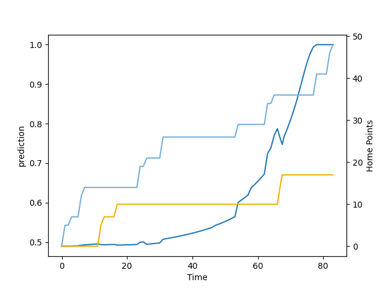

---  
layout: page  
title: Australia at Argentina; 17.0-48.0  
date: 2022-08-13 15:10:00 18:00:00 -0500  
categories: match review  
---
# Prediction: Argentina by 3.2

Australia by 1.8 on a neutral field

# Pre-Match Prediction: Australia by 2.9

Australia by 2.1 on a neutral pitch
# Projection using minutes played for each player: Argentina by 3.2

Australia by 1.8 on a neutral field

|   Away Minutes | Away Player      |   Away elo |   Away Percentile |   Number |   Home Percentile |   Home elo | Home Player            |   Home Minutes |
|---------------:|:-----------------|-----------:|------------------:|---------:|------------------:|-----------:|:-----------------------|---------------:|
|             68 | James Slipper    |     112.73 |                93 |        1 |                13 |      82.21 | Thomas Gallo           |             68 |
|             65 | Lachlan Lonergan |      80.48 |                 4 |        2 |                96 |     112.23 | Julian Montoya         |             73 |
|             58 | Taniela Tupou    |     125.5  |                99 |        3 |                97 |     113.75 | Francisco Gomez Kodela |             65 |
|             54 | Rory Arnold      |     116.57 |                94 |        4 |                92 |     110.82 | Matias Alemanno        |             83 |
|             83 | Darcy Swain      |      89.49 |                16 |        5 |                90 |     108.8  | Tomas Lavanini         |             83 |
|             54 | Jed Holloway     |      98.59 |                45 |        6 |                 2 |      74.55 | Juan Martin Gonzalez   |             83 |
|             83 | Fraser McReight  |      93.87 |                26 |        7 |                74 |     100.15 | Marcos Kremer          |             47 |
|             83 | Rob Valetini     |      94.93 |                28 |        8 |                97 |     117.24 | Pablo Matera           |             76 |
|             54 | Nic White        |     137.99 |               100 |        9 |                38 |      94.36 | Gonzalo Bertranou      |             65 |
|             83 | James O'Connor   |     114.13 |                92 |       10 |                23 |      89.31 | Santiago Carreras      |             77 |
|             83 | Marika Koroibete |     110.83 |                89 |       11 |                93 |     110.27 | Juan Imhoff            |             83 |
|             62 | Lalakai Foketi   |     103.66 |                72 |       12 |                92 |     110.13 | Jeronimo de la Fuente  |             26 |
|             83 | Len Ikitau       |      96.63 |                33 |       13 |                96 |     115.4  | Matias Moroni          |             83 |
|             83 | Jordan Petaia    |      99.88 |                49 |       14 |                84 |     102.82 | Emiliano Boffelli      |             83 |
|             68 | Tom Wright       |      84.74 |                14 |       15 |                13 |      79.47 | Juan Cruz Mallia       |             83 |
|             18 | Billy Pollard    |      80.97 |                 7 |       16 |               100 |     127.53 | Agustin Creevy         |             10 |
|             15 | Matt Gibbon      |      82.52 |                11 |       17 |                96 |     114.31 | Nahuel Tetaz Chaparro  |             15 |
|             25 | Pone Fa'amausili |      81.54 |                10 |       18 |                43 |      96.87 | Joel Sclavi            |             18 |
|             29 | Nick Frost       |      71.89 |                 0 |       19 |                88 |     108.14 | Facundo Isa            |             36 |
|             29 | Pete Samu        |     123.53 |                98 |       20 |                18 |      83.16 | Rodrigo Bruni          |              7 |
|             29 | Tate McDermott   |      96.27 |                37 |       21 |                86 |     105.74 | Tomas Cubelli          |             18 |
|             21 | Irae Simone      |     105.36 |                83 |       22 |                13 |      83.28 | Tomas Albornoz         |              6 |
|             15 | Reece Hodge      |     100.01 |                59 |       23 |                 3 |      76.58 | Lucio Cinti            |             57 |

