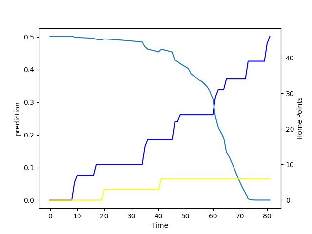

---  
layout: page  
title: Taranaki at Bay of Plenty; 6.0-46.0  
date: 2022-08-13 22:05:00 18:00:00 -0500  
categories: match review  
---
# Prediction: Bay of Plenty by 5.4

Bay of Plenty by 0.4 on a neutral field

# Pre-Match Prediction: Bay of Plenty by 4.4

Taranaki by 0.6 on a neutral pitch
# Projection using minutes played for each player: Bay of Plenty by 5.4

Bay of Plenty by 0.4 on a neutral field

|   Away Minutes | Away Player            |   Away elo |   Away Percentile |   Number |   Home Percentile |   Home elo | Home Player            |   Home Minutes |
|---------------:|:-----------------------|-----------:|------------------:|---------:|------------------:|-----------:|:-----------------------|---------------:|
|             60 | Jared Proffit          |      99.08 |                42 |        1 |                14 |      83.6  | Haereiti Hetet         |             71 |
|             52 | Bradley Slater         |     108.92 |                89 |        2 |                92 |     107.21 | Kurt Eklund            |             56 |
|             60 | Donald Brighouse       |      98.58 |                38 |        3 |                 9 |      79.27 | Tevita Mafileo         |             63 |
|             69 | Jesse Parete           |      91.22 |                19 |        4 |                 2 |      74.96 | Justin Sangster        |             81 |
|              5 | Stan van den Hoven     |      79.7  |                 6 |        5 |                30 |      91.35 | Manaaki Selby-Rickit   |             81 |
|             81 | Mitch Brown            |     104.63 |                77 |        6 |                17 |      81.09 | Naitoa Ah Kuoi         |             68 |
|             81 | Kaylum Boshier         |      79.41 |                 2 |        7 |                34 |      92.06 | Jacob Norris           |             81 |
|             81 | Pita Gus Sowakula      |     102.72 |                66 |        8 |                58 |      96.97 | Zane Kapeli            |             62 |
|             52 | Logan Crowley          |     100.72 |                60 |        9 |                75 |      99.94 | Te Toiroa Tahuriorangi |             48 |
|             81 | Jayson Potroz          |      82.74 |                 8 |       10 |                14 |      81.9  | Kaleb Trask            |             71 |
|             81 | Josh Setu              |      77.86 |                 1 |       11 |                89 |     106.22 | Nigel Ah Wong          |             81 |
|             62 | Teihorangi Walden      |      94.46 |                28 |       12 |                64 |      98.14 | Kaveinga Finau         |             66 |
|             81 | Brayton Northcott-Hill |      74.98 |                 0 |       13 |                18 |      84.34 | Joey Walton            |             81 |
|             59 | Paul Perez             |      96.08 |                35 |       14 |                28 |      89.34 | Emoni Narawa           |             81 |
|             81 | Adam Lennox            |      80    |                 5 |       15 |                69 |      98.53 | Gillies Kaka           |             81 |
|             29 | Ricky Riccitelli       |      93.31 |                26 |       16 |                42 |      97.52 | Anaru Rangi            |             25 |
|             29 | Liam Blyde             |      86.26 |                14 |       21 |                 6 |      78.66 | Jamie Dobie            |             33 |

